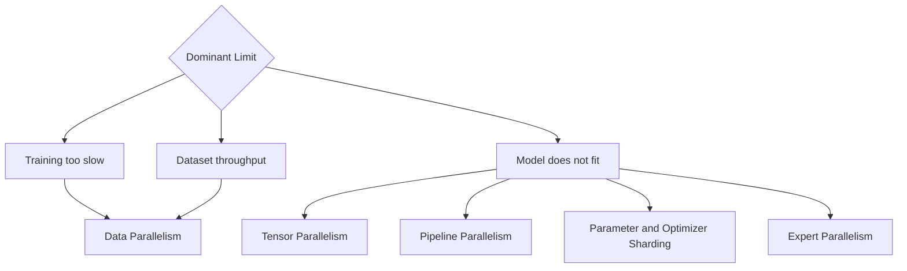

# Why Distributed Training Exists

A model fits on one GPU, but training would take months. A larger model does not fit at all. The engineering team adds GPUs and expects time-to-result to fall proportionally. Instead, communication, input stalls, synchronization, and checkpoint pauses consume a growing fraction of each step.

Distributed training exists because one device has finite compute, memory, and time. It introduces parallelism to overcome those limits, but every form of parallelism creates communication and coordination costs.

## Learning Objectives

You will be able to explain the scaling problem, distinguish parallelism types, identify synchronization costs, and define useful training efficiency metrics.

## Why One GPU Becomes Insufficient

- model parameters and optimizer state exceed memory;
- activations grow with batch, sequence, and layer dimensions;
- datasets and experiments demand shorter iteration cycles;
- business deadlines require lower time-to-result;
- resiliency requires recoverable multi-node execution.

## Parallelism Map

## Scaling Efficiency

Speedup is useful only relative to added resources. Track samples or tokens per second, step time, scaling efficiency, communication fraction, data wait, and checkpoint overhead.

## Production Story

A job scales well from one to eight GPUs inside a node but poorly across nodes. The model is not the first suspect. The transition introduced a network fabric, rank placement, and additional collective paths.

## Troubleshooting

**Symptom:** doubling GPUs improves throughput by only 30 percent.

**Diagnosis:** break step time into compute, collective communication, data loading, synchronization, and checkpointing.

**Root cause:** the workload added communication faster than useful compute.

## Interview Questions

- Why is linear scaling rare?
- Which parallelism solves memory versus time?
- What evidence distinguishes data starvation from collective bottlenecks?
