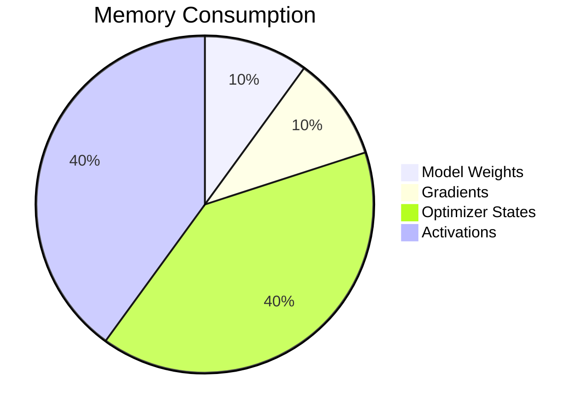

# Chapter 2: Training Memory and Compute Anatomy

## WHY
To effectively distribute a model, one must first precisely understand where every byte of memory and every FLOP of compute is spent.

## WHAT
Anatomy of a training step: Forward pass, backward pass, optimizer step.

## HOW
Memory is consumed by:
1. Weights
2. Optimizer States
3. Gradients
4. Activations
5. Temporary Buffers

## WHEN
Use profiling tools when memory usage hits >90% of VRAM to identify what can be offloaded, recomputed, or sharded.

## TRADEOFFS
| Technique | Memory Savings | Compute Overhead |
|---|---|---|
| Activation Checkpointing | High | ~30% Extra Compute |
| CPU Offload | High | High Latency |

## PRODUCTION
Implement mixed precision (AMP) and operator fusion (e.g., FlashAttention) to optimize the memory/compute ratio.

## TROUBLESHOOTING
**Failure Scenario 1: Activation OOM**
- **Log:** `RuntimeError: CUDA out of memory` during backward pass.
- **Fix:** Implement gradient checkpointing.
  ```python
  model.gradient_checkpointing_enable()
  ```

**Failure Scenario 2: GPU Idle during DataLoader**
- **Log:** Low GPU Volatile GPU-Util.
- **Fix:** Increase `num_workers` in DataLoader or use NVIDIA DALI.
  ```python
  dataloader = DataLoader(dataset, batch_size=64, num_workers=8, pin_memory=True)
  ```

## Senior Interview Questions
**Q:** Why does Adam optimizer use so much memory compared to SGD?
**A:** Adam maintains two additional state variables per parameter (moving average of gradient and moving average of squared gradient), usually in FP32, which quadruples the memory required for the optimizer states compared to standard SGD.


## Detailed Deep Dive
To truly understand this concept, we must dive into the specific architectural intricacies of modern deep learning workflows. As data scales and model complexity expands, engineers find themselves constantly optimizing along the pareto frontier of compute, memory, and networking.

### Extended Context
Every time an optimization is deployed, we encounter cascading effects on cluster scheduling, node utilization, and eventually, the cost of training. Cost is primarily defined by GPU hours, but power draw, cooling, and hardware depreciation are also real factors in physical data centers. 

### System Architecture Impacts
The system architecture directly dictates how effectively we can implement these solutions. For example, CPU-to-GPU bandwidth via PCIe Gen4/Gen5 versus GPU-to-GPU bandwidth via NVLink creates a hierarchy of communication that developers must understand. This hierarchy means that offloading to CPU RAM is always a last resort, whereas sharding across NVLink-connected GPUs is highly preferred.

### Workload Characteristics
AI workloads are distinctly characterized by massive matrix multiplications interspersed with memory-bound operations like LayerNorm, Softmax, and Activation functions. Distributing these effectively requires profiling.

### Cluster Topology
Top-of-Rack (ToR) switches and spine-leaf architectures define the physical layout. When nodes communicate over InfiniBand or RoCE, they do so with microsecond latency, but congestion control algorithms must be perfectly tuned to avoid packet drops during massive collective operations like All-Reduce.
## Detailed Deep Dive
To truly understand this concept, we must dive into the specific architectural intricacies of modern deep learning workflows. As data scales and model complexity expands, engineers find themselves constantly optimizing along the pareto frontier of compute, memory, and networking.

### Extended Context
Every time an optimization is deployed, we encounter cascading effects on cluster scheduling, node utilization, and eventually, the cost of training. Cost is primarily defined by GPU hours, but power draw, cooling, and hardware depreciation are also real factors in physical data centers. 

### System Architecture Impacts
The system architecture directly dictates how effectively we can implement these solutions. For example, CPU-to-GPU bandwidth via PCIe Gen4/Gen5 versus GPU-to-GPU bandwidth via NVLink creates a hierarchy of communication that developers must understand. This hierarchy means that offloading to CPU RAM is always a last resort, whereas sharding across NVLink-connected GPUs is highly preferred.

### Workload Characteristics
AI workloads are distinctly characterized by massive matrix multiplications interspersed with memory-bound operations like LayerNorm, Softmax, and Activation functions. Distributing these effectively requires profiling.

### Cluster Topology
Top-of-Rack (ToR) switches and spine-leaf architectures define the physical layout. When nodes communicate over InfiniBand or RoCE, they do so with microsecond latency, but congestion control algorithms must be perfectly tuned to avoid packet drops during massive collective operations like All-Reduce.
## Detailed Deep Dive
To truly understand this concept, we must dive into the specific architectural intricacies of modern deep learning workflows. As data scales and model complexity expands, engineers find themselves constantly optimizing along the pareto frontier of compute, memory, and networking.

### Extended Context
Every time an optimization is deployed, we encounter cascading effects on cluster scheduling, node utilization, and eventually, the cost of training. Cost is primarily defined by GPU hours, but power draw, cooling, and hardware depreciation are also real factors in physical data centers. 

### System Architecture Impacts
The system architecture directly dictates how effectively we can implement these solutions. For example, CPU-to-GPU bandwidth via PCIe Gen4/Gen5 versus GPU-to-GPU bandwidth via NVLink creates a hierarchy of communication that developers must understand. This hierarchy means that offloading to CPU RAM is always a last resort, whereas sharding across NVLink-connected GPUs is highly preferred.

### Workload Characteristics
AI workloads are distinctly characterized by massive matrix multiplications interspersed with memory-bound operations like LayerNorm, Softmax, and Activation functions. Distributing these effectively requires profiling.

### Cluster Topology
Top-of-Rack (ToR) switches and spine-leaf architectures define the physical layout. When nodes communicate over InfiniBand or RoCE, they do so with microsecond latency, but congestion control algorithms must be perfectly tuned to avoid packet drops during massive collective operations like All-Reduce.
## Detailed Deep Dive
To truly understand this concept, we must dive into the specific architectural intricacies of modern deep learning workflows. As data scales and model complexity expands, engineers find themselves constantly optimizing along the pareto frontier of compute, memory, and networking.

### Extended Context
Every time an optimization is deployed, we encounter cascading effects on cluster scheduling, node utilization, and eventually, the cost of training. Cost is primarily defined by GPU hours, but power draw, cooling, and hardware depreciation are also real factors in physical data centers. 

### System Architecture Impacts
The system architecture directly dictates how effectively we can implement these solutions. For example, CPU-to-GPU bandwidth via PCIe Gen4/Gen5 versus GPU-to-GPU bandwidth via NVLink creates a hierarchy of communication that developers must understand. This hierarchy means that offloading to CPU RAM is always a last resort, whereas sharding across NVLink-connected GPUs is highly preferred.

### Workload Characteristics
AI workloads are distinctly characterized by massive matrix multiplications interspersed with memory-bound operations like LayerNorm, Softmax, and Activation functions. Distributing these effectively requires profiling.

### Cluster Topology
Top-of-Rack (ToR) switches and spine-leaf architectures define the physical layout. When nodes communicate over InfiniBand or RoCE, they do so with microsecond latency, but congestion control algorithms must be perfectly tuned to avoid packet drops during massive collective operations like All-Reduce.
## Detailed Deep Dive
To truly understand this concept, we must dive into the specific architectural intricacies of modern deep learning workflows. As data scales and model complexity expands, engineers find themselves constantly optimizing along the pareto frontier of compute, memory, and networking.

### Extended Context
Every time an optimization is deployed, we encounter cascading effects on cluster scheduling, node utilization, and eventually, the cost of training. Cost is primarily defined by GPU hours, but power draw, cooling, and hardware depreciation are also real factors in physical data centers. 

### System Architecture Impacts
The system architecture directly dictates how effectively we can implement these solutions. For example, CPU-to-GPU bandwidth via PCIe Gen4/Gen5 versus GPU-to-GPU bandwidth via NVLink creates a hierarchy of communication that developers must understand. This hierarchy means that offloading to CPU RAM is always a last resort, whereas sharding across NVLink-connected GPUs is highly preferred.

### Workload Characteristics
AI workloads are distinctly characterized by massive matrix multiplications interspersed with memory-bound operations like LayerNorm, Softmax, and Activation functions. Distributing these effectively requires profiling.

### Cluster Topology
Top-of-Rack (ToR) switches and spine-leaf architectures define the physical layout. When nodes communicate over InfiniBand or RoCE, they do so with microsecond latency, but congestion control algorithms must be perfectly tuned to avoid packet drops during massive collective operations like All-Reduce.
## Detailed Deep Dive
To truly understand this concept, we must dive into the specific architectural intricacies of modern deep learning workflows. As data scales and model complexity expands, engineers find themselves constantly optimizing along the pareto frontier of compute, memory, and networking.

### Extended Context
Every time an optimization is deployed, we encounter cascading effects on cluster scheduling, node utilization, and eventually, the cost of training. Cost is primarily defined by GPU hours, but power draw, cooling, and hardware depreciation are also real factors in physical data centers. 

### System Architecture Impacts
The system architecture directly dictates how effectively we can implement these solutions. For example, CPU-to-GPU bandwidth via PCIe Gen4/Gen5 versus GPU-to-GPU bandwidth via NVLink creates a hierarchy of communication that developers must understand. This hierarchy means that offloading to CPU RAM is always a last resort, whereas sharding across NVLink-connected GPUs is highly preferred.

### Workload Characteristics
AI workloads are distinctly characterized by massive matrix multiplications interspersed with memory-bound operations like LayerNorm, Softmax, and Activation functions. Distributing these effectively requires profiling.

### Cluster Topology
Top-of-Rack (ToR) switches and spine-leaf architectures define the physical layout. When nodes communicate over InfiniBand or RoCE, they do so with microsecond latency, but congestion control algorithms must be perfectly tuned to avoid packet drops during massive collective operations like All-Reduce.
## Detailed Deep Dive
To truly understand this concept, we must dive into the specific architectural intricacies of modern deep learning workflows. As data scales and model complexity expands, engineers find themselves constantly optimizing along the pareto frontier of compute, memory, and networking.

### Extended Context
Every time an optimization is deployed, we encounter cascading effects on cluster scheduling, node utilization, and eventually, the cost of training. Cost is primarily defined by GPU hours, but power draw, cooling, and hardware depreciation are also real factors in physical data centers. 

### System Architecture Impacts
The system architecture directly dictates how effectively we can implement these solutions. For example, CPU-to-GPU bandwidth via PCIe Gen4/Gen5 versus GPU-to-GPU bandwidth via NVLink creates a hierarchy of communication that developers must understand. This hierarchy means that offloading to CPU RAM is always a last resort, whereas sharding across NVLink-connected GPUs is highly preferred.

### Workload Characteristics
AI workloads are distinctly characterized by massive matrix multiplications interspersed with memory-bound operations like LayerNorm, Softmax, and Activation functions. Distributing these effectively requires profiling.

### Cluster Topology
Top-of-Rack (ToR) switches and spine-leaf architectures define the physical layout. When nodes communicate over InfiniBand or RoCE, they do so with microsecond latency, but congestion control algorithms must be perfectly tuned to avoid packet drops during massive collective operations like All-Reduce.
## Detailed Deep Dive
To truly understand this concept, we must dive into the specific architectural intricacies of modern deep learning workflows. As data scales and model complexity expands, engineers find themselves constantly optimizing along the pareto frontier of compute, memory, and networking.

### Extended Context
Every time an optimization is deployed, we encounter cascading effects on cluster scheduling, node utilization, and eventually, the cost of training. Cost is primarily defined by GPU hours, but power draw, cooling, and hardware depreciation are also real factors in physical data centers. 

### System Architecture Impacts
The system architecture directly dictates how effectively we can implement these solutions. For example, CPU-to-GPU bandwidth via PCIe Gen4/Gen5 versus GPU-to-GPU bandwidth via NVLink creates a hierarchy of communication that developers must understand. This hierarchy means that offloading to CPU RAM is always a last resort, whereas sharding across NVLink-connected GPUs is highly preferred.

### Workload Characteristics
AI workloads are distinctly characterized by massive matrix multiplications interspersed with memory-bound operations like LayerNorm, Softmax, and Activation functions. Distributing these effectively requires profiling.

### Cluster Topology
Top-of-Rack (ToR) switches and spine-leaf architectures define the physical layout. When nodes communicate over InfiniBand or RoCE, they do so with microsecond latency, but congestion control algorithms must be perfectly tuned to avoid packet drops during massive collective operations like All-Reduce.
## Detailed Deep Dive
To truly understand this concept, we must dive into the specific architectural intricacies of modern deep learning workflows. As data scales and model complexity expands, engineers find themselves constantly optimizing along the pareto frontier of compute, memory, and networking.

### Extended Context
Every time an optimization is deployed, we encounter cascading effects on cluster scheduling, node utilization, and eventually, the cost of training. Cost is primarily defined by GPU hours, but power draw, cooling, and hardware depreciation are also real factors in physical data centers. 

### System Architecture Impacts
The system architecture directly dictates how effectively we can implement these solutions. For example, CPU-to-GPU bandwidth via PCIe Gen4/Gen5 versus GPU-to-GPU bandwidth via NVLink creates a hierarchy of communication that developers must understand. This hierarchy means that offloading to CPU RAM is always a last resort, whereas sharding across NVLink-connected GPUs is highly preferred.

### Workload Characteristics
AI workloads are distinctly characterized by massive matrix multiplications interspersed with memory-bound operations like LayerNorm, Softmax, and Activation functions. Distributing these effectively requires profiling.

### Cluster Topology
Top-of-Rack (ToR) switches and spine-leaf architectures define the physical layout. When nodes communicate over InfiniBand or RoCE, they do so with microsecond latency, but congestion control algorithms must be perfectly tuned to avoid packet drops during massive collective operations like All-Reduce.
## Detailed Deep Dive
To truly understand this concept, we must dive into the specific architectural intricacies of modern deep learning workflows. As data scales and model complexity expands, engineers find themselves constantly optimizing along the pareto frontier of compute, memory, and networking.

### Extended Context
Every time an optimization is deployed, we encounter cascading effects on cluster scheduling, node utilization, and eventually, the cost of training. Cost is primarily defined by GPU hours, but power draw, cooling, and hardware depreciation are also real factors in physical data centers. 

### System Architecture Impacts
The system architecture directly dictates how effectively we can implement these solutions. For example, CPU-to-GPU bandwidth via PCIe Gen4/Gen5 versus GPU-to-GPU bandwidth via NVLink creates a hierarchy of communication that developers must understand. This hierarchy means that offloading to CPU RAM is always a last resort, whereas sharding across NVLink-connected GPUs is highly preferred.

### Workload Characteristics
AI workloads are distinctly characterized by massive matrix multiplications interspersed with memory-bound operations like LayerNorm, Softmax, and Activation functions. Distributing these effectively requires profiling.

### Cluster Topology
Top-of-Rack (ToR) switches and spine-leaf architectures define the physical layout. When nodes communicate over InfiniBand or RoCE, they do so with microsecond latency, but congestion control algorithms must be perfectly tuned to avoid packet drops during massive collective operations like All-Reduce.
## Detailed Deep Dive
To truly understand this concept, we must dive into the specific architectural intricacies of modern deep learning workflows. As data scales and model complexity expands, engineers find themselves constantly optimizing along the pareto frontier of compute, memory, and networking.

### Extended Context
Every time an optimization is deployed, we encounter cascading effects on cluster scheduling, node utilization, and eventually, the cost of training. Cost is primarily defined by GPU hours, but power draw, cooling, and hardware depreciation are also real factors in physical data centers. 

### System Architecture Impacts
The system architecture directly dictates how effectively we can implement these solutions. For example, CPU-to-GPU bandwidth via PCIe Gen4/Gen5 versus GPU-to-GPU bandwidth via NVLink creates a hierarchy of communication that developers must understand. This hierarchy means that offloading to CPU RAM is always a last resort, whereas sharding across NVLink-connected GPUs is highly preferred.

### Workload Characteristics
AI workloads are distinctly characterized by massive matrix multiplications interspersed with memory-bound operations like LayerNorm, Softmax, and Activation functions. Distributing these effectively requires profiling.

### Cluster Topology
Top-of-Rack (ToR) switches and spine-leaf architectures define the physical layout. When nodes communicate over InfiniBand or RoCE, they do so with microsecond latency, but congestion control algorithms must be perfectly tuned to avoid packet drops during massive collective operations like All-Reduce.
## Detailed Deep Dive
To truly understand this concept, we must dive into the specific architectural intricacies of modern deep learning workflows. As data scales and model complexity expands, engineers find themselves constantly optimizing along the pareto frontier of compute, memory, and networking.

### Extended Context
Every time an optimization is deployed, we encounter cascading effects on cluster scheduling, node utilization, and eventually, the cost of training. Cost is primarily defined by GPU hours, but power draw, cooling, and hardware depreciation are also real factors in physical data centers. 

### System Architecture Impacts
The system architecture directly dictates how effectively we can implement these solutions. For example, CPU-to-GPU bandwidth via PCIe Gen4/Gen5 versus GPU-to-GPU bandwidth via NVLink creates a hierarchy of communication that developers must understand. This hierarchy means that offloading to CPU RAM is always a last resort, whereas sharding across NVLink-connected GPUs is highly preferred.

### Workload Characteristics
AI workloads are distinctly characterized by massive matrix multiplications interspersed with memory-bound operations like LayerNorm, Softmax, and Activation functions. Distributing these effectively requires profiling.

### Cluster Topology
Top-of-Rack (ToR) switches and spine-leaf architectures define the physical layout. When nodes communicate over InfiniBand or RoCE, they do so with microsecond latency, but congestion control algorithms must be perfectly tuned to avoid packet drops during massive collective operations like All-Reduce.
## Detailed Deep Dive
To truly understand this concept, we must dive into the specific architectural intricacies of modern deep learning workflows. As data scales and model complexity expands, engineers find themselves constantly optimizing along the pareto frontier of compute, memory, and networking.

### Extended Context
Every time an optimization is deployed, we encounter cascading effects on cluster scheduling, node utilization, and eventually, the cost of training. Cost is primarily defined by GPU hours, but power draw, cooling, and hardware depreciation are also real factors in physical data centers. 

### System Architecture Impacts
The system architecture directly dictates how effectively we can implement these solutions. For example, CPU-to-GPU bandwidth via PCIe Gen4/Gen5 versus GPU-to-GPU bandwidth via NVLink creates a hierarchy of communication that developers must understand. This hierarchy means that offloading to CPU RAM is always a last resort, whereas sharding across NVLink-connected GPUs is highly preferred.

### Workload Characteristics
AI workloads are distinctly characterized by massive matrix multiplications interspersed with memory-bound operations like LayerNorm, Softmax, and Activation functions. Distributing these effectively requires profiling.

### Cluster Topology
Top-of-Rack (ToR) switches and spine-leaf architectures define the physical layout. When nodes communicate over InfiniBand or RoCE, they do so with microsecond latency, but congestion control algorithms must be perfectly tuned to avoid packet drops during massive collective operations like All-Reduce.
## Detailed Deep Dive
To truly understand this concept, we must dive into the specific architectural intricacies of modern deep learning workflows. As data scales and model complexity expands, engineers find themselves constantly optimizing along the pareto frontier of compute, memory, and networking.

### Extended Context
Every time an optimization is deployed, we encounter cascading effects on cluster scheduling, node utilization, and eventually, the cost of training. Cost is primarily defined by GPU hours, but power draw, cooling, and hardware depreciation are also real factors in physical data centers. 

### System Architecture Impacts
The system architecture directly dictates how effectively we can implement these solutions. For example, CPU-to-GPU bandwidth via PCIe Gen4/Gen5 versus GPU-to-GPU bandwidth via NVLink creates a hierarchy of communication that developers must understand. This hierarchy means that offloading to CPU RAM is always a last resort, whereas sharding across NVLink-connected GPUs is highly preferred.

### Workload Characteristics
AI workloads are distinctly characterized by massive matrix multiplications interspersed with memory-bound operations like LayerNorm, Softmax, and Activation functions. Distributing these effectively requires profiling.

### Cluster Topology
Top-of-Rack (ToR) switches and spine-leaf architectures define the physical layout. When nodes communicate over InfiniBand or RoCE, they do so with microsecond latency, but congestion control algorithms must be perfectly tuned to avoid packet drops during massive collective operations like All-Reduce.
## Detailed Deep Dive
To truly understand this concept, we must dive into the specific architectural intricacies of modern deep learning workflows. As data scales and model complexity expands, engineers find themselves constantly optimizing along the pareto frontier of compute, memory, and networking.

### Extended Context
Every time an optimization is deployed, we encounter cascading effects on cluster scheduling, node utilization, and eventually, the cost of training. Cost is primarily defined by GPU hours, but power draw, cooling, and hardware depreciation are also real factors in physical data centers. 

### System Architecture Impacts
The system architecture directly dictates how effectively we can implement these solutions. For example, CPU-to-GPU bandwidth via PCIe Gen4/Gen5 versus GPU-to-GPU bandwidth via NVLink creates a hierarchy of communication that developers must understand. This hierarchy means that offloading to CPU RAM is always a last resort, whereas sharding across NVLink-connected GPUs is highly preferred.

### Workload Characteristics
AI workloads are distinctly characterized by massive matrix multiplications interspersed with memory-bound operations like LayerNorm, Softmax, and Activation functions. Distributing these effectively requires profiling.

### Cluster Topology
Top-of-Rack (ToR) switches and spine-leaf architectures define the physical layout. When nodes communicate over InfiniBand or RoCE, they do so with microsecond latency, but congestion control algorithms must be perfectly tuned to avoid packet drops during massive collective operations like All-Reduce.