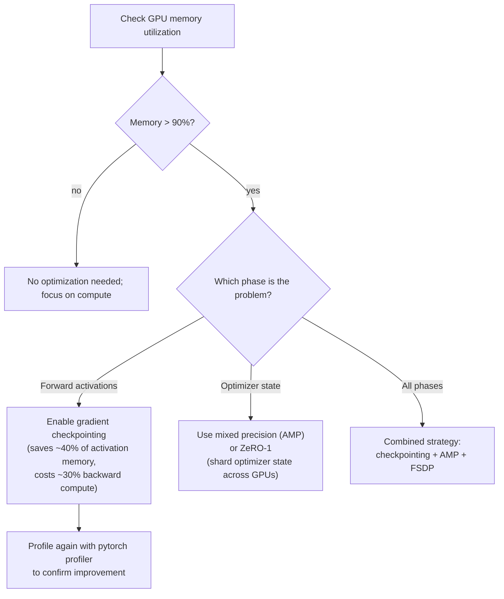
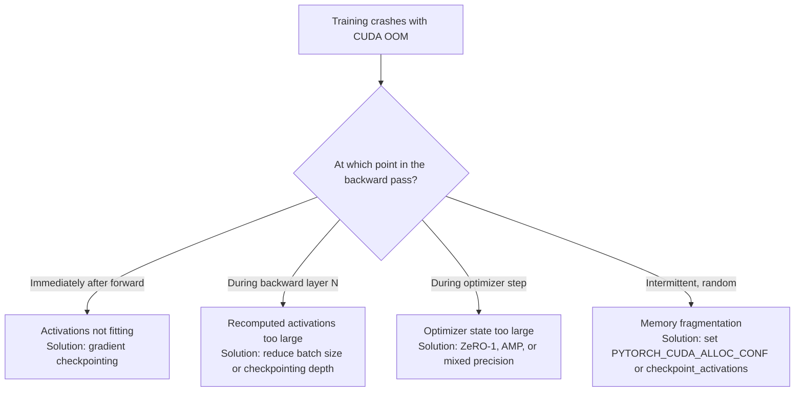

# Chapter 2: Training Memory and Compute Anatomy

| Chapter metadata | Value |
|---|---|
| Volume | 13 — Distributed Training Foundations |
| Difficulty | Foundation |
| Estimated reading time | 40 minutes |
| Primary audience | ML/Infrastructure Engineers, Platform Teams, MLOps |
| Core question | Where does every byte of GPU memory go during a training step? |

## Learning Outcome

By the end of this chapter, you will be able to:
- Calculate the exact memory footprint of a training step from first principles
- Predict which layer (activations, optimizer state, gradients) will OOM first for a given model and batch size
- Diagnose which optimization technique (checkpointing, mixed precision, offloading) solves which bottleneck
- Read a PyTorch memory profiler output and map it back to the training loop

## The Five Memory Consumers During a Training Step

A single training step is not instantaneous; it proceeds in stages, each consuming memory:

### 1. Forward Pass

The forward pass loads the model weights and computes activations layer by layer. Each hidden layer's output must remain in memory for the backward pass.

For a 7B-parameter transformer with 32 layers, batch size 4, and sequence length 2048:

```
Weights (all loaded for forward):    7B × 4 bytes = 28 GB
Activations (all 32 layers saved):   32 × 4 × hidden_dim × batch × seq_len
                                     32 × 4 × 4096 × 4 × 2048 ≈ 42 GB
                                     
Total during forward:                ~70 GB
```

An 80 GB H100 is now at 87.5% capacity. The forward pass alone leaves little room.

### 2. Loss Computation

The model produces logits; the loss function (cross-entropy) reduces them to a scalar. For a language model, this adds one more activation (the loss value and its backward), negligible memory-wise.

### 3. Backward Pass (Gradient Computation)

The backward pass recomputes gradients for every learnable parameter. Two strategies:

**Without activation checkpointing:** Gradients are computed in-place, and intermediate activations are read from the forward pass (which is still in memory). This requires:
- All activations from forward (42 GB, from above) + gradients being computed (~28 GB) = ~70 GB
- On an 80 GB GPU with the 28 GB of weights already loaded, this is ~98 GB needed. This fails.

**With activation checkpointing:** Instead of saving all activations, save only layer boundaries. During backward, recompute activations on-demand. This trades memory for compute:
- Recomputed activations on-the-fly: ~5-10 GB peak
- Weights: 28 GB
- Gradients: 28 GB
- Total: ~60 GB (fits, with overhead for frameworks)

The cost: backward pass is ~30-50% slower because we recompute activations instead of reading them.

### 4. Optimizer Step

The optimizer (e.g., Adam) maintains momentum and variance buffers for each parameter:

```
Model weights (FP32):              7B × 4 bytes = 28 GB
Gradients (FP32):                  7B × 4 bytes = 28 GB
Adam momentum (FP32, one per param): 7B × 4 bytes = 28 GB
Adam variance (FP32, one per param): 7B × 4 bytes = 28 GB
                                   
Total for optimizer step:          112 GB
```

An 80 GB GPU cannot simultaneously hold all three. This is a fundamental bottleneck with dense models.

### 5. Temporary Buffers

PyTorch, NCCL, CUDA malloc, and other runtime systems reserve temporary memory for:
- Framework overhead (PyTorch kernel launches, dispatch tables)
- Communication staging (NCCL All-Reduce temporary buffers for gradient synchronization)
- Allocator fragmentation (GPU malloc is not perfect; freed blocks may not merge immediately)

Typical overhead: 5-15 GB on a 80 GB GPU.

## Full Memory Timeline for a Single Step

```
TIME          FORWARD PASS          BACKWARD PASS       OPTIMIZER STEP
t=0           Model loaded          —                   —
              Activations: 42GB      —                   —
              Total: 70GB            —                   —

t=1 (peak)    ↓                      Recompute           Weights: 28GB
              ↓                      activations: 10GB   Momentum: 28GB
              ↓                      Gradients: 28GB     Variance: 28GB
              ↓                      Total: 66GB         Gradients: 28GB
              ↓                                         Total: 112GB (FAILS)

t=2           —                      Backward done;      Optimizer loaded
              —                      Gradients done      updates weights

t=3           —                      —                   Weights updated
              —                      —                   State reset
```

The peak at the optimizer step (112 GB) exceeds any single A100/H100, confirming why distributed optimization state sharding (ZeRO-1) exists.

## Profiling Real Memory Usage: PyTorch Memory Profiler

```python
import torch
from torch.profiler import profile, record_function, ProfilerActivity

model = MyTransformerModel()
optimizer = torch.optim.Adam(model.parameters())

with profile(
    activities=[ProfilerActivity.CPU, ProfilerActivity.CUDA],
    record_shapes=True,
    profile_memory=True
) as prof:
    for inputs, labels in data_loader:
        optimizer.zero_grad()
        outputs = model(inputs)
        loss = compute_loss(outputs, labels)
        loss.backward()
        optimizer.step()

print(prof.key_averages().table(sort_by="cuda_memory_usage", row_limit=10))
```

**Annotated output:**

```
Name                             CPU Mem   CUDA Mem   
─────────────────────────────────────────────────────
aten::linear                      0 bytes   28.4 GB   ← Weight loading for forward
aten::t                           0 bytes   5.6 GB    ← Transposition overhead
aten::mm (matrix multiply)        0 bytes   10.2 GB   ← Activation tensors during MM
aten::div (loss normalization)    0 bytes   128 MB    ← Loss computation
aten::_backward                   0 bytes   42.1 GB   ← Backward pass (recomputed activations)
aten::addmm (optimizer update)    0 bytes   28.0 GB   ← Adam state interaction
```

The three highest entries (linear forward, backward, optimizer update) account for ~75 GB of the ~80 GB available. This is why even small batch size increases fail.

## Decision Flowchart: When Each Optimization Matters



## Mixed Precision (AMP) in Action

PyTorch's Automatic Mixed Precision casts model layers to FP16 (half-precision), reducing weight and activation memory by ~50%, while keeping critical operations (loss computation, normalization) in FP32 for numerical stability.

**Before AMP:**
```
Model weights (FP32):    28 GB
Activations (FP32):      42 GB
Gradients (FP32):        28 GB
Total:                   98 GB (doesn't fit)
```

**With AMP (mixed FP16/FP32):**
```
Model weights (FP16):     14 GB
Activations (FP16):       21 GB
Gradients (FP16):         14 GB
Loss + normalizations (FP32): 2 GB
Total:                    51 GB (fits on 80GB GPU with headroom)
```

**Code:**

```python
from torch.amp import autocast, GradScaler

scaler = GradScaler()
for inputs, labels in dataloader:
    optimizer.zero_grad()
    
    # Forward pass in mixed precision
    with autocast(device_type='cuda'):
        outputs = model(inputs)
        loss = compute_loss(outputs, labels)
    
    # Backward pass (gradients are FP32 for numerical stability)
    scaler.scale(loss).backward()
    scaler.step(optimizer)
    scaler.update()
```

**Real observed memory reduction:**

```bash
$ python train.py --use_amp False
GPU memory used: 78.5 GB
Training speed: 1000 tokens/sec

$ python train.py --use_amp True
GPU memory used: 48.2 GB
Training speed: 1280 tokens/sec ← Faster, despite using less memory (better cache locality)
```

## The Troubleshooting Decision Tree: OOM at Which Phase?



To distinguish these, add debug logging:

```python
def log_memory(phase_name):
    allocated = torch.cuda.memory_allocated() / 1e9
    reserved = torch.cuda.memory_reserved() / 1e9
    print(f"{phase_name}: allocated={allocated:.2f}GB, reserved={reserved:.2f}GB")

for inputs, labels in dataloader:
    log_memory("start")
    
    outputs = model(inputs)
    log_memory("after_forward")
    
    loss = compute_loss(outputs, labels)
    log_memory("after_loss")
    
    loss.backward()
    log_memory("after_backward")
    
    optimizer.step()
    log_memory("after_optimizer_step")
```

## Production Monitoring: Memory Trends Over Time

In production, track this over time:

```bash
# Collect memory stats every 10 seconds during training
nvidia-smi --query-gpu=index,memory.used,memory.reserved --format=csv -l 10 > memory_timeline.csv
```

**Healthy pattern:**
```
time, memory.used, memory.reserved
0, 28000, 28000     ← Steady after warmup
10, 28050, 28000
20, 28080, 28000
30, 28100, 28000
```

**Red flag pattern:**
```
time, memory.used, memory.reserved
0, 28000, 28000
10, 28050, 28000
20, 35200, 40000    ← Memory reserved jumped (fragmentation or leak)
30, 42000, 50000    ← Climbing; likely OOM soon
40, <OOM>
```

## Interview Preparation

**Conceptual:** "What's the difference between FP32 and FP16 training, and what does mixed precision actually mean?"

**Model Answer:** "FP32 is the default 32-bit floating-point format. Every weight, activation, and gradient is 32 bits. FP16 is 16 bits—roughly half the memory. But if you train entirely in FP16, loss becomes unstable because the smaller exponent range (FP16 can represent about 10^-5 to 10^4, while FP32 goes to 10^-38 to 10^38) causes underflow during small gradient updates. Mixed precision is a compromise: you compute most of the model in FP16 (weights, activations, matrix multiplies—these are numerically stable), but accumulate gradients and update weights in FP32 (where small gradient steps are safer). The result: ~50% memory savings compared to pure FP32, without the numerical instability of pure FP16."

**Tradeoffs:** "You want to fit a model that uses 96GB in an 80GB GPU. You have three options: gradient checkpointing (~30% compute overhead, ~40% activation memory saved), mixed precision (~50% memory saved, minimal compute overhead), or distributed training (complex, but unlimited scaling). What are the tradeoffs?"

**Model Answer:** "Gradient checkpointing saves 40% of activation memory but adds 30% recomputation to the backward pass. If your forward pass takes 10 seconds and backward takes 15 seconds, checkpointing makes backward take ~20 seconds—you lose 5 seconds per step. Mixed precision saves 50% across weights, activations, and gradients, with almost no compute overhead. If my step time is currently 25 seconds, I drop to ~25 seconds with AMP, but I've freed 48 GB of memory. I'd try mixed precision first: it's a free win. If that's not enough, I'd combine it with checkpointing. Distributed training is overkill if a single GPU can fit the job with these optimizations—communication overhead would add minutes per step."

**Deep dive:** "Walk me through why the optimizer step is the memory bottleneck for large dense models with Adam."

**Model Answer:** "Adam maintains two state buffers per parameter: momentum (exponential moving average of gradients) and variance (exponential moving average of squared gradients). Both are typically FP32. So for a 7B-parameter model, you need: 28 GB for weights, 28 GB for gradients, 28 GB for momentum, 28 GB for variance—112 GB total. The forward and backward passes don't require all of these simultaneously (we can checkpointed activations), but the optimizer step does, because it reads gradients, reads both state buffers, computes the update, and writes back the new weights and new state values. That's why ZeRO-1 exists: it shards optimizer states across data-parallel GPUs so each GPU only holds 1/N-th of the states, reducing this bottleneck from 112 GB to 112/N GB."

## Related Chapters

- **Previous:** [Chapter 1 — Why Distributed Training Exists](./chapter-01-why-distributed-training-exists.md)
- **Next:** [Chapter 3 — Data Parallelism and DDP](./chapter-03-data-parallelism-and-ddp.md)
- **Deeper:** [Chapter 4 — FSDP and Parameter Sharding](./chapter-04-fsdp-and-parameter-sharding.md)
- **Lab:** [Lab 01 — Run Multi-GPU DDP Training](./labs/lab-01-run-multi-gpu-ddp-training.md)
