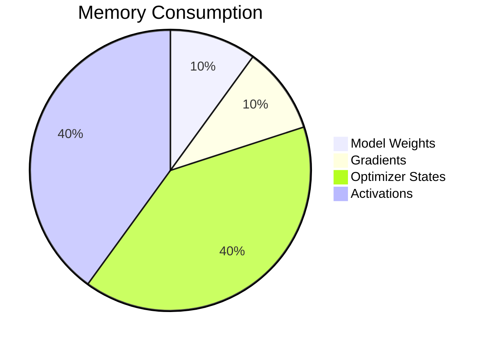

# Chapter 2: Training Memory and Compute Anatomy

## WHY
To effectively distribute a model, one must first precisely understand where every byte of memory and every FLOP of compute is spent.

## WHAT
Anatomy of a training step: Forward pass, backward pass, optimizer step.

## HOW
Memory is consumed by:
1. Weights
2. Optimizer States
3. Gradients
4. Activations
5. Temporary Buffers

## WHEN
Use profiling tools when memory usage hits >90% of VRAM to identify what can be offloaded, recomputed, or sharded.

## TRADEOFFS
| Technique | Memory Savings | Compute Overhead |
|---|---|---|
| Activation Checkpointing | High | ~30% Extra Compute |
| CPU Offload | High | High Latency |

## PRODUCTION
Implement mixed precision (AMP) and operator fusion (e.g., FlashAttention) to optimize the memory/compute ratio.

## TROUBLESHOOTING
**Failure Scenario 1: Activation OOM**
- **Log:** `RuntimeError: CUDA out of memory` during backward pass.
- **Fix:** Implement gradient checkpointing.
  ```python
  model.gradient_checkpointing_enable()
  ```

**Failure Scenario 2: GPU Idle during DataLoader**
- **Log:** Low GPU Volatile GPU-Util.
- **Fix:** Increase `num_workers` in DataLoader or use NVIDIA DALI.
  ```python
  dataloader = DataLoader(dataset, batch_size=64, num_workers=8, pin_memory=True)
  ```

## Senior Interview Questions
**Q:** Why does Adam optimizer use so much memory compared to SGD?
**A:** Adam maintains two additional state variables per parameter (moving average of gradient and moving average of squared gradient), usually in FP32, which quadruples the memory required for the optimizer states compared to standard SGD.


