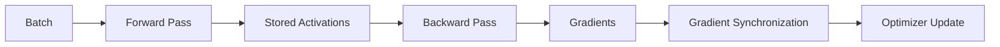

# Training Memory and Compute Anatomy

A training job consumes more memory than model weights. Production sizing must account for every persistent and transient component.

## Memory Components

| Component | Behavior |
|---|---|
| Parameters | Model-size dependent |
| Gradients | Usually similar scale to parameters |
| Optimizer state | Can exceed parameter memory significantly |
| Activations | Depends on batch, sequence, layers, and checkpointing |
| Temporary workspace | Kernel and framework dependent |
| Communication buffers | Parallelism and collective dependent |

## Training Step

## Memory Reduction Techniques

Reduced precision, activation checkpointing, gradient accumulation, parameter sharding, optimizer sharding, offload, and sequence or tensor parallelism reduce different components. Each introduces compute, communication, or operational trade-offs.

## Troubleshooting

**Symptom:** OOM occurs only during backward pass.

**Diagnosis:** inspect activation retention, gradient buffers, optimizer state, bucket sizes, and peak allocator behavior.

**Root cause:** sizing used static parameter memory rather than peak training memory.
