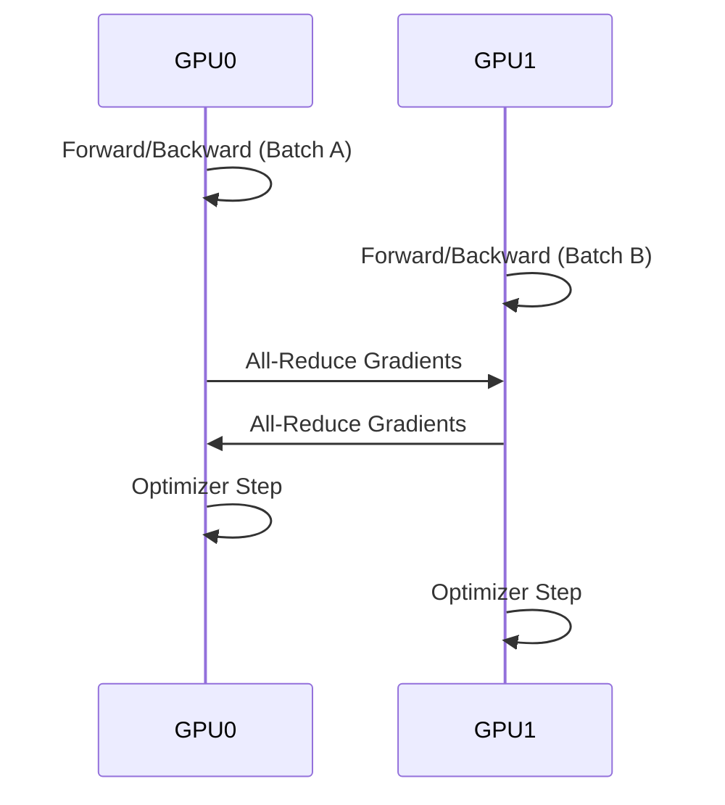

# Chapter 3: Data Parallelism and DDP

## WHY
When the model fits on a single GPU but training on a single GPU takes too long, Data Parallelism (DP) scales compute by processing different mini-batches simultaneously.

## WHAT
DistributedDataParallel (DDP) is PyTorch's optimized solution for data parallelism, operating at the multi-process level rather than DP's multi-thread level.

## HOW
Each GPU has a replica of the model. The dataset is sharded using `DistributedSampler`. During the backward pass, gradients are synchronized across all GPUs using an All-Reduce operation via NCCL.

## WHEN
Use DDP whenever your model fits comfortably in the VRAM of a single GPU and you have multiple GPUs available.

## TRADEOFFS
| Feature | DP | DDP |
|---|---|---|
| Overhead | High (GIL, Scatter/Gather) | Low (Multi-process, All-Reduce) |
| Speed | Slow | Fast |
| Usability | 1 Line of Code | Requires process group setup |

## PRODUCTION
In production, use `torchrun` to launch DDP scripts. Ensure `NCCL_DEBUG=WARN` is set to catch network issues early.

## TROUBLESHOOTING
**Failure Scenario 1: Deadlock during All-Reduce**
- **Log:** Process hangs indefinitely without crashing.
- **Command:** `kill -USR1 <pid>` to dump stack traces.
- **Fix:** Ensure all processes execute the same number of forward/backward passes. Check for conditional execution involving tensors.
  ```bash
  export TORCH_DISTRIBUTED_DEBUG=DETAIL
  ```

**Failure Scenario 2: Unused Parameters Crash**
- **Log:** `RuntimeError: Expected to have finished reduction in the prior iteration before starting a new one.`
- **Fix:** Set `find_unused_parameters=True` in DDP wrapper, or optimally, rewrite the forward pass to use all parameters.
  ```python
  model = DistributedDataParallel(model, device_ids=[local_rank], find_unused_parameters=True)
  ```

## Senior Interview Questions
**Q:** Explain the Ring All-Reduce algorithm used by NCCL in DDP.
**A:** Ring All-Reduce breaks the synchronization into a Scatter-Reduce phase and an All-Gather phase. Each GPU sends chunks of gradients to its right neighbor and receives from its left, taking $2(N-1)$ steps. This makes bandwidth utilization optimal and independent of the number of GPUs $N$.


