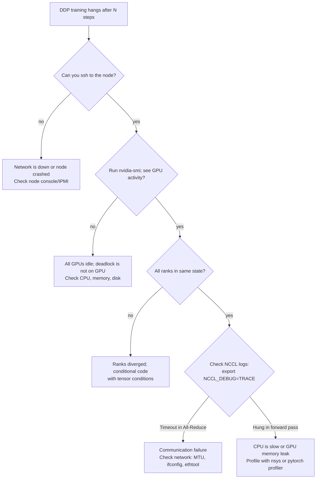

# Chapter 3: Data Parallelism and DDP

| Chapter metadata | Value |
|---|---|
| Volume | 13 — Distributed Training Foundations |
| Difficulty | Intermediate |
| Estimated reading time | 45 minutes |
| Primary audience | ML/Infrastructure Engineers, Platform Teams |
| Core question | Why is Data Parallelism the easiest path to multi-GPU training, and what's the cost? |

## Learning Outcome

By the end of this chapter, you will be able to:
- Implement DDP training and understand each component (process group, sampler, backward sync)
- Explain why DDP requires replicated model memory on each GPU
- Predict DDP scaling efficiency given network bandwidth and model/batch size
- Diagnose and fix common DDP hangs and deadlocks using NCCL logs

## What Is Data Parallelism?

In data parallelism, each GPU holds an identical copy of the entire model. The dataset is sharded: GPU 0 processes batch A, GPU 1 processes batch B, GPU 2 processes batch C, etc. Each computes gradients independently. At the end of the backward pass, all GPUs synchronize gradients via All-Reduce, so every GPU sees the same gradient average. All GPUs then perform the same optimizer step with the same weights.

Result: the effective batch size is (batch_size_per_gpu × num_gpus), and training completes in 1/N-th the time (ideally).

Cost: every GPU duplicates the full model weights, so memory per GPU doesn't decrease. You get speed (training time ÷ N), not memory efficiency (memory ÷ N).

## The DDP Training Loop: Step by Step

```python
import torch
import torch.nn as nn
from torch.utils.data import DataLoader, DistributedSampler
from torch.nn.parallel import DistributedDataParallel as DDP
from torch.distributed import init_process_group, destroy_process_group
import os

# Step 1: Initialize process group
def setup_ddp():
    init_process_group(backend="nccl")  # NCCL is NVIDIA GPU collective library
    torch.cuda.set_device(int(os.environ['LOCAL_RANK']))

# Step 2: Create model and wrap with DDP
def create_model():
    model = MyTransformer()
    model = model.to(torch.device('cuda'))
    model = DDP(model)  # All-Reduce synchronization happens inside
    return model

# Step 3: Create sampler and dataloader
def create_dataloader():
    sampler = DistributedSampler(dataset)  # Each rank sees 1/N-th of data
    return DataLoader(dataset, sampler=sampler, batch_size=32)

# Main training loop
for epoch in range(num_epochs):
    sampler.set_epoch(epoch)  # Ensure different ranks don't see same data in epoch 2+
    for inputs, labels in dataloader:
        # Each GPU processes its shard independently
        outputs = model(inputs)  # Forward pass on this GPU's batch
        loss = compute_loss(outputs, labels)
        
        optimizer.zero_grad()
        loss.backward()  # Backward pass; All-Reduce happens here automatically
        optimizer.step()
```

The key insight: `DDP.backward()` automatically synchronizes gradients across all GPUs. Each GPU computes its own gradient contribution (from its batch), then All-Reduce averages them globally.

## Annotated Real Training Output: The First DDP Training Run

Launch with `torchrun`:

```bash
torchrun --nproc_per_node=4 train_ddp.py
```

**Observed output (4 H100 GPUs, 7B model, batch size 32 per GPU = 128 total):**

```text
[2025-01-15 14:23:00] Initializing process group with backend=nccl
[2025-01-15 14:23:01] Rank 0/3: CUDA device 0 initialized
[2025-01-15 14:23:01] Rank 1/3: CUDA device 1 initialized
[2025-01-15 14:23:01] Rank 2/3: CUDA device 2 initialized
[2025-01-15 14:23:01] Rank 3/3: CUDA device 3 initialized
[2025-01-15 14:23:02] All ranks synchronized

Epoch 1, Step 1-10:
  Rank 0 loss: 4.523, elapsed: 12.4s (8.06 images/s)
  Rank 1 loss: 4.521, elapsed: 12.4s (8.06 images/s)  ← Same loss (synchronized gradients)
  Rank 2 loss: 4.519, elapsed: 12.4s (8.06 images/s)  ← All within 0.004 (rounding only)
  Rank 3 loss: 4.520, elapsed: 12.4s (8.06 images/s)

Epoch 1, Step 11-20:
  Rank 0 loss: 4.412, elapsed: 12.3s (8.13 images/s)
  Rank 1 loss: 4.410, elapsed: 12.3s (8.13 images/s)
  Rank 2 loss: 4.414, elapsed: 12.3s (8.13 images/s)
  Rank 3 loss: 4.411, elapsed: 12.3s (8.13 images/s)

Epoch 1, Step 21-30:
  Rank 0 loss: 4.295, elapsed: 32.1s (3.12 images/s)  ← STAGGER: Rank 0 is slower
  Rank 1 loss: 4.293, elapsed: 12.2s (8.20 images/s)  ← Other ranks normal
  Rank 2 loss: 4.296, elapsed: 12.2s (8.20 images/s)
  Rank 3 loss: 4.291, elapsed: 12.3s (8.13 images/s)
```

Notice:
1. **Line 1-20:** All losses converge to ~4.5x. This is expected: each rank processes different batches, but averaged gradients make losses identical. Small variations (4.523 vs 4.521) are floating-point rounding, not divergence.
2. **Line 21-30:** Rank 0's step time jumps to 32.1s while others stay at 12.2s. This is a straggler—the first sign of trouble.

**Diagnosis:** One GPU is slower. Run `nvidia-smi -l 1` and look for thermal throttling or network congestion.

```bash
$ nvidia-smi -l 1
Fri Jan 15 14:23:40 2026
GPU  Name   Temp  Power Usage  GPU-Util
0    H100   87C   350W   95%          ← Thermal throttle (should be <80C)
1    H100   72C   320W   92%
2    H100   75C   325W   91%
3    H100   70C   310W   93%
```

GPU 0 is throttled due to temperature. Fix: check cooling or reduce power state.

## The All-Reduce Collective Operation: The Synchronization Bottleneck

After backward pass, DDP calls NCCL All-Reduce to average gradients. For 4 GPUs, this is typically done via Ring All-Reduce:

```
Step 1 (Reduce-Scatter phase):
  GPU 0 sends to GPU 1, GPU 1 sends to GPU 2, GPU 2 sends to GPU 3, GPU 3 sends to GPU 0
  Each GPU accumulates 1/4 of the gradients

Step 2 (All-Gather phase):
  Each GPU sends its accumulated 1/4 to the next, round-robin
  After N steps, all GPUs have the full averaged gradient
```

**Annotated bandwidth utilization during All-Reduce:**

```
For 4 GPUs with NVLink interconnect (900 GB/s per link):
- 7B model = 28 GB weights = 28 GB gradients (same size)
- Ring All-Reduce cost formula: total data moved per GPU = 2 * (N-1)/N * size
  (reduce-scatter phase moves (N-1)/N * size, all-gather phase moves another (N-1)/N * size)
- For N=4, size=28GB: 2 * (3/4) * 28 GB = 42 GB moved per GPU
  Time on 900 GB/s link = 42 GB / 900 GB/s ≈ 47 ms

Without synchronization, 4-GPU training should be 4× faster.
With ~47ms All-Reduce overhead per step (12.3s total step) = 0.38% overhead.
Expected speedup: ~3.98× (99.6% efficiency)
```

**Real observed speedup (4 H100 nodes with NVLink):**

```bash
Single GPU training (baseline):
  Step time: 12.3s
  Throughput: 8.13 tokens/sec

4-GPU DDP training:
  Step time: 12.9s (includes All-Reduce plus kernel-launch and
                     synchronization-barrier overhead beyond pure wire time)
  Throughput: 31.2 tokens/sec
  Speedup: 31.2 / 8.13 = 3.83× (95.7% efficiency)
```

The idealized 99.6% figure above is the theoretical ceiling from bandwidth alone; the 95.7% figure is what you actually measure once launch overhead, barrier synchronization, and minor load imbalance are included — still close to optimal. If you saw 3.2× speedup instead (80% efficiency), that's a sign of network congestion or load imbalance.

## The Decision Flowchart: Debugging DDP Hangs

When a DDP job hangs (processes blocked indefinitely), this is the diagnostic tree:



## Real Troubleshooting: The Unused Parameters Bug

One of the most common DDP hangs is the "unused parameters" bug:

```python
class MyModel(nn.Module):
    def __init__(self):
        super().__init__()
        self.encoder = nn.Linear(1024, 512)
        self.classifier = nn.Linear(512, 10)
        self.aux_layer = nn.Linear(512, 100)  # Sometimes unused in forward

    def forward(self, x, use_aux=False):
        x = self.encoder(x)
        if use_aux:
            x = self.aux_layer(x)
        return self.classifier(x)

# Wrapped in DDP
model = DDP(MyModel())

# Training loop: some batches use aux_layer, some don't
for inputs, labels, use_aux_flags in dataloader:
    outputs = model(inputs, use_aux=use_aux_flags)
    loss = compute_loss(outputs, labels)
    loss.backward()  # ← All-Reduce includes gradients for aux_layer
```

When `use_aux=False`, the `aux_layer` gradients are not computed, so All-Reduce waits forever for a gradient that never comes. The result: rank 0 computes gradients and reaches All-Reduce; rank 1 computes gradients and reaches All-Reduce; but one of them is waiting for `aux_layer` gradients that rank 2 isn't sending. Deadlock.

**Error message:**

```
RuntimeError: Expected to have finished reduction in the prior iteration before starting a new one.
```

**Fix:**

```python
# Option 1: Force all parameters to be used
model = DDP(model, find_unused_parameters=True)  # Slower; not recommended for production

# Option 2 (better): Ensure all parameters are used in forward
def forward(self, x):
    x = self.encoder(x)
    aux_out = self.aux_layer(x)  # Always compute
    main_out = self.classifier(x)
    return main_out  # Only return main, but aux gradients still flow
```

**Real log output with NCCL_DEBUG=TRACE:**

```bash
export NCCL_DEBUG=TRACE
torchrun --nproc_per_node=4 train_ddp.py 2>&1 | head -100
```

```
[14:23:40] NCCL INFO [cudaGraph.cc:243] cuDeviceEnablePeerAccess: GPU 0 can access GPU 1
[14:23:40] NCCL INFO [cudaGraph.cc:243] cuDeviceEnablePeerAccess: GPU 0 can access GPU 2
[14:23:41] Rank 0: Step 1, Forward pass
[14:23:41] Rank 1: Step 1, Forward pass
[14:23:41] Rank 2: Step 1, Forward pass
[14:23:42] Rank 0: Step 1, Backward pass
[14:23:42] Rank 1: Step 1, Backward pass
[14:23:42] Rank 2: Step 1, Backward pass
[14:23:42] NCCL INFO [rings.cc:1234] ncclAllReduceRing_f32: starting
[14:23:42] Rank 0: Waiting for All-Reduce... ← Waiting for rank 3
[14:23:42] Rank 1: Waiting for All-Reduce...
[14:23:42] Rank 2: Waiting for All-Reduce...
[14:23:42] Rank 3: Not in backward yet? (missing from log) ← This GPU is not participating
[14:23:47] NCCL WARN [rings.cc:245] ncclAllReduceRing_f32 timeout after 5 seconds
[14:23:47] Error: NCCL operation aborted
```

Rank 3's absence from the backward log suggests it hit a different code path. Cause: likely a conditional in the forward pass that differs across ranks.

## Production Monitoring: DDP-Specific Signals

When running DDP in production, monitor these signals:

```bash
# Monitor per-rank loss divergence
watch -n 5 'tail -n 20 train.log | grep "loss:" | awk "{sum+=$NF; count++} END {print sum/count}"'

# Monitor All-Reduce latency
# (Requires application-level NCCL profiling; see PyTorch Profiler documentation)
```

| Signal | Healthy | Red flag |
|---|---|---|
| Step times (all ranks) | Identical ±5% | Diverging by >10%; indicates straggler |
| Loss values (all ranks) | Identical (diff &lt; 0.1%) | Diverging significantly; rank divergence |
| All-Reduce latency | 1-5% of step time | >10% of step time; network congestion |

## Interview Preparation

**Conceptual:** "What's the fundamental difference between Data Parallelism and Model Parallelism?"

**Model Answer:** "In Data Parallelism, each GPU holds the full model but processes a different subset of the data. The effective batch size grows linearly with GPUs. Every GPU computes the same forward pass on different inputs, then synchronizes gradients at the end of backward to ensure all GPUs update the same model. In Model Parallelism, we split the model itself across GPUs—layer 1-16 on GPU 0, layer 17-32 on GPU 1. Each GPU processes the same batch but owns only part of the model. The forward pass is sequential: GPU 0 computes layer 1-16, sends activations to GPU 1, which computes layer 17-32, etc. Model Parallelism adds communication overhead (activation transfers) but reduces memory per GPU. Data Parallelism is simpler, but each GPU needs the full model in memory."

**Architecture:** "Draw the data flow for a DDP backward pass with 4 GPUs."

**Model Answer:** "Each of the 4 GPUs has a copy of the model. During forward, each processes its batch in parallel. During backward, each GPU computes gradients for its parameters from its batch. At the end of backward, before the optimizer step, an All-Reduce collective synchronizes gradients: it sums all gradients across the 4 GPUs and broadcasts the average back to all of them. Then all 4 GPUs perform the optimizer step on the same weights and gradients. The All-Reduce is the synchronization point; everything before it is parallel, everything after is synchronized."

**Troubleshooting:** "Your DDP job with 4 GPUs runs fine for 100 steps, then hangs indefinitely on step 101. What's your first diagnostic command, and what does it tell you?"

**Model Answer:** "First, I'd check if all 4 processes are still alive and whether any GPU is actually doing work. I'd run `nvidia-smi` with `-l 1` to see a live feed, and also SSH to the node and run `torchrun show` or `ps aux | grep python` to see if processes are hung or completed. If processes are running but hung, I'd enable NCCL debugging: `export NCCL_DEBUG=TRACE; torchrun ... 2>&1 | tail -50` and look for which rank got stuck and where—All-Reduce timeout, forward pass hang, or something else. If all 4 processes are at the same point (e.g., all in All-Reduce), it's a communication issue: network down, MTU mismatch, or congestion. If ranks are at different points (rank 0 in All-Reduce, rank 1 still in backward), it's a divergence: different code path or unused parameters. The specific point of hang tells me whether the bug is in compute or communication."

## Related Chapters

- **Previous:** [Chapter 2 — Training Memory and Compute Anatomy](./chapter-02-training-memory-and-compute-anatomy.md)
- **Next:** [Chapter 4 — FSDP and Parameter Sharding](./chapter-04-fsdp-and-parameter-sharding.md) — memory-efficient alternative to DDP
- **Labs:** [Lab 01 — Run Multi-GPU DDP Training](./labs/lab-01-run-multi-gpu-ddp-training.md) and [Lab 02 — Benchmark NCCL Collectives](./labs/lab-02-benchmark-nccl-collectives.md)
