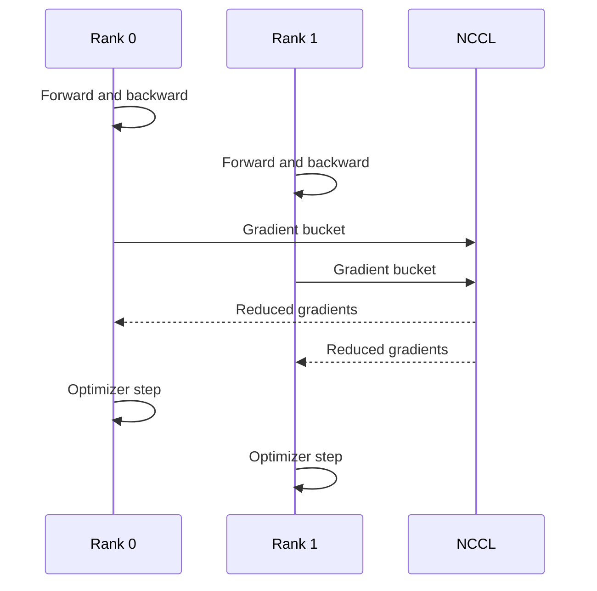

# Data Parallelism and DDP

Data parallelism places a model replica on each rank, gives each rank different input data, and synchronizes gradients so replicas remain consistent.

## Sequence

## Why DDP Works

Each GPU performs useful compute on a local batch. Collective communication combines gradients. Overlapping gradient reduction with backward computation can hide part of the communication cost.

## Limits

Every rank stores a full model and optimizer state. DDP therefore improves throughput but does not solve models that cannot fit on one rank.

## Production Concerns

- identical software and model state across ranks;
- deterministic rank and device mapping;
- distributed sampler correctness;
- one slow rank delaying all others;
- collective timeout and failure behavior.

## Troubleshooting

A hang after several steps often indicates a rank divergence: one process exited, skipped a collective, hit different control flow, or lost network connectivity.
