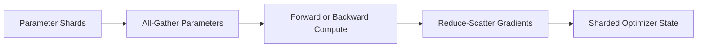

# FSDP and Parameter Sharding

FSDP reduces per-rank memory by sharding training state and materializing parameters when needed.

## Conceptual Flow

## Trade-off

Sharding makes larger models possible but increases communication and lifecycle complexity. Wrapping policy, prefetching, mixed precision, CPU offload, and state-dict strategy all influence memory and performance.

## Checkpointing

A distributed checkpoint must preserve enough metadata to reconstruct sharded state. Consolidating all state on one rank may become a memory and time bottleneck.

## Troubleshooting

**Symptom:** the model fits with FSDP but trains slower than DDP.

**Diagnosis:** inspect all-gather and reduce-scatter time, wrapping granularity, communication overlap, CPU offload, and small shard inefficiency.

**Root cause:** memory savings were achieved at excessive communication cost.
