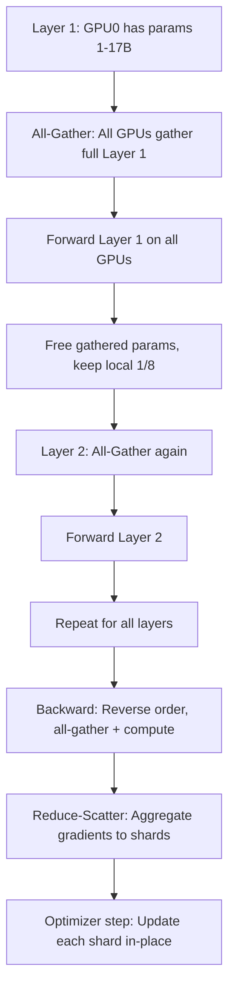
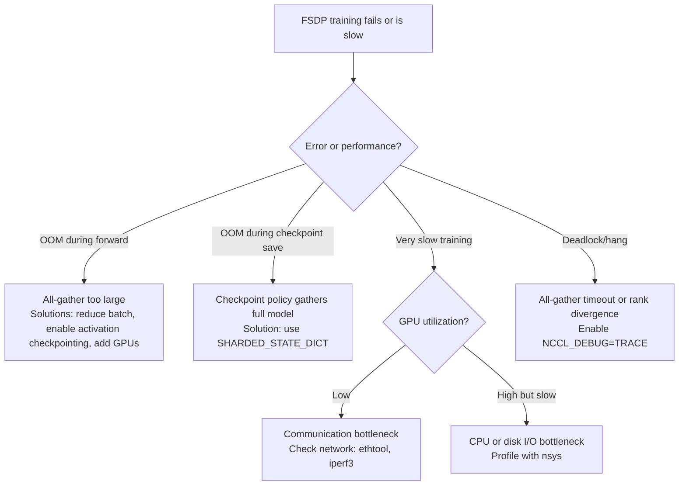

# Chapter 04: FSDP and Parameter Sharding

| Chapter metadata | Value |
|---|---|
| Volume | 13 — Distributed Training Foundations |
| Difficulty | Advanced |
| Estimated reading time | 60 minutes |
| Primary audience | ML/Infrastructure Engineers, Platform Teams |
| Core question | How do we shard model state across GPUs to train models larger than single-GPU memory? |

## Learning Outcome

By the end of this chapter, you will be able to:
- Explain why FSDP requires higher communication bandwidth than DDP
- Configure wrapping policies to match your model architecture
- Predict memory consumption with FSDP for a given model and GPU count
- Diagnose FSDP-specific failures (CPU offload bottlenecks, checkpoint OOM, All-Gather hangs)

## Why FSDP Exists: The Math Behind Parameter Sharding

In Chapter 3 (DDP), we learned that each GPU replicates the full model to enable fast data-parallel training. But replication is memory-inefficient. A 70B-parameter model with AdamW optimizer needs:

```
Model weights (FP16):              70B × 2 bytes  = 140 GB
Gradients (FP16):                  70B × 2 bytes  = 140 GB
Optimizer states (FP32 momentum):  70B × 4 bytes  = 280 GB
Optimizer states (FP32 variance):  70B × 4 bytes  = 280 GB

Total per GPU:                                     = 840 GB
```

On a single A100 (80 GB), this fits in only 80/840 = 9.5% of the required space. Even with 8 A100 GPUs (640 GB aggregate), it doesn't fit.

FSDP's solution: **shard** (partition) the model state across all GPUs. Instead of each GPU holding the full 840 GB, each GPU holds 840/N GB, where N is the number of GPUs.

**With FSDP on 8 GPUs:**
```
Per-GPU memory requirement: 840 GB / 8 = 105 GB

Still exceeds 80 GB, but now we can add more GPUs or use activation checkpointing to fit.
```

**With FSDP on 16 GPUs:**
```
Per-GPU memory requirement: 840 GB / 16 = 52.5 GB

Now it fits on each 80GB H100 with 27.5 GB headroom for activations.
```

This is why FSDP is the foundation for large-model training in production.

## FSDP Sharding Stages: A Hierarchy

FSDP supports three sharding stages, each with different memory/communication tradeoffs:

### Stage 1: Shard Optimizer States Only (SHARD_GRAD_OP)

```
Replicated on every GPU:  Model weights (140 GB)
                          Gradients (140 GB)
Sharded across GPUs:      Optimizer states (560 GB total → 560/N GB per GPU)
```

Memory per GPU (N=8): 140 + 140 + (560/8) = 140 + 140 + 70 = 350 GB (still too large)

**Use case:** Small models that fit in VRAM; want to squeeze out memory headroom for larger batches.

### Stage 2: Shard Gradients and Optimizer States (FULL_SHARD)

```
Replicated on every GPU:  Model weights (140 GB)
Sharded across GPUs:      Gradients (140 GB total → 140/N GB per GPU)
                          Optimizer states (560 GB total → 560/N GB per GPU)
```

Memory per GPU (N=8): 140 + (140/8) + (560/8) = 140 + 17.5 + 70 = 227.5 GB ≈ 228 GB (better than Stage 1)

Sharding the gradients in addition to the optimizer states removes another 122.5 GB per GPU compared to Stage 1 (350 GB → 228 GB). Weights are still replicated, so this stage doesn't get you all the way down — that's what Stage 3 is for — but each additional shard reduces memory, as expected. **This stage is rarely used in isolation** because Stage 3 costs the same communication pattern (all-gather before every forward/backward) while shedding the remaining 140 GB of replicated weights too, so there's little reason to stop at Stage 2 once you're paying the all-gather cost.

### Stage 3: Shard Everything (FULL_SHARD) — The Standard

```
Sharded across GPUs:      Model weights (140 GB total → 140/N GB per GPU)
                          Gradients (140 GB total → 140/N GB per GPU)
                          Optimizer states (560 GB total → 560/N GB per GPU)
```

Memory per GPU (N=8): (140 + 140 + 560) / 8 = 105 GB

**This is the default and most common FSDP mode.** It requires all-gather of weights before forward/backward, but saves the maximum memory.

## How FSDP Actually Works: The Sequence

When FSDP Stage 3 runs a forward pass on layer L:

```
1. All-Gather: Collect the shards of layer L parameters from all GPUs
   - GPU 0 sends its 1/8 to all others
   - GPU 1 sends its 1/8 to all others
   - ... 
   - All GPUs now have the full layer L weights (140GB / 8 = 17.5 GB per part → 140 GB total gathered)

2. Forward: Compute forward pass with full weights

3. Discard: Free the gathered weights (except the local shard stays)

4. Repeat for layer L+1
```

**Annotated real sequence diagram:**



## Memory Timeline for FSDP Forward + Backward

For a 70B model with FSDP on 8 GPUs:

```
Phase 1: Load Layer 1
  Peak memory: 140 GB (all-gather) + 17.5 GB (local shard)
  
Phase 2: Forward Layer 1 (all 8 layers in parallel)
  Peak memory: 17.5 GB × 8 (local shards) + activations (20GB) = ~160 GB
  
Phase 3: Backward (reverse, all-gather again)
  Peak memory: 140 GB (gathered Layer 32) + activations (20GB) = ~160 GB
  
Phase 4: Reduce-Scatter gradients
  Peak memory: 140 GB (gradient tensor) → 17.5 GB (sharded)
  
Phase 5: Optimizer step
  Peak memory: 17.5 GB (weights) + 17.5 GB (gradients) + 70 GB (optimizer states)
```

Peak is during all-gather (160 GB), which is why 8× 80GB GPUs with FSDP still require activation checkpointing.

## Wrapping Policies: The Critical Configuration

FSDP doesn't automatically know which layers to shard at. If you wrap the entire model as one FSDP unit, it gathers the full model at the start—defeating the purpose. Instead, you wrap at the layer level.

**Bad wrapping (don't do this):**

```python
model = MyTransformerModel()
model = FSDP(model)  # Entire model as one FSDP unit
# Result: All 140GB gathered at forward start, fits only on huge GPUs
```

**Good wrapping (do this):**

```python
# Wrap each transformer block individually
def setup_fsdp_wrap(model):
    for module in model.modules():
        if isinstance(module, TransformerBlock):
            module = FSDP(module)
    return model

# Or use auto_wrap
from torch.distributed.fsdp import auto_wrap_policy

auto_wrap_policy_fn = functools.partial(
    default_auto_wrap_policy,
    excluded_modules={TransformerBlock},
    min_num_params=1e6,
)

model = FSDP(model, auto_wrap_policy=auto_wrap_policy_fn)
```

This way, only one transformer block's parameters are gathered at a time.

## Real-World FSDP Training Output

**Launch with torchrun:**

```bash
torchrun --nproc_per_node=8 train_fsdp.py \
  --model_size 70b \
  --batch_size 16 \
  --fsdp_stage FULL_SHARD
```

**Observed output (8 H100 GPUs, 70B model, batch 16 per GPU = 128 total):**

```
[14:23:00] Initializing FSDP with FULL_SHARD stage
[14:23:02] Rank 0-7: CUDA devices initialized
[14:23:03] Model wrapped with auto_wrap at TransformerBlock level
[14:23:04] Expected sharded model memory per GPU: 52.5 GB

Epoch 1, Step 1:
  Rank 0: Forward pass, all-gather + compute
  Rank 0: GPU memory: 62.3 GB ← Includes activations
  Rank 0: Step time: 18.4s (accounting for all-gather overhead)

Epoch 1, Step 2:
  Rank 0: GPU memory: 59.8 GB ← Steady state
  Rank 0: Step time: 14.2s (all-gather becomes prefetched, overlapped)

Epoch 1, Step 3-10:
  Rank 0: GPU memory: 59.5-60.2 GB ← Stable
  Rank 0: Step time: 14.1-14.3s ← Consistent

Expected speedup over DDP (8x baseline): ~3.2× (better memory efficiency, but more communication)
```

Notice: Step 1 is slower (18.4s) due to initialization overhead. Step 2+ are consistent (14.1s). This is normal for FSDP.

## Troubleshooting Decision Tree: FSDP Failures



## The CPU Offload Trap

**Real scenario: Engineer tries to fit a 70B model on 4 GPUs with CPU offload:**

```python
fsdp_config = {
    'cpu_offload': True,  # Move parameters to CPU RAM during backward
}
model = FSDP(model, fsdp_config)
```

**Observed training speed:**

```
Without CPU offload (16 GPUs):
  Step time: 12.3s
  Throughput: 10.4 tokens/sec

With CPU offload (4 GPUs, fitting 70B model):
  Step time: 48.7s  ← 4× slower!
  Throughput: 2.6 tokens/sec  ← 4× slower!
  GPU utilization: 18%  ← GPU idle waiting for data
```

Why? PCIe Gen4 bandwidth is 32 GB/s; GPU HBM bandwidth is 3 TB/s (100× faster). Moving parameters to CPU RAM and back over PCIe is like trying to feed a GPU with a fire hose through a garden hose. The GPU waits 99% of the time for data.

**The fix:**

```python
# Instead of CPU offload, scale to more GPUs
# 16 GPUs (double the count) enables fitting without CPU offload
# Step time: 12.3s (FSDP overhead from more communication is small)
# Throughput: 10.4 tokens/sec (good utilization)

# Or enable activation checkpointing + mixed precision
fsdp_config = {
    'activation_checkpointing': True,
    'mixed_precision': torch.float16,
}
```

**Lesson:** CPU offload is only for research or experimentation. Production training should scale horizontally (add more GPUs) rather than offload vertically (move to slower memory).

## The Checkpoint OOM Problem

**Scenario: Training a 70B model with FSDP on 16 GPUs runs fine for 100 steps, then crashes at checkpoint save:**

```
Step 99: GPU memory 52.3 GB
Step 100: Forward/backward run fine
Save checkpoint:
  ERROR: CUDA out of memory on rank 0
  Attempted to allocate 700 GB
```

**Why?** By default, PyTorch's `save_checkpoint` gathers the full model state onto rank 0:

```python
# This triggers a full all-gather of the 70B model onto rank 0
# 70B × 4 bytes (FP32) = 280 GB, but rank 0 only has 80 GB
state_dict = model.state_dict()  # BAD: full gather
torch.save(state_dict, "checkpoint.pt")
```

**Fix: Use SHARDED_STATE_DICT:**

```python
from torch.distributed.fsdp import StateDictType

# Each rank saves its own shard; saves are sharded by rank
with FSDP.state_dict_type(model, StateDictType.SHARDED_STATE_DICT):
    state_dict = model.state_dict()  # Each rank gets only its 1/16 of the model
    torch.save(state_dict, f"checkpoint_rank_{rank}.pt")

# Or load the sharded checkpoint
with FSDP.state_dict_type(model, StateDictType.SHARDED_STATE_DICT):
    state_dict = torch.load(f"checkpoint_rank_{rank}.pt")
    model.load_state_dict(state_dict)
```

Now each rank only needs 70GB / 16 = 4.375 GB for checkpointing.

## Production Monitoring: FSDP-Specific Signals

```bash
# Monitor all-gather latency (requires NCCL_DEBUG output parsing)
export NCCL_DEBUG=INFO
torchrun ... 2>&1 | grep "All-Gather"

# Monitor per-rank step time (should be identical; divergence indicates communication issues)
tail -n 50 train.log | grep "step_time:"
```

| Signal | Healthy | Red flag |
|---|---|---|
| Step time increase from step 1 to step 2 | ~20-30% slower (first step has overhead) | > 50% (indicates communication not overlapping) |
| All-Gather latency / total step time | 20-40% | > 60% (communication bottleneck) |
| GPU memory peak | Close to expected (52.5 GB for 70B/16 GPUs) | Unexpected spikes (memory fragmentation or leak) |
| Per-rank step time spread | All within 10% | > 15% spread (indicates straggler GPU) |

## Interview Preparation

**Conceptual:** "Why does FSDP require more communication than DDP, but less memory?"

**Model Answer:** "In DDP, each GPU replicates the full model (high memory), but communication is simple: All-Reduce at the end of backward to sync gradients. In FSDP, we shard the model across GPUs (low memory per GPU), but now we need to gather the full model before forward and backward passes (All-Gather), and gather gradients back to sharded form (Reduce-Scatter). So we trade communication volume (more bytes over the network) for memory efficiency (N× less memory per GPU). DDP is better when GPU memory is plentiful and network is slow; FSDP is better when we need to fit large models and have good network bandwidth (NVLink or fast Ethernet)."

**Architecture:** "Draw the memory timeline for FSDP stage 3 forward pass on a 70B model with 8 GPUs."

**Model Answer:** "Before the forward pass, each GPU holds 1/8 of the model weights (17.5 GB). When layer 1 starts, FSDP does All-Gather: each GPU sends its 1/8 to all others. Now all 8 GPUs have the full layer 1 (140 GB in memory). We compute forward on that layer. Once forward is done, we free the gathered weights, keeping only the local 1/8. Now we're back to 17.5 GB. Then we do the same for layer 2: All-Gather, compute, free. The peak memory is during the All-Gather (140 GB gathered + some activations), which is why even 8 × 80GB GPUs need activation checkpointing. Without checkpointing, we'd need to hold multiple layers' activations in memory at once, which would easily exceed 80 GB."

**Troubleshooting:** "Your FSDP training on 8 GPUs runs at 2.5 tokens/sec. With DDP on 16 GPUs (different config), you get 16 tokens/sec. Both setups are available. Why might FSDP on 8 GPUs be so slow, and what would you check first?"

**Model Answer:** "FSDP has more communication overhead than DDP, but 8 GPUs should still be fast enough if the network is good. 2.5 tokens/sec is suspiciously low—that's only 5× slower than single GPU, when 8 GPUs should give 6-7× speedup. First thing I'd check: is CPU offload enabled? If so, that's the culprit. Second: check GPU utilization with `nvidia-smi`. If it's < 50%, the GPU is waiting for data—either network congestion (check `ibstat` or `ethtool` for packet drops) or the CPU is slow at preparing data (check CPU utilization and data loader performance). Third: enable NCCL_DEBUG=INFO and measure the actual all-gather latency. If all-gather is taking > 50% of the step time, we need a faster network or fewer GPUs with each holding larger shards. FSDP on 8 GPUs with good network should hit 8-10 tokens/sec easily, so 2.5 tokens/sec is a clear signal something is misconfigured."

## Related Chapters

- **Previous:** [Chapter 3 — Data Parallelism and DDP](./chapter-03-data-parallelism-and-ddp.md)
- **Next:** [Chapter 5 — DeepSpeed and ZeRO](./chapter-05-deepspeed-and-zero.md) — alternative sharding implementation with more aggressive optimizations
- **Lab:** [Lab 03 — Test Sharded Training with FSDP](./labs/lab-03-test-sharded-training-with-fsdp.md)
