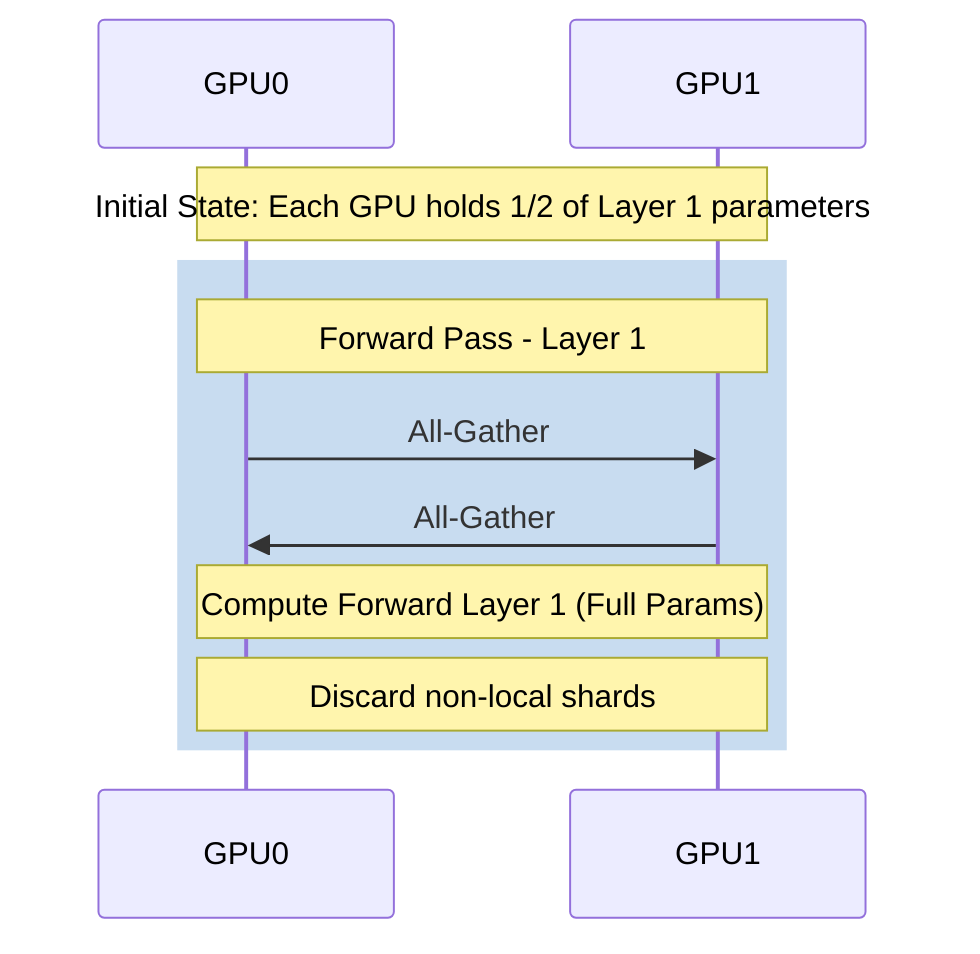

# Chapter 04: FSDP and Parameter Sharding

## WHY: The Memory Wall
In modern LLM training, the memory footprint is dominated by the optimizer states and gradients, not just the model weights. Consider the memory math for a standard AdamW optimizer in mixed precision (FP16/BF16 weights):
* Model Parameters: 2 bytes/parameter
* Gradients: 2 bytes/parameter
* Optimizer State: 8 bytes/parameter
Total: ~12 bytes per parameter (excluding activations). For a 70B parameter model, this equates to ~840 GB of memory just for the model state—far exceeding the capacity of an 80GB GPU.

## WHAT: Fully Sharded Data Parallel (FSDP)
FSDP represents a significant evolution in distributed training, enabling the training of models that far exceed the memory capacity of a single GPU. Unlike standard DDP which replicates the entire model state across all GPUs, FSDP shards (partitions) the model parameters, gradients, and optimizer states across data parallel workers.

## HOW: Parameter Materialization Lifecycle
FSDP achieves memory efficiency by materializing the full parameters only when they are needed for computation and immediately discarding the non-local shards.
When a specific layer needs to perform its forward or backward pass, FSDP executes an `All-Gather` operation to collect the shards from all other GPUs. 

## WHEN: Wrapping Policies and Checkpointing
FSDP relies on "wrapping" PyTorch modules. Models should be wrapped at the layer level (e.g., individual Transformer blocks). This granular wrapping allows for the overlapping of communication and computation. FSDP is needed when the model state outgrows a single GPU.

## TRADEOFFS: FSDP vs DDP

| Feature | DDP | FSDP |
| :--- | :--- | :--- |
| **Memory Footprint** | Replicated | Divided by N |
| **Communication** | `All-Reduce` | `All-Gather`, `Reduce-Scatter` |
| **Communication Volume** | $2 	imes P$ bytes | $3 	imes P$ bytes |

## PRODUCTION: Scalability and Memory Math
Even with FSDP, a 70B model with a large batch size might OOM due to activation memory. Activation Checkpointing is crucial. A 70B model requires $70B 	imes 12 	ext{ bytes} pprox 840 	ext{ GB}$. With N=8 GPUs, $840 / 8 = 105 	ext{ GB}$ per GPU, which still exceeds 80GB. Production scaling requires more nodes or offloading.

## TROUBLESHOOTING: Failure Scenarios

### Scenario 1: CPU Offload Bottleneck
**Symptom:** The model fits in memory, but training throughput is abysmal. GPU utilization is ~15-20%.
**Diagnosis:** CPU offloading moves parameters to RAM via PCIe, which is vastly slower than HBM3 bandwidth. GPUs are starved for data.
**Resolution:** Disable `cpu_offload` and scale the cluster up to fit the model purely in GPU memory.

### Senior Interview Questions
**Q: Explain FSDP's FULL_SHARD vs SHARD_GRAD_OP.**
**A:** FULL_SHARD shards parameters, gradients, and optimizer states, requiring all-gather before forward/backward. SHARD_GRAD_OP shards only gradients and optimizer states, keeping parameters replicated to avoid all-gathers during compute, at the cost of more memory.

                        
                        
 
 
 
 
 
 
 
 
 
 
 
 
 
 
 
 
 
 
 
 
 
 
 
 
 
 
 
 
 
 
 
 
 
 
 
 
 
 
 
 
 
 
 
 
 
 
 
 
 
 
 
 
 
 
 
 
 
 
 
 
 
 
 
 
 
 
 
 
 
 
 
 
 
 
 
 
 
 
 
 
 
 
 
 
 
 
 
 
 
 
 
 
 
 
 
 
 
 
 
 
 
 
 
 
 
 
 
 
 
 
 
 
 
 
 
 
 
 
 
 
 
 
 
 
 
 
 
 
 
 
 
 
 
 
 
 
 
 
 
 
 
 
 
 
 
 
 
 
 
 
 
 
 
 
 
 
 
 
 
 
 
 
 
 
 
 
 
 
 
 
 
 
 
 
 
 
 
 
 
 
 
 
 
 
 
 
 
 
 
 
 
 
 
 
 
 
 
 
 
 
 
 
 
 
 
 
 
 
 
 
 
 
 
 
 
 
 
 
 
 
