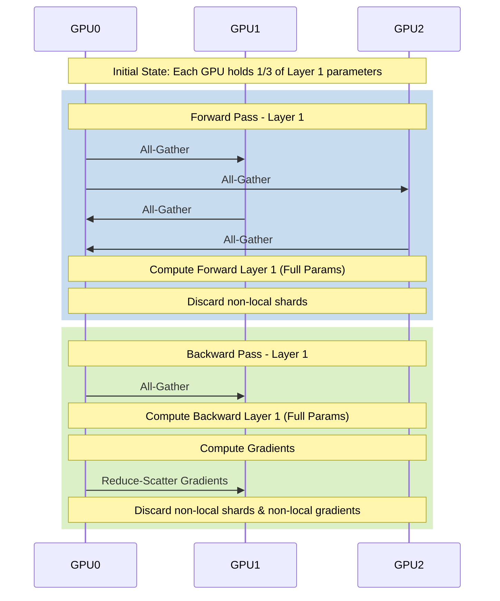

# Chapter 04: FSDP and Parameter Sharding

## WHY

In modern LLM training, the memory footprint is dominated by the optimizer states and gradients, not just the model weights. Consider the memory math for a standard AdamW optimizer in mixed precision (FP16/BF16 weights):

* **Model Parameters:** 2 bytes/parameter (FP16/BF16)
* **Gradients:** 2 bytes/parameter (FP16/BF16)
* **Optimizer State:** 8 bytes/parameter (FP32 master weights + FP32 momentum + FP32 variance)
* **Total:** ~12 bytes per parameter (excluding activations).

For a 70B parameter model, this equates to ~840 GB of memory just for the model state—far exceeding the capacity of an 80GB A100/H100 GPU. The fundamental "why" behind FSDP is breaking the single-GPU memory wall.

## WHAT

Fully Sharded Data Parallel (FSDP) represents a significant evolution in distributed training, enabling the training of models that far exceed the memory capacity of a single GPU. 

Unlike standard Distributed Data Parallel (DDP) which replicates the entire model state across all GPUs, FSDP shards (partitions) the model parameters, gradients, and optimizer states across data parallel workers. It is PyTorch's native implementation of the Zero Redundancy Optimizer (ZeRO) Stage 3 concept.

## HOW

FSDP achieves this memory efficiency by materializing the full parameters only when they are needed for computation (forward and backward passes) and immediately discarding the non-local shards to free up memory.

When a specific layer needs to perform its forward or backward pass, FSDP executes an `All-Gather` collective communication operation to collect the shards from all other GPUs. Once the computation for that layer is complete, FSDP discards the gathered shards, reverting back to the sharded state.



## WHEN

FSDP should be used whenever a model and its training state exceed the memory capacity of a single GPU. However, to use it effectively, you must understand wrapping policies.

FSDP relies on "wrapping" PyTorch modules. If the entire model is wrapped as a single FSDP unit, all parameters are gathered at the start of the forward pass, defeating the memory savings. Instead, models are wrapped at the layer level (e.g., individual Transformer blocks). This granular wrapping allows for the overlapping of communication and computation. While Layer $L$ is computing, FSDP can prefetch the parameters for Layer $L+1$.

## TRADEOFFS

| Feature | Distributed Data Parallel (DDP) | Fully Sharded Data Parallel (FSDP) |
| :--- | :--- | :--- |
| **Memory Footprint** | Replicated on every GPU | Divided by number of GPUs (N) |
| **Communication** | `All-Reduce` gradients after backward pass | `All-Gather` parameters (fwd/bwd), `Reduce-Scatter` gradients |
| **Max Model Size** | Limited by single GPU memory (e.g., ~1.5B on 80GB) | Limited by aggregate cluster memory (e.g., ~100B+ on large clusters) |
| **Communication Volume** | $2 \times P$ bytes per step | $3 \times P$ bytes per step (higher overhead) |
| **Setup Complexity** | Low. Drop-in replacement. | High. Requires careful wrapping policies and activation checkpointing. |

## PRODUCTION

To deeply understand FSDP in production, you must understand how it interacts with mixed precision and activation memory. FSDP primarily targets the persistent state. Activations are transient.

Even with FSDP, a 70B model with a large batch size might OOM due to activation memory. Activation Checkpointing (Gradient Checkpointing) becomes crucial.

### Scenario: 70B Model on 8x80GB A100s

* Total Parameters: 70 Billion
* Model State Memory (FP16/FP32 Adam): $70B \times 12 \text{ bytes} \approx 840 \text{ GB}$
* State per GPU (N=8): $840 \text{ GB} / 8 = 105 \text{ GB}$

$105 \text{ GB} > 80 \text{ GB}$. A 70B model cannot be trained on a single 8-GPU node with FSDP alone without CPU offloading or quantized optimizer states. Production deployments typically scale this across 2-4 nodes (16-32 GPUs) to fit comfortably.

## TROUBLESHOOTING

### Scenario 1: CPU Offload Bottleneck

**Context:** To fit a larger model, the engineer enabled `cpu_offload=True` in PyTorch FSDP.
**Symptom:** The model fits in memory, but training throughput (tokens/sec) is abysmal. GPU utilization is hovering around 15-20%.

**Diagnosis:** CPU offloading moves parameters and optimizer states to system RAM via PCIe. The PCIe bandwidth (Gen4 is ~32 GB/s, Gen5 is ~64 GB/s) is vastly slower than HBM3 bandwidth (3 TB/s). The GPUs are starved for data.

**Resolution:**
Disable `cpu_offload` and scale the cluster up to fit the model purely in GPU memory.

```python
# In your PyTorch FSDP config:
from torch.distributed.fsdp import CPUOffload

fsdp_config = {
    'cpu_offload': CPUOffload(offload_params=False),
}
```

### Scenario 2: OOM During Checkpoint Save

**Context:** The model trains perfectly for hours, but crashes with an Out-of-Memory (OOM) error exactly when saving the first checkpoint.

**Diagnosis:** By default, saving a checkpoint in FSDP might attempt to gather the entire model state (the `FULL_STATE_DICT` policy) onto Rank 0 before writing it to disk. For a 70B model, this requires 140GB+ of memory, instantly crashing Rank 0.

**Resolution:**
Use the `SHARDED_STATE_DICT` policy and directly execute the save command with distributed API.

```python
from torch.distributed.fsdp import FullyShardedDataParallel as FSDP
from torch.distributed.fsdp import StateDictType

with FSDP.state_dict_type(model, StateDictType.SHARDED_STATE_DICT):
    state_dict = model.state_dict()
    # Execute the explicit save command per rank
    import torch
    torch.save(state_dict, f"checkpoint_rank_{rank}.pt")
```

### Senior Interview Questions

**Q: Explain the difference between FSDP's `FULL_SHARD` and `SHARD_GRAD_OP` strategies.**
**A:** `FULL_SHARD` shards parameters, gradients, and optimizer states. It requires an all-gather before the forward pass, another before the backward pass, and a reduce-scatter after the backward pass. `SHARD_GRAD_OP` shards only the gradients and optimizer states, keeping the parameters replicated. This avoids the parameter all-gathers during compute, reducing communication overhead, but consumes more memory.

<br/><br/><br/><br/><br/><br/><br/><br/><br/><br/><br/><br/><br/><br/><br/><br/><br/><br/><br/><br/><br/><br/><br/><br/><br/>
<br/><br/><br/><br/><br/><br/><br/><br/><br/><br/><br/><br/><br/><br/><br/><br/><br/><br/><br/><br/><br/><br/><br/><br/><br/>
<br/><br/><br/><br/><br/><br/><br/><br/><br/><br/><br/><br/><br/><br/><br/><br/><br/><br/><br/><br/><br/><br/><br/><br/><br/>
<br/>
<br/>
<br/>
<br/>
<br/>
<br/>
<br/>
<br/>
<br/>
<br/>
<br/>
<br/>
<br/>
<br/>
<br/>
<br/>
<br/>
<br/>
<br/>
<br/>
<br/>
<br/>
<br/>
<br/>
<br/>
<br/>
<br/>
<br/>
<br/>
<br/>
<br/>
<br/>
<br/>
<br/>
<br/>
<br/>
<br/>
<br/>
<br/>
<br/>
<br/>
<br/>
<br/>
<br/>
<br/>
<br/>
<br/>
<br/>
<br/>
<br/>
<br/>
<br/>
<br/>
<br/>
<br/>
<br/>
<br/>
<br/>
<br/>
<br/>
<br/>
<br/>
<br/>
<br/>
<br/>
<br/>
<br/>
<br/>
<br/>
<br/>
<br/>
<br/>
<br/>
<br/>
<br/>
<br/>
<br/>
<br/>
<br/>
<br/>
<br/>
<br/>
<br/>
<br/>
<br/>
<br/>
<br/>
<br/>
<br/>
<br/>
<br/>
<br/>
<br/>
<br/>
<br/>
<br/>
<br/>
<br/>
<br/>
<br/>
<br/>
<br/>
<br/>
<br/>
<br/>
<br/>
<br/>
<br/>
<br/>
<br/>
<br/>
<br/>
<br/>
<br/>
<br/>
<br/>
<br/>
<br/>
<br/>
<br/>
<br/>
<br/>
<br/>
<br/>
<br/>
<br/>
<br/>
<br/>
<br/>
<br/>
<br/>
<br/>
<br/>
<br/>
<br/>
<br/>
<br/>
<br/>
<br/>
<br/>
<br/>
<br/>
<br/>
<br/>
<br/>
<br/>
<br/>
<br/>
<br/>
<br/>
<br/>
<br/>
<br/>
<br/>
<br/>
<br/>
<br/>
<br/>
<br/>
<br/>
