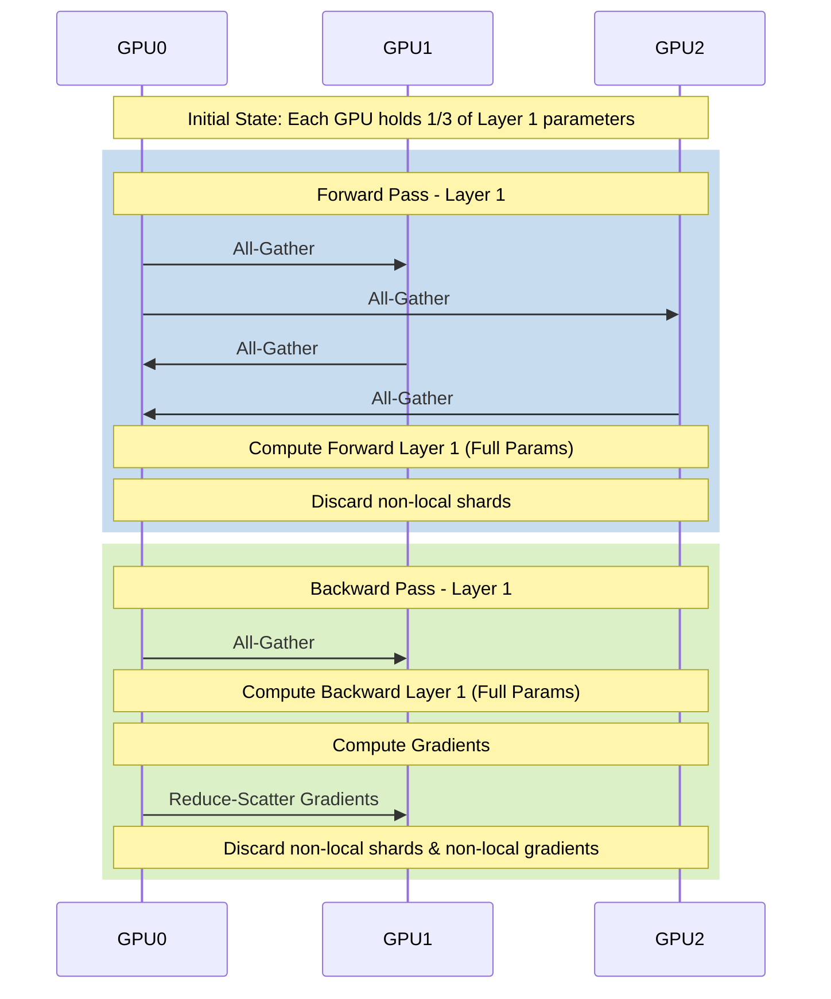

# Chapter 04: FSDP and Parameter Sharding

Fully Sharded Data Parallel (FSDP) represents a significant evolution in distributed training, enabling the training of models that far exceed the memory capacity of a single GPU. Unlike standard Distributed Data Parallel (DDP) which replicates the entire model state across all GPUs, FSDP shards (partitions) the model parameters, gradients, and optimizer states across data parallel workers.

FSDP achieves this memory efficiency by materializing the full parameters only when they are needed for computation (forward and backward passes) and immediately discarding the non-local shards to free up memory.

## The Core Concept: Sharding the State

In modern LLM training, the memory footprint is dominated by the optimizer states and gradients, not just the model weights. Consider the memory math for a standard AdamW optimizer in mixed precision (FP16/BF16 weights):

* **Model Parameters:** 2 bytes/parameter (FP16/BF16)
* **Gradients:** 2 bytes/parameter (FP16/BF16)
* **Optimizer State:** 8 bytes/parameter (FP32 master weights + FP32 momentum + FP32 variance)
* **Total:** ~12 bytes per parameter (excluding activations).

For a 70B parameter model, this equates to ~840 GB of memory just for the model state—far exceeding the capacity of an 80GB A100/H100 GPU.

FSDP solves this by dividing this state across $N$ GPUs. The memory required per GPU becomes roughly `(12 bytes * Parameters) / N`.

### Parameter Materialization Lifecycle

When a specific layer needs to perform its forward or backward pass, FSDP executes an `All-Gather` collective communication operation to collect the shards from all other GPUs. Once the computation for that layer is complete, FSDP discards the gathered shards, reverting back to the sharded state.



## Wrapping Policies

FSDP relies on "wrapping" PyTorch modules. If the entire model is wrapped as a single FSDP unit, all parameters are gathered at the start of the forward pass, defeating the memory savings. Instead, models are wrapped at the layer level (e.g., individual Transformer blocks).

This granular wrapping allows for the overlapping of communication and computation. While Layer $L$ is computing, FSDP can prefetch the parameters for Layer $L+1$.

## Trade-off Analysis: FSDP vs DDP

| Feature | Distributed Data Parallel (DDP) | Fully Sharded Data Parallel (FSDP) |
| :--- | :--- | :--- |
| **Memory Footprint** | Replicated on every GPU | Divided by number of GPUs (N) |
| **Communication** | `All-Reduce` gradients after backward pass | `All-Gather` parameters (fwd/bwd), `Reduce-Scatter` gradients |
| **Max Model Size** | Limited by single GPU memory (e.g., ~1.5B on 80GB) | Limited by aggregate cluster memory (e.g., ~100B+ on large clusters) |
| **Communication Volume** | $2 	imes P$ bytes per step | $3 	imes P$ bytes per step (higher overhead) |
| **Setup Complexity** | Low. Drop-in replacement. | High. Requires careful wrapping policies and activation checkpointing. |

## Memory Math in FSDP

To deeply understand FSDP, you must understand how it interacts with mixed precision and activation memory. FSDP primarily targets the persistent state (weights, gradients, optimizer). Activations are transient.

Even with FSDP, a 70B model with a large batch size might OOM due to activation memory. This is where **Activation Checkpointing (Gradient Checkpointing)** becomes crucial.

### Scenario: 70B Model on 8x80GB A100s

* Total Parameters: 70 Billion
* Model State Memory (FP16/FP32 Adam): $70B 	imes 12 	ext{ bytes} pprox 840 	ext{ GB}$
* State per GPU (N=8): $840 	ext{ GB} / 8 = 105 	ext{ GB}$

Wait, $105 	ext{ GB} > 80 	ext{ GB}$. A 70B model cannot be trained on a single 8-GPU node with FSDP alone without CPU offloading or using quantized optimizer states (e.g., 8-bit Adam) or swapping. To train a 70B model efficiently, you typically need at least 2-4 nodes (16-32 GPUs) with FSDP.

## Failure Scenarios

### Scenario 1: CPU Offload Bottleneck

**Context:** To fit a larger model, the engineer enabled `cpu_offload=True` in PyTorch FSDP.
**Symptom:** The model fits in memory, but training throughput (tokens/sec) is abysmal. GPU utilization is hovering around 15-20%.

**Logs/Evidence:**
```text
Epoch 1: 100%|██████████| 100/100 [2:15:30<00:00, 81.30s/it, loss=2.341]
nvidia-smi dmon:
# gpu   pwr gtemp mtemp    sm   mem   enc   dec  mclk  pclk
    0   120    45    50    18     5     0     0  1215  1410
    1   118    44    49    15     4     0     0  1215  1410
```
**Diagnosis:** CPU offloading moves parameters and optimizer states to system RAM via PCIe. The PCIe bandwidth (Gen4 is ~32 GB/s, Gen5 is ~64 GB/s) is vastly slower than HBM3 bandwidth (3 TB/s). The GPUs are starved for data, waiting for the CPU to send the parameters for the next layer.

**Resolution:**
1. Disable `cpu_offload`.
2. Scale the cluster up (add more nodes) to fit the model purely in GPU memory.
3. If scaling isn't possible, use parameter-efficient fine-tuning (PEFT) like LoRA.

### Scenario 2: OOM During Checkpoint Save

**Context:** The model trains perfectly for hours, but crashes with an Out-of-Memory (OOM) error exactly when saving the first checkpoint.
**Symptom:**
```text
[rank0]: RuntimeError: CUDA out of memory. Tried to allocate 2.15 GiB 
(GPU 0; 79.35 GiB total capacity; 75.10 GiB already allocated; 
 1.20 GiB free; 76.50 GiB reserved in total by PyTorch)
[rank0]: File "torch/distributed/fsdp/fully_sharded_data_parallel.py", line 1245, in _state_dict
```

**Diagnosis:** By default, saving a checkpoint in FSDP might attempt to gather the entire model state (the `FULL_STATE_DICT` policy) onto Rank 0 before writing it to disk. For a 70B model, this requires 140GB+ of memory, instantly crashing Rank 0.

**Resolution:**
Use the `SHARDED_STATE_DICT` policy. This instructs each rank to save only its local shard of the model and optimizer state to disk directly, bypassing the need to gather the full model on a single GPU.

```python
from torch.distributed.fsdp import FullyShardedDataParallel as FSDP
from torch.distributed.fsdp import StateDictType

with FSDP.state_dict_type(model, StateDictType.SHARDED_STATE_DICT):
    state_dict = model.state_dict()
    # Save using torch.save or distributed checkpointing API
```

## Senior Interview Questions

**Q: Explain the difference between FSDP's `FULL_SHARD` and `SHARD_GRAD_OP` strategies.**
**A:** `FULL_SHARD` (analogous to ZeRO Stage 3) shards parameters, gradients, and optimizer states. It requires an all-gather before the forward pass, another before the backward pass, and a reduce-scatter after the backward pass. `SHARD_GRAD_OP` (analogous to ZeRO Stage 2) shards only the gradients and optimizer states, keeping the parameters replicated. This avoids the parameter all-gathers during compute, reducing communication overhead, but consumes more memory.

**Q: Why is FSDP wrapping policy critical for performance? What happens if you don't wrap submodules?**
**A:** If you wrap the entire model in a single FSDP unit, FSDP will all-gather the entire model's parameters at the start of the forward pass. This requires enough memory on every GPU to hold the full, un-sharded model, completely negating the memory benefits of FSDP. Wrapping individual submodules (like Transformer blocks) ensures that only one layer's parameters are gathered at a time, keeping the memory footprint small and allowing communication (prefetching the next layer) to overlap with computation.

**Q: How does activation checkpointing interact with FSDP, and why is it usually necessary for large models?**
**A:** FSDP reduces the memory used by the model state, but the memory used by activations (saved during the forward pass for backpropagation) scales linearly with model depth and batch size. For large models, activations can consume more memory than the sharded parameters. Activation checkpointing discards intermediate activations during the forward pass and recomputes them during the backward pass. This trades compute (recomputing) for memory, allowing you to train much larger models or use larger batch sizes within the FSDP memory constraints.

<br/>
<br/>
<br/>
<br/>
<br/>
<br/>
<br/>
<br/>
<br/>
<br/>
<br/>
<br/>
<br/>
<br/>
<br/>
<br/>
<br/>
<br/>
<br/>
<br/>
<br/>
<br/>
<br/>
<br/>
<br/>
<br/>
<br/>
<br/>
<br/>
<br/>
<br/>
<br/>
<br/>
<br/>
<br/>
<br/>
<br/>
<br/>
<br/>
<br/>
<br/>
<br/>
<br/>
<br/>
<br/>
<br/>
<br/>
<br/>
<br/>
<br/>
<br/>
<br/>
<br/>
<br/>
<br/>
<br/>
<br/>
<br/>
<br/>
<br/>
<br/>
<br/>
<br/>
<br/>
<br/>
<br/>
<br/>
<br/>
<br/>
<br/>
<br/>
<br/>
<br/>
<br/>
<br/>
<br/>
<br/>
<br/>
<br/>
<br/>
<br/>
<br/>
<br/>
<br/>
<br/>
<br/>
<br/>
<br/>
<br/>
<br/>
<br/>
<br/>
<br/>
<br/>
<br/>
<br/>
<br/>
<br/>
<br/>
<br/>
<br/>
<br/>
<br/>
<br/>
<br/>
<br/>
<br/>
<br/>
<br/>
<br/>
<br/>
<br/>
<br/>
<br/>
<br/>
<br/>
<br/>
<br/>
<br/>
<br/>
<br/>
<br/>
<br/>
<br/>
<br/>
<br/>
<br/>
<br/>
<br/>
<br/>
<br/>
<br/>
<br/>
<br/>
<br/>
<br/>
<br/>
<br/>
<br/>
<br/>
<br/>
<br/>
<br/>
<br/>
<br/>
<br/>
<br/>
<br/>
<br/>
<br/>
