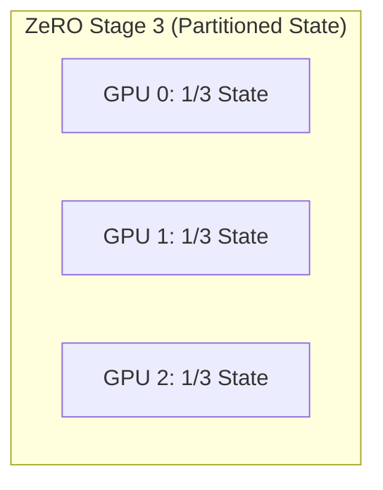

# Chapter 05: DeepSpeed and ZeRO

## WHY: Eliminating Redundancy
Before ZeRO, standard Distributed Data Parallel (DDP) required every GPU to hold a full replica of the model parameters, gradients, and optimizer states. This redundancy was the primary obstacle to scaling model sizes.

## WHAT: Zero Redundancy Optimizer (ZeRO)
ZeRO eliminates memory redundancy by partitioning the training state across the data-parallel workers, trading communication overhead for massive memory savings. It was popularized by Microsoft's DeepSpeed library.

## HOW: The ZeRO Stages
ZeRO implements partitioning in three progressive stages:
1. **ZeRO-1 (Optimizer State):** Shards only the optimizer state across N GPUs.
2. **ZeRO-2 (Gradients):** Shards both the optimizer state and the gradients. Uses Reduce-Scatter instead of All-Reduce.
3. **ZeRO-3 (Parameters):** Shards everything, materializing parameters via All-Gather only when needed.



## WHEN: Choosing Offload Options
DeepSpeed offers ZeRO-Offload (CPU) and ZeRO-Infinity (NVMe). Offload is used when the model is too large for aggregate GPU memory, paging optimizer states and gradients out to host memory or SSDs.

## TRADEOFFS: Stage Comparison

| Configuration | Memory Reduction | Comm Overhead | Best Use Case |
| :--- | :--- | :--- | :--- |
| **ZeRO-1** | Moderate (~4x) | Low | When the model fits, for larger batch sizes. |
| **ZeRO-2** | High (~8x) | Moderate | The sweet spot for most medium models. |
| **ZeRO-3** | Extreme (N-fold) | High | Massive models that cannot fit otherwise. |

## PRODUCTION: Architecture Selection
Architecturally, FSDP `FULL_SHARD` and ZeRO-3 do the same thing. DeepSpeed offers advanced features like ZeRO-Infinity and custom Adam kernels, while FSDP is natively integrated into PyTorch for less friction.

## TROUBLESHOOTING: Failure Scenarios

### Scenario 1: NVMe Offload Thrashing
**Symptom:** Throughput is in seconds per token. `iostat` shows NVMe pegged at 100%.
**Diagnosis:** PCIe bus and NVMe drives are completely saturated. GPUs are waiting for optimizer states to page in.
**Resolution:** Use PCIe Gen5 NVMe in RAID0. Reduce offload amount to only optimizer states.

```json
// In deepspeed_config.json
"zero_optimization": {
  "offload_optimizer": {
    "device": "nvme",
    "nvme_path": "/mnt/nvme0n1"
  },
  "offload_param": {
    "device": "none"
  }
}
```

### Senior Interview Questions
**Q: Explain the memory math difference between ZeRO-2 and ZeRO-3.**
**A:** For a 10B param model on 8 GPUs, ZeRO-2 replicates parameters (20GB) but shards gradients/optimizer states, taking 37.5GB per GPU. ZeRO-3 shards everything, taking just 20GB per GPU.

<br/><br/><br/><br/><br/><br/><br/><br/><br/><br/><br/><br/><br/><br/><br/><br/><br/><br/><br/><br/><br/><br/><br/><br/>
<br/><br/><br/><br/><br/><br/><br/><br/><br/><br/><br/><br/><br/><br/><br/><br/><br/><br/><br/><br/><br/><br/><br/><br/>
<br/>
<br/>
<br/>
<br/>
<br/>
<br/>
<br/>
<br/>
<br/>
<br/>
<br/>
<br/>
<br/>
<br/>
<br/>
<br/>
<br/>
<br/>
<br/>
<br/>
<br/>
<br/>
<br/>
<br/>
<br/>
<br/>
<br/>
<br/>
<br/>
<br/>
<br/>
<br/>
<br/>
<br/>
<br/>
<br/>
<br/>
<br/>
<br/>
<br/>
<br/>
<br/>
<br/>
<br/>
<br/>
<br/>
<br/>
<br/>
<br/>
<br/>
<br/>
<br/>
<br/>
<br/>
<br/>
<br/>
<br/>
<br/>
<br/>
<br/>
<br/>
<br/>
<br/>
<br/>
<br/>
<br/>
<br/>
<br/>
<br/>
<br/>
<br/>
<br/>
<br/>
<br/>
<br/>
<br/>
<br/>
<br/>
<br/>
<br/>
<br/>
<br/>
<br/>
<br/>
<br/>
<br/>
<br/>
<br/>
<br/>
<br/>
<br/>
<br/>
<br/>
<br/>
<br/>
<br/>
<br/>
<br/>
<br/>
<br/>
<br/>
<br/>
<br/>
<br/>
<br/>
<br/>
<br/>
<br/>
<br/>
<br/>
<br/>
<br/>
<br/>
<br/>
<br/>
<br/>
<br/>
<br/>
<br/>
<br/>
<br/>
<br/>
<br/>
<br/>
<br/>
<br/>
<br/>
<br/>
<br/>
<br/>
<br/>
<br/>
<br/>
<br/>
<br/>
<br/>
<br/>
<br/>
<br/>
<br/>
<br/>
<br/>
<br/>
<br/>
<br/>
<br/>
<br/>
<br/>
<br/>
<br/>
<br/>
<br/>
<br/>
<br/>
<br/>
<br/>
<br/>
<br/>
<br/>
<br/>
<br/>
<br/>
<br/>
<br/>
<br/>
<br/>
<br/>
<br/>
<br/>
<br/>
<br/>
<br/>
<br/>
<br/>
<br/>
<br/>
<br/>
<br/>
<br/>
<br/>
<br/>
<br/>
<br/>
<br/>
<br/>
<br/>
<br/>
<br/>
<br/>
<br/>
<br/>
<br/>
<br/>
<br/>
<br/>
<br/>
<br/>
<br/>
<br/>
<br/>
<br/>
<br/>
<br/>
<br/>
<br/>
<br/>
<br/>
<br/>
<br/>
<br/>
<br/>
<br/>
<br/>
<br/>
<br/>
<br/>
<br/>
<br/>
<br/>
<br/>
