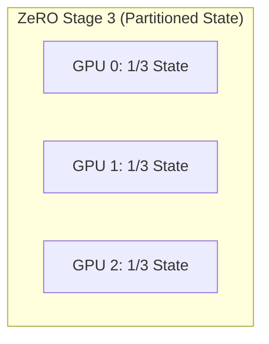

# Chapter 05: DeepSpeed and ZeRO

## WHY

Before ZeRO, standard Distributed Data Parallel (DDP) required every GPU to hold a full replica of the model parameters, gradients, and optimizer states. This redundancy was the primary obstacle to scaling model sizes. When the parameters alone exceed a single GPU's memory, replication is mathematically impossible. ZeRO was created to eliminate this memory redundancy.

## WHAT

Microsoft's DeepSpeed and its Zero Redundancy Optimizer (ZeRO) fundamentally changed how we train large language models. ZeRO eliminates memory redundancy by partitioning the training state across the data-parallel workers, trading communication overhead for massive memory savings.

## HOW

ZeRO implements this partitioning in three progressive stages. To understand them, consider a model with $P$ parameters trained in mixed precision (16 bytes total state per parameter).

1. **ZeRO Stage 1 (Optimizer State):** Shards *only* the optimizer state (12 bytes/param) across the $N$ GPUs.
2. **ZeRO Stage 2 (Gradients):** Shards both the optimizer state and the gradients. Uses a `Reduce-Scatter` for gradients instead of an `All-Reduce`.
3. **ZeRO Stage 3 (Parameters):** Shards everything: optimizer states, gradients, and the model parameters themselves. Parameters are materialized via `All-Gather` only when needed for a specific layer.



## WHEN

DeepSpeed goes beyond partitioning with **ZeRO-Offload** (CPU) and **ZeRO-Infinity** (NVMe). Offload should be used when a model is too large to fit in aggregate GPU memory even with ZeRO-3. DeepSpeed can page optimizer states, gradients, and even parameters out to the host CPU memory or fast NVMe SSDs. It is typically used for fine-tuning massive models on budget hardware rather than high-performance pre-training.

## TRADEOFFS

| Configuration | Memory Reduction | Comm Overhead | Best Use Case |
| :--- | :--- | :--- | :--- |
| **ZeRO-1** | Moderate (~4x) | Low | When the model fits easily, but you want larger batch sizes. |
| **ZeRO-2** | High (~8x) | Moderate | The sweet spot for most medium-to-large models on standard clusters. |
| **ZeRO-3** | Extreme (N-fold) | High | Massive models that cannot fit otherwise. Requires fast interconnect. |
| **ZeRO-Offload (CPU)** | Pushes limits beyond GPU VRAM | Very High (PCIe bound) | Fine-tuning large models on budget/single-node hardware. |

## PRODUCTION

In production, you must decide between PyTorch native FSDP and DeepSpeed ZeRO-3. Architecturally, FSDP `FULL_SHARD` and ZeRO-3 do the same thing. DeepSpeed is a separate framework that requires altering your training loop (e.g., using `deepspeed.initialize`), but it offers advanced features like ZeRO-Infinity (NVMe offload), MoE support, and a highly optimized custom Adam kernel. FSDP is natively integrated into PyTorch, making it a cleaner drop-in replacement for DDP.

## TROUBLESHOOTING

### Scenario 1: ZeRO-3 Communication Hang

**Context:** Training a 30B model with ZeRO-3 on a 4-node cluster (32 GPUs). The training suddenly hangs after a few hours with no obvious errors.

**Diagnosis:** A classic collective communication deadlock. In ZeRO-3, parameters are constantly being gathered and scattered. If a single rank falls behind (due to a slow disk read or a transient network glitch), the other ranks will block indefinitely waiting for it in an `All-Gather`.

**Resolution:**
Set explicit NCCL environment variables to enable async error handling and time out, forcing a crash instead of a hang.

```bash
export NCCL_ASYNC_ERROR_HANDLING=1
export NCCL_DEBUG=INFO
export NCCL_TIMEOUT=1200 # Timeout after 20 minutes
```

### Scenario 2: NVMe Offload Thrashing

**Context:** Fine-tuning a 70B model on a single 8-GPU node using ZeRO-Infinity with NVMe offloading.
**Symptom:** `iostat` shows the NVMe drives pegged at 100% utilization. Throughput is extremely low.

**Diagnosis:** The PCIe bus and NVMe drives are completely saturated. The GPUs are spending 99% of their time waiting for the optimizer states and parameters to be paged in from disk.

**Resolution:**
Ensure you are using PCIe Gen5 NVMe drives in RAID0. Reduce the offload amount to *only* offload the optimizer states.

```json
// In deepspeed_config.json
"zero_optimization": {
  "stage": 3,
  "offload_optimizer": {
    "device": "nvme",
    "nvme_path": "/mnt/nvme_raid0"
  },
  "offload_param": {
    "device": "none"
  }
}
```

### Senior Interview Questions

**Q: Explain the memory math difference between ZeRO-2 and ZeRO-3 for a 10B parameter model on 8 GPUs.**
**A:** Total state memory is 160GB. In ZeRO-2, parameters are replicated (20GB per GPU), but gradients and optimizer states (140GB total) are sharded across 8 GPUs (17.5GB per GPU). Total memory per GPU: $20\text{GB} + 17.5\text{GB} = 37.5\text{GB}$. In ZeRO-3, everything is sharded. Total memory per GPU: $160\text{GB} / 8 = 20\text{GB}$.

<br/><br/><br/><br/><br/><br/><br/><br/><br/><br/><br/><br/><br/><br/><br/><br/><br/><br/><br/><br/><br/><br/><br/><br/><br/>
<br/><br/><br/><br/><br/><br/><br/><br/><br/><br/><br/><br/><br/><br/><br/><br/><br/><br/><br/><br/><br/><br/><br/><br/><br/>
<br/><br/><br/><br/><br/><br/><br/><br/><br/><br/><br/><br/><br/><br/><br/><br/><br/><br/><br/><br/><br/><br/><br/><br/><br/>
<br/>
<br/>
<br/>
<br/>
<br/>
<br/>
<br/>
<br/>
<br/>
<br/>
<br/>
<br/>
<br/>
<br/>
<br/>
<br/>
<br/>
<br/>
<br/>
<br/>
<br/>
<br/>
<br/>
<br/>
<br/>
<br/>
<br/>
<br/>
<br/>
<br/>
<br/>
<br/>
<br/>
<br/>
<br/>
<br/>
<br/>
<br/>
<br/>
<br/>
<br/>
<br/>
<br/>
<br/>
<br/>
<br/>
<br/>
<br/>
<br/>
<br/>
<br/>
<br/>
<br/>
<br/>
<br/>
<br/>
<br/>
<br/>
<br/>
<br/>
<br/>
<br/>
<br/>
<br/>
<br/>
<br/>
<br/>
<br/>
<br/>
<br/>
<br/>
<br/>
<br/>
<br/>
<br/>
<br/>
<br/>
<br/>
<br/>
<br/>
<br/>
<br/>
<br/>
<br/>
<br/>
<br/>
<br/>
<br/>
<br/>
<br/>
<br/>
<br/>
<br/>
<br/>
<br/>
<br/>
<br/>
<br/>
<br/>
<br/>
<br/>
<br/>
<br/>
<br/>
<br/>
<br/>
<br/>
<br/>
<br/>
<br/>
<br/>
<br/>
<br/>
<br/>
<br/>
<br/>
<br/>
<br/>
<br/>
<br/>
<br/>
<br/>
<br/>
<br/>
<br/>
<br/>
<br/>
<br/>
<br/>
<br/>
<br/>
<br/>
<br/>
<br/>
<br/>
<br/>
<br/>
<br/>
<br/>
<br/>
<br/>
<br/>
<br/>
<br/>
<br/>
<br/>
<br/>
<br/>
<br/>
<br/>
<br/>
<br/>
<br/>
<br/>
<br/>
<br/>
<br/>
<br/>
<br/>
<br/>
