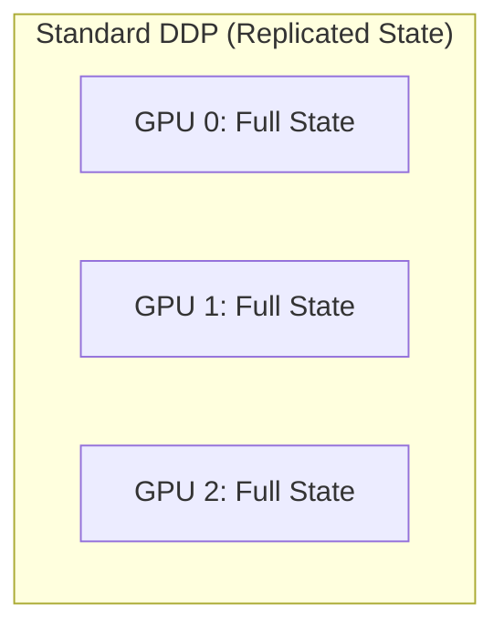
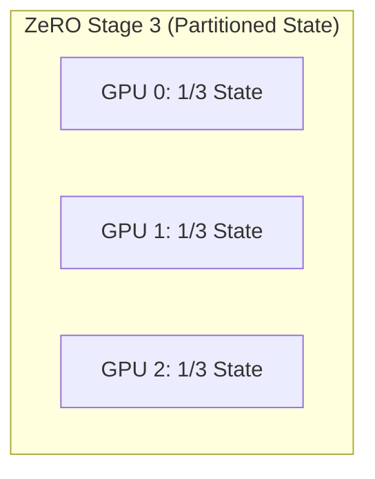

# Chapter 05: DeepSpeed and ZeRO

Microsoft's DeepSpeed and its Zero Redundancy Optimizer (ZeRO) fundamentally changed how we train large language models. Before ZeRO, standard Distributed Data Parallel (DDP) required every GPU to hold a full replica of the model parameters, gradients, and optimizer states. ZeRO recognized that this redundancy was the primary obstacle to scaling model sizes.

ZeRO eliminates this memory redundancy by partitioning the training state across the data-parallel workers, trading communication overhead for massive memory savings.

## The ZeRO Stages Explained

ZeRO implements this partitioning in three progressive stages. To understand them, we must first look at the memory footprint of training. For a model with $P$ parameters trained in mixed precision (using FP16 for math, FP32 for the optimizer):

*   **Parameters:** 2 bytes $	imes P$
*   **Gradients:** 2 bytes $	imes P$
*   **Optimizer States (Adam):** 12 bytes $	imes P$ (FP32 weights, FP32 momentum, FP32 variance)
*   **Total State:** 16 bytes per parameter.



### ZeRO Stage 1: Optimizer State Partitioning

The optimizer state takes up the vast majority (75%) of the memory footprint. ZeRO-1 shards *only* the optimizer state across the $N$ GPUs.
*   Memory per GPU: $4 	ext{ bytes} 	imes P + (12 	ext{ bytes} 	imes P) / N$
*   Each rank updates only its assigned partition of the parameters. After the step, it broadcasts the updated parameters to the other ranks.

### ZeRO Stage 2: Gradient Partitioning

Gradients are also redundant. ZeRO-2 shards both the optimizer state and the gradients.
*   Memory per GPU: $2 	ext{ bytes} 	imes P + (14 	ext{ bytes} 	imes P) / N$
*   Instead of an `All-Reduce` for gradients, ZeRO-2 uses a `Reduce-Scatter`, so each rank only receives the reduced gradients for its specific parameter partition.

### ZeRO Stage 3: Parameter Partitioning

ZeRO-3 shards everything: optimizer states, gradients, and the model parameters themselves.
*   Memory per GPU: $(16 	ext{ bytes} 	imes P) / N$
*   Parameters are materialized via `All-Gather` only when needed for a specific layer's forward or backward pass, and then immediately discarded. (This is conceptually identical to PyTorch FSDP's `FULL_SHARD`).



## ZeRO Offloading

DeepSpeed goes beyond partitioning with **ZeRO-Offload** (CPU) and **ZeRO-Infinity** (NVMe). If a model is too large to fit in aggregate GPU memory (even with ZeRO-3), DeepSpeed can page optimizer states, gradients, and even parameters out to the host CPU memory or fast NVMe SSDs.

### Trade-off Analysis: ZeRO Stages and Offload

| Configuration | Memory Reduction | Comm Overhead | Best Use Case |
| :--- | :--- | :--- | :--- |
| **ZeRO-1** | Moderate (~4x) | Low | When the model fits easily, but you want larger batch sizes. |
| **ZeRO-2** | High (~8x) | Moderate | The sweet spot for most medium-to-large models on standard clusters. |
| **ZeRO-3** | Extreme (N-fold) | High | Massive models that cannot fit otherwise. Requires fast interconnect (InfiniBand/NVLink). |
| **ZeRO-Offload (CPU)** | Pushes limits beyond GPU VRAM | Very High (PCIe bound) | Fine-tuning large models on budget/single-node hardware. Not ideal for pre-training. |

## Failure Scenarios

### Scenario 1: ZeRO-3 Communication Hang

**Context:** Training a 30B model with ZeRO-3 on a 4-node cluster (32 GPUs). The training suddenly hangs after a few hours with no obvious errors, just stalled progress.

**Symptom/Logs:**
```text
[Rank 0] Step 450: Loss 2.14
[Rank 0] Step 451: Loss 2.12
... (No further output for hours)

# Running `nvidia-smi` on the nodes shows 100% GPU utilization but 0W power draw (stuck in a kernel).
```

**Diagnosis:** A classic collective communication deadlock. In ZeRO-3, parameters are constantly being gathered and scattered. If a single rank falls behind (due to a slow disk read, a straggler CPU process, or a transient network glitch), the other 31 ranks will block indefinitely waiting for it in an `All-Gather` operation. NCCL does not time out by default.

**Resolution:**
1.  Set `NCCL_ASYNC_ERROR_HANDLING=1` and `NCCL_DEBUG=INFO` to get stack traces when a collective fails.
2.  Enable a timeout in the DeepSpeed config or PyTorch distributed initialization to crash the job (and allow the orchestrator to restart it) rather than hanging indefinitely.

### Scenario 2: NVMe Offload Thrashing

**Context:** Fine-tuning a 70B model on a single 8-GPU node using ZeRO-Infinity with NVMe offloading.
**Symptom:** Training runs, but the throughput is measured in seconds per token rather than tokens per second. `iostat` shows the NVMe drives pegged at 100% utilization.

**Logs/Evidence:**
```text
Epoch 1:  1%|▎         | 10/1000 [45:20<74:10:00, 269.80s/it]
$ iostat -x 1
Device:         rrqm/s   wrqm/s     r/s     w/s    rkB/s    wkB/s avgrq-sz avgqu-sz   await r_await w_await  svctm  %util
nvme0n1           0.00     0.00 4502.00 4100.00 502000.0 490000.0   230.59    32.10    3.75    2.10    5.50   0.22 100.00
```

**Diagnosis:** The PCIe bus and NVMe drives are completely saturated. The GPUs are spending 99% of their time waiting for the optimizer states and parameters to be paged in from disk for the next layer.

**Resolution:**
1.  Ensure you are using PCIe Gen4/Gen5 NVMe drives. SATA SSDs will not work.
2.  Check the DeepSpeed `nvme_path` configuration to ensure it is pointing to a RAID0 array of multiple high-speed drives, not a single drive.
3.  Reduce the offload amount. If possible, only offload the optimizer states (which are updated once per step) and keep parameters in GPU memory or CPU memory.

## Senior Interview Questions

**Q: Explain the memory math difference between ZeRO-2 and ZeRO-3 for a 10B parameter model on 8 GPUs.**
**A:** (Assume FP16/FP32 mixed precision, 16 bytes total state per param). Total state memory is 160GB.
In ZeRO-2, parameters are replicated (20GB per GPU), but gradients and optimizer states (140GB total) are sharded across 8 GPUs (17.5GB per GPU). Total memory per GPU: $20	ext{GB} + 17.5	ext{GB} = 37.5	ext{GB}$.
In ZeRO-3, everything is sharded. Total memory per GPU: $160	ext{GB} / 8 = 20	ext{GB}$. (Plus a small buffer for the materialized layer).

**Q: Why might you choose PyTorch FSDP over DeepSpeed ZeRO-3, or vice versa?**
**A:** Architecturally, FSDP `FULL_SHARD` and ZeRO-3 do the same thing. DeepSpeed is a separate framework that requires altering your training loop (e.g., using `deepspeed.initialize`), but it offers advanced features like ZeRO-Infinity (NVMe offload), MoE support, and a highly optimized custom Adam kernel. FSDP is natively integrated into PyTorch, making it a cleaner drop-in replacement for DDP with less architectural friction, but it historically lagged slightly in offloading features.

**Q: If you enable CPU offload in ZeRO, which component is the most beneficial to offload first, and why?**
**A:** The optimizer states. They consume the most memory (12 bytes per parameter) but are only accessed once at the very end of the training step during the weight update. Parameters and gradients are needed continuously during the forward and backward passes, so offloading them incurs a massive PCIe bandwidth penalty throughout the entire step. Offloading only the optimizer state minimizes data movement while maximizing memory savings.

<br/>
<br/>
<br/>
<br/>
<br/>
<br/>
<br/>
<br/>
<br/>
<br/>
<br/>
<br/>
<br/>
<br/>
<br/>
<br/>
<br/>
<br/>
<br/>
<br/>
<br/>
<br/>
<br/>
<br/>
<br/>
<br/>
<br/>
<br/>
<br/>
<br/>
<br/>
<br/>
<br/>
<br/>
<br/>
<br/>
<br/>
<br/>
<br/>
<br/>
<br/>
<br/>
<br/>
<br/>
<br/>
<br/>
<br/>
<br/>
<br/>
<br/>
<br/>
<br/>
<br/>
<br/>
<br/>
<br/>
<br/>
<br/>
<br/>
<br/>
<br/>
<br/>
<br/>
<br/>
<br/>
<br/>
<br/>
<br/>
<br/>
<br/>
<br/>
<br/>
<br/>
<br/>
<br/>
<br/>
<br/>
<br/>
<br/>
<br/>
<br/>
<br/>
<br/>
<br/>
<br/>
<br/>
<br/>
<br/>
<br/>
<br/>
<br/>
<br/>
<br/>
<br/>
<br/>
<br/>
<br/>
<br/>
<br/>
<br/>
<br/>
<br/>
<br/>
<br/>
<br/>
<br/>
<br/>
<br/>
<br/>
<br/>
<br/>
<br/>
<br/>
<br/>
<br/>
<br/>
<br/>
<br/>
<br/>
<br/>
<br/>
<br/>
<br/>
<br/>
<br/>
<br/>
<br/>
<br/>
<br/>
<br/>
<br/>
<br/>
<br/>
<br/>
<br/>
<br/>
<br/>
<br/>
<br/>
<br/>
<br/>
<br/>
<br/>
<br/>
<br/>
<br/>
<br/>
<br/>
<br/>
<br/>
