# Chapter 06: Tensor, Pipeline, and Expert Parallelism

While Data Parallelism (DP/FSDP/ZeRO) partitions the *data* and the *state*, sometimes a single model layer is too large to fit on one GPU, or the communication overhead of FSDP becomes a bottleneck across slow network links. 

Model Parallelism solves this by splitting the *computation* of the model itself. The three primary methods are Tensor Parallelism (TP), Pipeline Parallelism (PP), and Expert Parallelism (EP).

## Tensor Parallelism (TP)

Tensor Parallelism slices individual operations (like a matrix multiplication) across multiple GPUs. If you have a massive weight matrix, you split it into blocks, put one block on each GPU, have them compute their partial results, and then combine the results.

### The Communication Topology

Because TP splits operations *within* a layer, the GPUs must communicate multiple times *per layer* during both the forward and backward passes. This requires extremely high-bandwidth, low-latency interconnects.

Therefore, **TP is almost always constrained to a single physical node** (e.g., the 8 GPUs connected via NVLink inside a DGX). Crossing a standard InfiniBand/Ethernet network for TP will destroy performance.

```mermaid
graph LR
    subgraph "Single Node (NVLink Domain)"
        GPU0 <-->|All-Reduce| GPU1
        GPU1 <-->|All-Reduce| GPU2
        GPU2 <-->|All-Reduce| GPU3
    end
    Note over GPU0,GPU3: Extremely high communication frequency. Must stay on-node.
```

## Pipeline Parallelism (PP)

Pipeline Parallelism slices the model by layers. For a 24-layer Transformer, GPU 0 gets layers 1-6, GPU 1 gets 7-12, and so on. 

### The Bubble Problem

The naive implementation of PP means GPU 1 sits idle waiting for GPU 0 to finish its layers. To fix this, we split the batch into smaller "micro-batches". GPU 0 processes Micro-batch 1 and passes the activations to GPU 1. While GPU 1 processes Micro-batch 1, GPU 0 begins processing Micro-batch 2.

Even with micro-batches, there is idle time at the start (filling the pipeline) and end (draining the pipeline) of every step. This idle time is the **Pipeline Bubble**.

```mermaid
gantt
    title Pipeline Bubble Visualization (4 Stages, 4 Micro-batches)
    dateFormat  s
    axisFormat %S
    
    section GPU 0 (Stage 1)
    MB 1 Forward :active, 0, 1s
    MB 2 Forward :active, 1, 2s
    MB 3 Forward :active, 2, 3s
    MB 4 Forward :active, 3, 4s
    Idle (Bubble) :crit, 4, 8s
    MB 1 Backward :active, 8, 9s
    MB 2 Backward :active, 9, 10s
    MB 3 Backward :active, 10, 11s
    MB 4 Backward :active, 11, 12s
    
    section GPU 3 (Stage 4)
    Idle (Bubble) :crit, 0, 3s
    MB 1 Forward :active, 3, 4s
    MB 2 Forward :active, 4, 5s
    MB 3 Forward :active, 5, 6s
    MB 4 Forward :active, 6, 7s
    MB 1 Backward :active, 7, 8s
    MB 2 Backward :active, 8, 9s
    MB 3 Backward :active, 9, 10s
    MB 4 Backward :active, 10, 11s
```



The bubble fraction is approximately $(P-1) / M$, where $P$ is the number of pipeline stages and $M$ is the number of micro-batches. To minimize the bubble, $M \gg P$.

## Expert Parallelism (EP)

In Mixture-of-Experts (MoE) models (like Mixtral), each token is routed to a specific subset of "expert" feed-forward networks. EP places different experts on different GPUs.

The primary challenge is **All-to-All communication**. After the routing layer, tokens must be shuffled across the network to their assigned expert GPU, processed, and then shuffled back. If the routing is unbalanced (all tokens want Expert 1), GPU 1 becomes a bottleneck while others sit idle.

## Trade-off Analysis: 3D Parallelism

| Strategy | Partitions... | Bottleneck / Challenge | Network Requirement |
| :--- | :--- | :--- | :--- |
| **Tensor (TP)** | Matrices within a layer | High communication frequency | Intra-node (NVLink/NVSwitch) |
| **Pipeline (PP)** | Layers sequentially | Pipeline bubble, memory imbalance | Inter-node (InfiniBand/RoCE) |
| **Data (DP/ZeRO)** | Batch / Model State | Memory capacity vs network traffic | Inter-node (InfiniBand/RoCE) |
| **Expert (EP)** | MoE Experts | Load balancing, All-to-All bandwidth | Inter-node or Intra-node |

## Failure Scenarios

### Scenario 1: Inter-Node Tensor Parallelism

**Context:** A team configures Megatron-LM to use TP=16 for a massive model, running across two 8-GPU nodes.
**Symptom:** Training starts but throughput is exceptionally low. GPU compute utilization is < 10%, but the network interface (NIC) is saturated.

**Diagnosis:** TP requires collective communications (All-Reduce) multiple times inside every single Transformer block. By setting TP=16, these operations are forced to cross the InfiniBand network between nodes. The network bandwidth (e.g., 400 Gbps) is a fraction of the NVLink bandwidth (3600 Gbps), choking the GPUs.

**Resolution:** Constrain TP to the size of a single node (e.g., TP=8). Use Pipeline Parallelism (PP) or Data Parallelism (DP) to scale across multiple nodes.

### Scenario 2: Pipeline Bubble Starvation

**Context:** Training a 70B model using PP=8 and DP=4. The batch size is small due to memory constraints.
**Symptom:** GPUs show an unusual "sawtooth" utilization pattern. Overall step time is slow.

**Logs/Evidence:**
```text
Megatron-LM config:
global_batch_size: 128
micro_batch_size: 16
pipeline_model_parallel_size (PP): 8
data_parallel_size (DP): 4
```

**Diagnosis:** Let's calculate the number of micro-batches ($M$) per pipeline.
Total micro-batches in the global batch = `global_batch_size / micro_batch_size` = $128 / 16 = 8$.
Because DP=4, each pipeline replica gets $8 / 4 = 2$ micro-batches.
So, $M = 2$ and $P = 8$.
Bubble fraction = $(P - 1) / (P + M - 1) = (8 - 1) / (8 + 2 - 1) = 7 / 9 pprox 77\%$.
The GPUs are spending 77% of their time waiting in the pipeline bubble.

**Resolution:**
Increase the number of micro-batches per pipeline. You can do this by increasing the global batch size (using gradient accumulation) or decreasing the micro-batch size (if memory allows). The goal is $M \ge 4 	imes P$.

## Senior Interview Questions

**Q: In a 3D parallel setup (DP, TP, PP), how should you map the logical ranks to the physical cluster topology?**
**A:** TP requires the highest bandwidth and lowest latency, so TP ranks must be mapped to GPUs within the same physical node (connected by NVLink). PP requires relatively low bandwidth (only passing activation boundaries between stages), so PP stages should cross nodes. DP/ZeRO sits in the middle; it requires high bandwidth but handles latency better than TP. Therefore, DP and PP groups communicate over the inter-node network (InfiniBand/Ethernet).

**Q: What is Interleaved Pipeline Parallelism, and how does it reduce the pipeline bubble?**
**A:** In standard PP, each GPU gets one contiguous chunk of layers (e.g., GPU 0 gets layers 1-4). In interleaved PP, each GPU gets multiple smaller chunks (e.g., GPU 0 gets layers 1-2 AND layers 9-10). This means the pipeline has more "virtual" stages. While this increases communication frequency slightly, it dramatically reduces the size of the pipeline bubble because the earlier GPUs can start working on their second chunk of layers while the later GPUs are finishing their first chunk.

**Q: Explain the difference between `All-Reduce` in Data Parallelism vs `All-Reduce` in Tensor Parallelism.**
**A:** In Data Parallelism, `All-Reduce` is used to sum the gradients across all workers *after* the backward pass is complete. In Tensor Parallelism (specifically Megatron-LM style), `All-Reduce` is used to sum the partial activations *during* the forward and backward pass of every single layer. DP All-Reduce happens once per step; TP All-Reduce happens dozens or hundreds of times per step.

<br/>
<br/>
<br/>
<br/>
<br/>
<br/>
<br/>
<br/>
<br/>
<br/>
<br/>
<br/>
<br/>
<br/>
<br/>
<br/>
<br/>
<br/>
<br/>
<br/>
<br/>
<br/>
<br/>
<br/>
<br/>
<br/>
<br/>
<br/>
<br/>
<br/>
<br/>
<br/>
<br/>
<br/>
<br/>
<br/>
<br/>
<br/>
<br/>
<br/>
<br/>
<br/>
<br/>
<br/>
<br/>
<br/>
<br/>
<br/>
<br/>
<br/>
<br/>
<br/>
<br/>
<br/>
<br/>
<br/>
<br/>
<br/>
<br/>
<br/>
<br/>
<br/>
<br/>
<br/>
<br/>
<br/>
<br/>
<br/>
<br/>
<br/>
<br/>
<br/>
<br/>
<br/>
<br/>
<br/>
<br/>
<br/>
<br/>
<br/>
<br/>
<br/>
<br/>
<br/>
<br/>
<br/>
<br/>
<br/>
<br/>
<br/>
<br/>
<br/>
<br/>
<br/>
<br/>
<br/>
<br/>
<br/>
<br/>
<br/>
<br/>
<br/>
<br/>
<br/>
<br/>
<br/>
<br/>
<br/>
<br/>
<br/>
<br/>
<br/>
<br/>
<br/>
<br/>
<br/>
<br/>
<br/>
<br/>
<br/>
<br/>
<br/>
<br/>
<br/>
<br/>
<br/>
<br/>
<br/>
<br/>
<br/>
<br/>
<br/>
<br/>
<br/>
<br/>
<br/>
<br/>
<br/>
<br/>
<br/>
<br/>
<br/>
<br/>
<br/>
<br/>
<br/>
<br/>
<br/>
<br/>
<br/>
