# Chapter 06: Tensor, Pipeline, and Expert Parallelism

## WHY: Beyond State Partitioning
While Data Parallelism (FSDP/ZeRO) partitions the state, sometimes a single model layer is too large to fit on one GPU, or the communication overhead becomes a network bottleneck. 

## WHAT: Model Parallelism Paradigms
Model Parallelism splits the *computation* of the model itself. The three primary methods are:
1. **Tensor Parallelism (TP):** Slices individual operations (like matmuls) across GPUs.
2. **Pipeline Parallelism (PP):** Slices the model by layers across GPUs.
3. **Expert Parallelism (EP):** Routes tokens to specific subsets of experts in MoE models.

## HOW: Topology and Execution
TP communicates multiple times per layer, constraining it to a single node via NVLink. PP splits execution into micro-batches, but introduces Pipeline Bubbles where GPUs sit idle waiting for activations.

```mermaid
gantt
    title Pipeline Bubble Visualization (4 Stages)
    dateFormat  s
    axisFormat %S
    section GPU 0
    MB 1 Fwd :active, 0, 1s
    Idle (Bubble) :crit, 4, 8s
    section GPU 3
    Idle (Bubble) :crit, 0, 3s
    MB 1 Fwd :active, 3, 4s
```


## WHEN: Combining in 3D Parallelism
TP is used intra-node. PP is used inter-node. DP is used across the whole cluster. Combining them enables scaling to thousands of GPUs.

## TRADEOFFS: Parallelism Constraints

| Strategy | Bottleneck | Network Requirement |
| :--- | :--- | :--- |
| **Tensor (TP)** | High comm frequency | Intra-node (NVLink) |
| **Pipeline (PP)** | Pipeline bubble | Inter-node (InfiniBand) |
| **Expert (EP)** | All-to-All bandwidth | Inter-node or Intra-node |

## PRODUCTION: Load Balancing
A mathematically balanced partition can be physically unbalanced when stages have different kernels, memory, or network paths. Interleaved Pipeline Parallelism assigns multiple smaller chunks of layers to GPUs to reduce the bubble.

## TROUBLESHOOTING: Failure Scenarios

### Scenario 1: Inter-Node Tensor Parallelism
**Symptom:** TP=16 on two 8-GPU nodes yields < 10% GPU utilization but saturated NICs.
**Diagnosis:** TP All-Reduce operations are forced to cross InfiniBand, choking the GPUs compared to NVLink.
**Resolution:** Constrain TP to the size of a single node (e.g., TP=8) and use PP for inter-node scaling.

```bash
# Adjust your Megatron launch arguments:
python pretrain_gpt.py \
  --tensor-model-parallel-size 8 \
  --pipeline-model-parallel-size 4 \
  # ...
```

### Senior Interview Questions
**Q: How do you reduce the pipeline bubble?**
**A:** Increase the number of micro-batches (M >> P) or use Interleaved Pipeline Parallelism to give each GPU multiple smaller chunks, allowing earlier stages to start their next chunk sooner.

<br/><br/><br/><br/><br/><br/><br/><br/><br/><br/><br/><br/><br/><br/><br/><br/><br/><br/><br/><br/><br/><br/><br/><br/>
<br/><br/><br/><br/><br/><br/><br/><br/><br/><br/><br/><br/><br/><br/><br/><br/><br/><br/><br/><br/><br/><br/><br/><br/>
<br/>
<br/>
<br/>
<br/>
<br/>
<br/>
<br/>
<br/>
<br/>
<br/>
<br/>
<br/>
<br/>
<br/>
<br/>
<br/>
<br/>
<br/>
<br/>
<br/>
<br/>
<br/>
<br/>
<br/>
<br/>
<br/>
<br/>
<br/>
<br/>
<br/>
<br/>
<br/>
<br/>
<br/>
<br/>
<br/>
<br/>
<br/>
<br/>
<br/>
<br/>
<br/>
<br/>
<br/>
<br/>
<br/>
<br/>
<br/>
<br/>
<br/>
<br/>
<br/>
<br/>
<br/>
<br/>
<br/>
<br/>
<br/>
<br/>
<br/>
<br/>
<br/>
<br/>
<br/>
<br/>
<br/>
<br/>
<br/>
<br/>
<br/>
<br/>
<br/>
<br/>
<br/>
<br/>
<br/>
<br/>
<br/>
<br/>
<br/>
<br/>
<br/>
<br/>
<br/>
<br/>
<br/>
<br/>
<br/>
<br/>
<br/>
<br/>
<br/>
<br/>
<br/>
<br/>
<br/>
<br/>
<br/>
<br/>
<br/>
