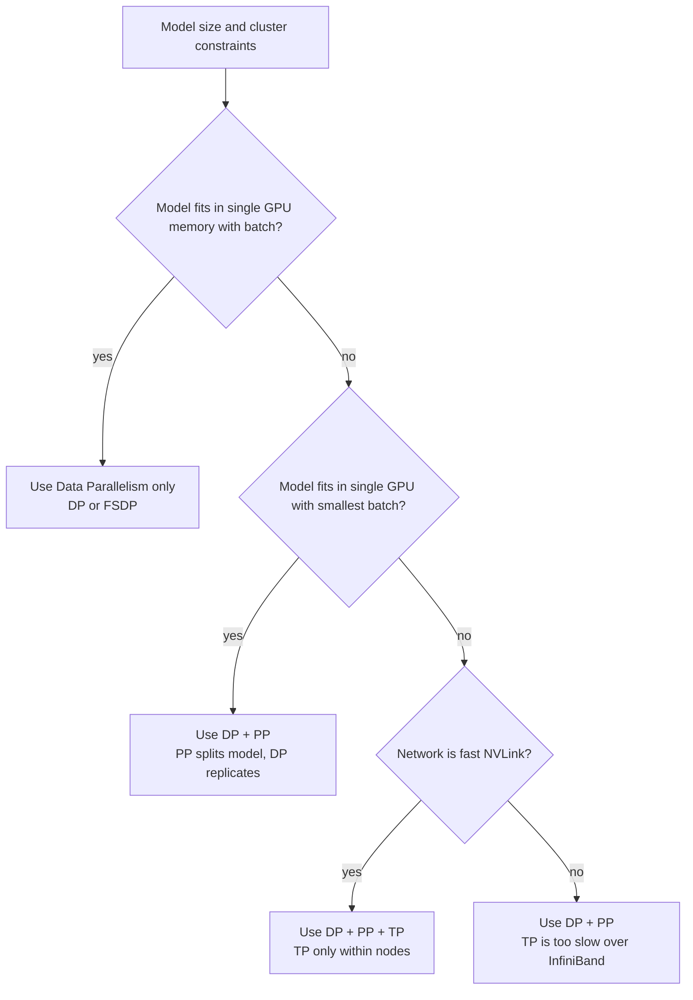

# Chapter 06: Tensor, Pipeline, and Expert Parallelism

| Chapter metadata | Value |
|---|---|
| Volume | 13 — Distributed Training Foundations |
| Difficulty | Expert |
| Estimated reading time | 75 minutes |
| Primary audience | ML/Infrastructure Engineers specializing in distributed systems |
| Core question | When should we shard computation (model parallelism) instead of data? |

## Learning Outcome

By the end of this chapter, you will be able to:
- Explain when Tensor Parallelism is necessary vs. when Data Parallelism suffices
- Calculate the pipeline bubble and predict efficiency for a given PP configuration
- Diagnose and fix TP/PP-specific failures (inter-node TP, bubble starvation, load imbalance)
- Design a hybrid parallelism strategy for a specific model and cluster topology

## Why Model Parallelism Exists: When Single-GPU Memory Isn't the Problem

Data Parallelism (FSDP, ZeRO-3) works well when **the model can fit on a single GPU** and we just want to speed up training by processing multiple batches in parallel. But for extremely large models, even FSDP sharding across 16-32 GPUs isn't enough.

Example: A 1-trillion-parameter (1T) model:
```
Memory needed (mixed precision, 12 bytes/param):  1T × 12 bytes = 12 TB

Even with 16 × 80GB H100s (1.28 TB aggregate):     Not enough by 9.4×
```

At this scale, we must split the model itself across GPUs. This is **Model Parallelism**.

## The Three Flavors of Model Parallelism

### Tensor Parallelism (TP): Shard Inside Layers

Tensor Parallelism splits individual matrix multiplications across GPUs. For example, a forward pass computation like:

```
C = matmul(A, B)  where A is [batch, hidden_size], B is [hidden_size, output_size]
```

becomes (with TP=2):

```
GPU 0: C_left = matmul(A, B_left)    # B_left is [hidden_size, output_size/2]
GPU 1: C_right = matmul(A, B_right)   # B_right is [hidden_size, output_size/2]
Then:  C = cat([C_left, C_right])     # Concatenate results
```

**Communication requirement:** A hidden value computed on GPU 0 is needed on GPU 1 for the next layer. This requires **All-Reduce** or **All-Gather** *every layer*.

For a 120-layer Transformer with TP=8, this is ~500 collective operations per training step. Each operation must complete before the next layer can proceed. This requires **intra-node NVLink** (900 GB/s) or InfiniBand won't be fast enough.

**Real communication math:**

```
Per-GPU computation time for one Transformer layer: ~500 ms (estimate for 7B model)
All-Reduce of activations (1/8 of layer output):  ~50-100 ms on NVLink
                                                   ~2-5 seconds on InfiniBand

If TP=8 crosses nodes: 2-5s per layer × 32 layers = 64-160s per step
Expected step without communication: 12s
Overhead: 5-13× slower! ← Not viable
```

### Pipeline Parallelism (PP): Shard Across Layers

Pipeline Parallelism splits the model by depth:

```
GPU 0: Layers 1-8 (embedding + first 8 transformer blocks)
GPU 1: Layers 9-16
GPU 2: Layers 17-24
GPU 3: Layers 25-32 (final layers + lm_head)
```

Each GPU processes its subset of layers. To avoid GPU 3 sitting idle while GPU 0 computes, the batch is split into **micro-batches**.

**Example: 4 stages, 8 micro-batches, 32 total layers:**

```
Time      GPU 0       GPU 1       GPU 2       GPU 3
t=0       MB1 fwd     idle        idle        idle
t=1       MB2 fwd     MB1 fwd     idle        idle
t=2       MB3 fwd     MB2 fwd     MB1 fwd     idle
t=3       MB4 fwd     MB3 fwd     MB2 fwd     MB1 fwd
t=4       MB5 fwd     MB4 fwd     MB3 fwd     MB2 fwd
t=5       MB6 fwd     MB5 fwd     MB4 fwd     MB3 fwd
t=6       MB7 fwd     MB6 fwd     MB5 fwd     MB4 fwd
t=7       MB8 fwd     MB7 fwd     MB6 fwd     MB5 fwd
t=8       idle        MB8 fwd     MB7 fwd     MB6 fwd
t=9       MB1 bwd     idle        MB8 fwd     MB7 fwd
...       (mirror for backward)
```

Notice: GPU 0 is idle from t=8 to t=9 (one time step). This is the **Pipeline Bubble**. It grows with the number of stages and shrinks with more micro-batches.

**Bubble percentage:**

```
Bubble = (num_stages - 1) / (num_micro_batches + num_stages - 1)

With 4 stages, 8 micro-batches:  (4-1) / (8+4-1) = 3/11 ≈ 27% idle
With 4 stages, 16 micro-batches: (4-1) / (16+4-1) = 3/19 ≈ 16% idle
With 4 stages, 32 micro-batches: (4-1) / (32+4-1) = 3/35 ≈ 8% idle
```

Reducing the bubble requires more micro-batches, which requires larger effective batch size (communication volume grows).

### Expert Parallelism (EP): Shard Across Experts in MoE

Mixture-of-Experts (MoE) models route each token to a subset of "experts" (specialized FFN layers). With 128 experts and 16 GPUs, you might place 8 experts per GPU. A token on GPU 0 might need to communicate with GPU 3 and GPU 7 for its experts.

```
Token enters GPU 0, gets routed to experts on GPUs: 0, 3, 7
Gradient update for experts 0, 3, 7 happens on their respective GPUs
All-to-All communication required to send tokens to correct experts
```

This requires low-latency **All-to-All** communication, which is harder to optimize than All-Reduce.

## Real-World TP Failure: Inter-Node Misconfiguration

**Scenario: Training a 200B model on a 2-node cluster (16 GPUs per node = 32 total)**

Engineer configures: TP=32 (one tensor parallelism group spanning all 32 GPUs)

**Observed behavior:**

```bash
torchrun --nproc_per_node=16 pretrain.py --tensor-model-parallel-size 32

GPU utilization:
  Node 0: GPUs 0-15  ← 85-90% utilization
  Node 1: GPUs 16-31 ← 8-12% utilization (mostly idle, waiting)

Training speed: 1.2 tokens/sec
Expected (if local): 20 tokens/sec
Slowdown: 16.7×
```

**Why?** TP=32 means every All-Reduce crosses the InfiniBand network between nodes:

```
Node 0  ←→  Node 1
Latency: ~2-5 microseconds
Bandwidth: ~200 Gbps (vs 900 Gbps NVLink)

Per All-Reduce (7B model / 32 shards = 219 MB):
  Time on NVLink: 219 MB / 900 GB/s ≈ 0.25 ms
  Time on IB: 219 MB / 25 GB/s ≈ 9 ms  ← 36× slower!

With 120 layers × 2 All-Reduces per layer = 240 All-Reduces per step:
  NVLink: 0.25ms × 240 = 60 ms overhead
  IB: 9ms × 240 = 2160 ms overhead  ← Over 2 seconds wasted!
```

**Fix: Constrain TP to node boundaries**

```bash
torchrun --nproc_per_node=16 pretrain.py \
  --tensor-model-parallel-size 8 \  # Stay within one node
  --pipeline-model-parallel-size 4  # Use PP to scale across nodes

# Topology:
#   Node 0: TP group 0 (GPUs 0-7) of pipeline stages 0,1; TP group 1 (GPUs 8-15) of stages 2,3
#   Node 1: TP groups 2,3 of stages 0,1; TP groups 4,5 of stages 2,3
```

Now All-Reduces stay within nodes (NVLink, 0.25ms each), and pipeline communication crosses nodes (acceptable).

**Resulting speed:** 18 tokens/sec (compared to 1.2 before)

## Real-World PP Failure: Bubble Starvation

**Scenario: Training a 70B model with PP=8, batch size 128 (16 tokens per GPU)**

```bash
torchrun --nproc_per_node=8 pretrain.py \
  --pipeline-parallel-size 8 \
  --global-batch-size 128 \
  --micro-batch-size 1  # Only 1 micro-batch per GPU!

Bubble calculation: (8-1) / (128/8 + 8-1) = 7 / 23 ≈ 30%
```

**Observed training speed:** 6.2 tokens/sec

**Expected (with low bubble):** ~10 tokens/sec

**Analysis:** With only 16 total micro-batches and 8 pipeline stages, we can't keep the pipeline full. GPU 7 finishes its forward pass for micro-batch 8, then waits 7 time steps for micro-batch 1 backward to arrive. This idle time is the bubble.

**Fix: Increase micro-batches**

```bash
torchrun --nproc_per_node=8 pretrain.py \
  --pipeline-parallel-size 8 \
  --global-batch-size 512 \    # 4× larger
  --micro-batch-size 8         # 8 tokens per GPU → 64 micro-batches total

Bubble: (8-1) / (512/8 + 8-1) = 7 / 71 ≈ 10%
```

**Resulting speed:** 9.7 tokens/sec (near expected, bubble reduced to ~10%)

**The tradeoff:** Larger batch size means more communication in gradient synchronization. But for this model, the bubble was the bottleneck, so the tradeoff was worth it.

## Choosing Between TP, PP, DP, and Combinations



## Production Monitoring: Parallelism-Specific Signals

For TP: Monitor All-Reduce frequency and latency
```bash
nvidia-smi -l 1  # Check GPU utilization (should be smooth, not sawtooth)
```

For PP: Monitor bubble via timeline profiler
```bash
# Use PyTorch profiler to measure idle vs active time per GPU
```

| Signal | TP indicator | PP indicator |
|---|---|---|
| Communication overhead | > 5% of step time | < 1% (communication happens across node boundary) |
| GPU utilization pattern | Smooth (constant ~90%) | Sawtooth (fills then empties pipeline) |
| Per-GPU step time variance | Identical (within 5%) | Varies by stage (edges have bigger bubbles) |

## Interview Preparation

**Conceptual:** "Why can't we use Tensor Parallelism across two separate data centers with slow WAN links?"

**Model Answer:** "Tensor Parallelism requires an All-Reduce collective operation inside every single transformer layer—dozens of times per training step. Each collective must complete before the next layer can proceed. Over a WAN with millisecond latency and gigabit-level bandwidth, even one All-Reduce could take seconds, and hundreds of them would make each step take minutes. This isn't just slow; it breaks the sequential nature of forward propagation. Tensor Parallelism only works with intra-node, high-bandwidth communication like NVLink. For geographic distribution, you need Pipeline Parallelism, which has one activation transfer per layer boundary (much less frequent)."

**Architecture:** "Design a 3D parallelism strategy for training a 1-trillion-parameter model on 1024 GPUs in a 16-node cluster (64 GPUs per node), assuming NVLink within nodes and InfiniBand between nodes."

**Model Answer:** "I'd use TP × PP × DP:
- **TP=8** (tensor parallelism): Each transformer block's matrix multiply is sharded across 8 GPUs within a single node. This keeps All-Reduces on NVLink.
- **PP=4** (pipeline parallelism): The model is split into 4 stages, each on a different node. This lets different nodes work in parallel without requiring tensor-level communication.
- **DP=32** (data parallelism): Remaining GPUs (1024 / 8 / 4 = 32) form data-parallel groups. Each DP group trains on a different batch shard.

Total: 8 × 4 × 32 = 1024 GPUs. Each node gets 64 GPUs arranged as 8 TP-groups × (portions of 4 PP stages) × DP. The TP operations stay local (NVLink), PP activations cross nodes (acceptable small overhead), and DP gradient synchronization happens within PP stages."

**Deep dive:** "Calculate the pipeline bubble for a 120-layer Transformer with PP=8, global batch size 2048, micro-batch size 4. Is it acceptable?"

**Model Answer:** "Number of micro-batches = 2048 / 4 = 512. Bubble % = (8-1) / (512+8-1) = 7/519 ≈ 1.35%. This is excellent—only ~1.35% idle time. Very acceptable. With 120 layers and ~50ms per layer, a full step is ~6 seconds. The bubble costs ~80ms, which is tiny. This configuration would yield near-optimal utilization."

## Related Chapters

- **Previous:** [Chapter 5 — DeepSpeed and ZeRO](./chapter-05-deepspeed-and-zero.md)
- **Next:** [Chapter 7 — Megatron-LM Architecture](./chapter-07-megatron-lm-architecture.md)
- **Related:** [Chapter 8 — NCCL Collectives](./chapter-08-nccl-collectives-and-communication-paths.md) — communication primitives underlying TP/PP
