# Chapter 06: Tensor, Pipeline, and Expert Parallelism

## WHY

While Data Parallelism (DP/FSDP/ZeRO) partitions the *data* and the *state*, sometimes a single model layer is too large to fit on one GPU, or the communication overhead of FSDP becomes a massive bottleneck across slow network links between nodes. Model Parallelism solves this by splitting the *computation* of the model itself.

## WHAT

The three primary methods of Model Parallelism are:
1. **Tensor Parallelism (TP):** Slices individual operations (like a matrix multiplication) across multiple GPUs. 
2. **Pipeline Parallelism (PP):** Slices the model by layers. For a 24-layer Transformer, GPU 0 gets layers 1-6, GPU 1 gets 7-12, etc.
3. **Expert Parallelism (EP):** In Mixture-of-Experts (MoE) models, each token is routed to a specific subset of "expert" networks. EP places different experts on different GPUs.

## HOW

TP slices individual operations *within* a layer, meaning GPUs must communicate multiple times *per layer* during both forward and backward passes. This requires extremely high-bandwidth, low-latency interconnects (NVLink).

PP slices the model sequentially. To avoid having GPU 1 sit idle while GPU 0 processes the batch, the batch is split into "micro-batches". However, there is still idle time at the start and end of every step. This idle time is the **Pipeline Bubble**.

```mermaid
gantt
    title Pipeline Bubble Visualization (4 Stages, 4 Micro-batches)
    dateFormat  s
    axisFormat %S
    
    section GPU 0 (Stage 1)
    MB 1 Forward :active, 0, 1s
    MB 2 Forward :active, 1, 2s
    MB 3 Forward :active, 2, 3s
    MB 4 Forward :active, 3, 4s
    Idle (Bubble) :crit, 4, 8s
    MB 1 Backward :active, 8, 9s
    
    section GPU 3 (Stage 4)
    Idle (Bubble) :crit, 0, 3s
    MB 1 Forward :active, 3, 4s
    MB 2 Forward :active, 4, 5s
    MB 3 Forward :active, 5, 6s
    MB 4 Forward :active, 6, 7s
    MB 1 Backward :active, 7, 8s
```



## WHEN

You use Tensor Parallelism when a single layer cannot fit on one GPU, or to increase compute bandwidth. You use Pipeline Parallelism when you need to scale across multiple nodes and TP is impossible due to slow InfiniBand links. You use Expert Parallelism strictly when training MoE architectures to balance routing.

## TRADEOFFS

| Strategy | Partitions... | Bottleneck / Challenge | Network Requirement |
| :--- | :--- | :--- | :--- |
| **Tensor (TP)** | Matrices within a layer | High communication frequency | Intra-node (NVLink/NVSwitch) |
| **Pipeline (PP)** | Layers sequentially | Pipeline bubble, memory imbalance | Inter-node (InfiniBand/RoCE) |
| **Data (DP/ZeRO)** | Batch / Model State | Memory capacity vs network traffic | Inter-node (InfiniBand/RoCE) |
| **Expert (EP)** | MoE Experts | Load balancing, All-to-All bandwidth | Inter-node or Intra-node |

## PRODUCTION

In a 3D parallel production setup, you must map logical ranks to the physical cluster topology carefully. TP requires the highest bandwidth, so TP ranks must be mapped to GPUs within the same physical node. PP requires relatively low bandwidth, so PP stages cross nodes. 

To reduce the pipeline bubble in production, engineers use **Interleaved Pipeline Parallelism**, which assigns multiple, smaller, non-contiguous blocks of layers to each GPU to increase virtual pipeline stages.

## TROUBLESHOOTING

### Scenario 1: Inter-Node Tensor Parallelism

**Context:** A team configures Megatron-LM to use TP=16 for a massive model across two 8-GPU nodes.
**Symptom:** Training starts but throughput is exceptionally low. GPU compute utilization is < 10%, but the network interface (NIC) is saturated.

**Diagnosis:** TP requires All-Reduce multiple times inside every single Transformer block. By setting TP=16, these operations are forced to cross the InfiniBand network between nodes, which is vastly slower than NVLink, choking the GPUs.

**Resolution:**
Constrain TP to the size of a single node (e.g., TP=8). Use Pipeline Parallelism (PP) or Data Parallelism (DP) to scale across nodes.

```bash
# Adjust your Megatron launch arguments to restrict TP to node boundaries
python pretrain_gpt.py \
  --tensor-model-parallel-size 8 \
  --pipeline-model-parallel-size 4 \
  # ...
```

### Scenario 2: Pipeline Bubble Starvation

**Context:** Training a 70B model using PP=8 and DP=4.
**Symptom:** GPUs show an unusual "sawtooth" utilization pattern. The bubble fraction calculation shows they spend 77% of their time idle.

**Diagnosis:** The number of micro-batches per pipeline is too low compared to the number of pipeline stages.

**Resolution:**
Increase the number of micro-batches per pipeline by increasing the global batch size.

```bash
# Increase micro-batches by scaling global batch size
python pretrain_gpt.py \
  --micro-batch-size 16 \
  --global-batch-size 512 \
  # ...
```

### Senior Interview Questions

**Q: Explain the difference between `All-Reduce` in Data Parallelism vs `All-Reduce` in Tensor Parallelism.**
**A:** In Data Parallelism, `All-Reduce` is used to sum the gradients across all workers *after* the backward pass is complete (once per step). In Tensor Parallelism, `All-Reduce` is used to sum the partial activations *during* the forward and backward pass of every single layer (dozens or hundreds of times per step).

<br/><br/><br/><br/><br/><br/><br/><br/><br/><br/><br/><br/><br/><br/><br/><br/><br/><br/><br/><br/><br/><br/><br/><br/><br/>
<br/><br/><br/><br/><br/><br/><br/><br/><br/><br/><br/><br/><br/><br/><br/><br/><br/><br/><br/><br/><br/><br/><br/><br/><br/>
<br/><br/><br/><br/><br/><br/><br/><br/><br/><br/><br/><br/><br/><br/><br/><br/><br/><br/><br/><br/><br/><br/><br/><br/><br/>
<br/>
<br/>
<br/>
<br/>
<br/>
<br/>
<br/>
<br/>
<br/>
<br/>
<br/>
<br/>
<br/>
<br/>
<br/>
<br/>
<br/>
<br/>
<br/>
<br/>
<br/>
<br/>
<br/>
<br/>
<br/>
<br/>
<br/>
<br/>
<br/>
<br/>
<br/>
<br/>
<br/>
<br/>
<br/>
<br/>
<br/>
<br/>
<br/>
<br/>
<br/>
<br/>
<br/>
<br/>
<br/>
<br/>
<br/>
<br/>
<br/>
<br/>
<br/>
<br/>
<br/>
<br/>
<br/>
<br/>
<br/>
<br/>
<br/>
<br/>
<br/>
<br/>
<br/>
<br/>
<br/>
<br/>
<br/>
<br/>
<br/>
<br/>
<br/>
<br/>
<br/>
<br/>
<br/>
<br/>
<br/>
<br/>
<br/>
<br/>
<br/>
<br/>
<br/>
<br/>
<br/>
<br/>
<br/>
<br/>
<br/>
<br/>
<br/>
<br/>
<br/>
<br/>
<br/>
<br/>
<br/>
<br/>
<br/>
<br/>
<br/>
<br/>
<br/>
<br/>
<br/>
<br/>
<br/>
<br/>
<br/>
<br/>
<br/>
<br/>
<br/>
<br/>
<br/>
<br/>
<br/>
<br/>
<br/>
<br/>
<br/>
<br/>
<br/>
<br/>
<br/>
<br/>
<br/>
<br/>
<br/>
<br/>
<br/>
<br/>
<br/>
<br/>
<br/>
<br/>
<br/>
<br/>
<br/>
<br/>
<br/>
<br/>
<br/>
<br/>
<br/>
<br/>
<br/>
<br/>
<br/>
<br/>
<br/>
<br/>
<br/>
<br/>
<br/>
<br/>
<br/>
<br/>
<br/>
<br/>
