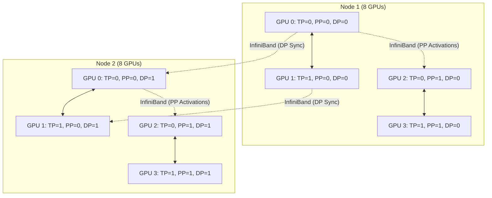

# Chapter 07: Megatron-LM Architecture

Megatron-LM, developed by NVIDIA's Applied Deep Learning Research team, is not just a framework—it is the foundational architecture for training the world's largest language models. While PyTorch provides the primitives (DDP, FSDP, RPC), Megatron-LM provides the hyper-optimized, 3D-parallel (Tensor, Pipeline, and Data Parallel) implementation of the Transformer architecture.

Understanding Megatron-LM means understanding how a single logical Transformer is physically shattered across thousands of GPUs and stitched back together using highly optimized CUDA kernels and NCCL collectives.

## The 3D Parallel Topology

Megatron-LM is built around the concept of orthogonal process groups. Every GPU belongs to a Tensor Parallel (TP) group, a Pipeline Parallel (PP) group, and a Data Parallel (DP) group simultaneously.



### 1. Tensor Parallel (TP) Dimension
Megatron's TP implementation splits the Multi-Head Attention (MHA) and Multi-Layer Perceptron (MLP) blocks column-wise and row-wise. 
* In the MHA block, the `Q, K, V` weight matrices are split column-wise. Each GPU computes a subset of the attention heads independently.
* An `All-Reduce` operation is required at the end of the MHA block to sum the outputs.
* This is completely invisible to the user mathematically, but physically relies heavily on NVLink bandwidth.

### 2. Pipeline Parallel (PP) Dimension
Megatron implements "1F1B" (One Forward, One Backward) pipeline scheduling, or the more advanced "Interleaved" 1F1B.
* Instead of buffering all forward micro-batches before starting backward passes (which consumes massive memory), 1F1B alternates them once the pipeline is full.
* This keeps activation memory strictly bounded.

### 3. Sequence Parallelism (SP)
A newer addition to the Megatron architecture is Sequence Parallelism.
* TP leaves certain operations (like LayerNorm and Dropout) unpartitioned, meaning every GPU in the TP group does redundant work and stores redundant activations.
* SP splits the sequence dimension (the tokens) across the TP group for these operations, further reducing activation memory without adding extra `All-Reduce` overhead.

## Trade-off Analysis: Megatron-LM vs. DeepSpeed ZeRO

| Feature | Megatron-LM (3D Parallel) | DeepSpeed ZeRO-3 (FSDP) |
| :--- | :--- | :--- |
| **Philosophy** | Partition compute and data explicitly (TP/PP). | Shard data and materialize on the fly (DP only). |
| **Network Reliance** | Requires extreme intra-node bandwidth (NVLink) for TP. | Requires extreme inter-node bandwidth for constant All-Gathers. |
| **Max Model Size** | Virtually unlimited (scales to trillions of params). | Bounded by network bandwidth and collective latency. |
| **Code Intrusiveness** | Extremely high. You must write models the "Megatron way." | Moderate. Can wrap standard PyTorch models. |
| **Usability** | Steep learning curve, strict cluster requirements. | Easier to adopt on varied hardware. |

*Note: In modern practice, these are often combined. Megatron-DeepSpeed integrates ZeRO-1/2 with Megatron's TP/PP.*

## Failure Scenarios

### Scenario 1: Unbalanced Pipeline Stages

**Context:** A team is adapting Megatron-LM for a custom vision-language model. They append a large Vision Encoder (ViT) to the start of the LLM pipeline.
**Symptom:** Throughput is low. `nvidia-smi` shows GPU 0 running at 100%, while GPUs 1-7 are running at 20%.

**Diagnosis:** Pipeline Parallelism requires all stages to take roughly the same amount of time. The ViT compute is much heavier than a single LLM layer block. GPU 0 is processing the ViT, creating a massive bottleneck. The rest of the pipeline is starved, waiting for GPU 0 to emit activations.

**Resolution:**
Megatron requires manual load balancing. You must define a custom pipeline split. You might need to place the ViT across multiple GPUs (using TP) or give GPU 0 fewer LLM layers to compensate for the ViT compute load.

### Scenario 2: The "Hanging on Initialization" Issue

**Context:** Launching a 1024-GPU Megatron-LM job using Slurm.
**Symptom:** The job starts, outputs a few lines about building process groups, and then hangs indefinitely. No error is thrown.

**Logs/Evidence:**
```text
[Rank 0] initializing torch distributed ...
[Rank 0] initialized tensor model parallel group
[Rank 0] initialized pipeline model parallel group
[Rank 0] initialized data parallel group
# ... silence for 20 minutes ...
```

**Diagnosis:** This is the most common Megatron failure. Megatron rigorously asserts that the process grid (`TP * PP * DP`) exactly equals the total `WORLD_SIZE`. If a single node fails to communicate due to a broken InfiniBand cable, a bad NCCL configuration, or a mismatched Slurm hostlist, NCCL will block forever trying to form the global ring.

**Resolution:**
1. Enable `NCCL_DEBUG=INFO` to see exactly which rank is failing to connect.
2. Run a standard `all_reduce_perf` test (from the `nccl-tests` suite) across the cluster before launching Megatron to isolate hardware faults.
3. Verify the `MASTER_ADDR` and `MASTER_PORT` are reachable from all nodes.

## Senior Interview Questions

**Q: In Megatron's Tensor Parallelism, why is the first Linear layer split column-wise, but the second Linear layer split row-wise?**
**A:** This specific arrangement minimizes communication. If the first layer is split column-wise, its outputs are partitioned along the feature dimension. The second layer, split row-wise, can take these partitioned outputs directly as input. Each GPU computes a partial sum. We only need a single `All-Reduce` at the very end of the second layer to sum the partial results across the TP group. If both were split the same way, we would need two `All-Reduce` operations.

**Q: Explain how Megatron-LM's "Interleaved 1F1B" scheduling improves over standard 1F1B.**
**A:** Standard 1F1B assigns a contiguous block of layers (e.g., layers 1-4) to a GPU. The pipeline bubble is proportional to the number of stages. Interleaved 1F1B assigns multiple, smaller, non-contiguous blocks to a GPU (e.g., layers 1-2 AND layers 9-10). Because the GPU serves as multiple "virtual" stages in the pipeline, it begins processing its second block of layers earlier, effectively shrinking the idle time (bubble) at the start and end of the batch.

**Q: Why might sequence parallelism be necessary even if you are already using Tensor Parallelism (TP=8)?**
**A:** Standard TP (TP=8) splits the heavy matmuls (MHA, MLP). However, it leaves operations like LayerNorm and Dropout replicated on all 8 GPUs. For very long context windows (e.g., 100k tokens), storing the replicated activations for LayerNorm across all 8 GPUs causes OOM errors. Sequence Parallelism slices the sequence dimension for these operations, ensuring the activation memory for LayerNorm is also divided by 8, enabling much longer context training.

<br/>
<br/>
<br/>
<br/>
<br/>
<br/>
<br/>
<br/>
<br/>
<br/>
<br/>
<br/>
<br/>
<br/>
<br/>
<br/>
<br/>
<br/>
<br/>
<br/>
<br/>
<br/>
<br/>
<br/>
<br/>
<br/>
<br/>
<br/>
<br/>
<br/>
<br/>
<br/>
<br/>
<br/>
<br/>
<br/>
<br/>
<br/>
<br/>
<br/>
<br/>
<br/>
<br/>
<br/>
<br/>
<br/>
<br/>
<br/>
<br/>
<br/>
<br/>
<br/>
<br/>
<br/>
<br/>
<br/>
<br/>
<br/>
<br/>
<br/>
<br/>
<br/>
<br/>
<br/>
<br/>
<br/>
<br/>
<br/>
<br/>
<br/>
<br/>
<br/>
<br/>
<br/>
<br/>
<br/>
<br/>
<br/>
<br/>
<br/>
<br/>
<br/>
<br/>
<br/>
<br/>
<br/>
<br/>
<br/>
<br/>
<br/>
<br/>
<br/>
<br/>
<br/>
<br/>
<br/>
<br/>
<br/>
<br/>
<br/>
<br/>
<br/>
<br/>
<br/>
<br/>
<br/>
<br/>
<br/>
<br/>
<br/>
<br/>
<br/>
<br/>
<br/>
<br/>
<br/>
<br/>
<br/>
<br/>
<br/>
<br/>
<br/>
<br/>
<br/>
<br/>
<br/>
<br/>
<br/>
<br/>
<br/>
<br/>
<br/>
<br/>
<br/>
<br/>
<br/>
<br/>
<br/>
<br/>
<br/>
<br/>
<br/>
<br/>
<br/>
<br/>
<br/>
<br/>
<br/>
<br/>
<br/>
<br/>
