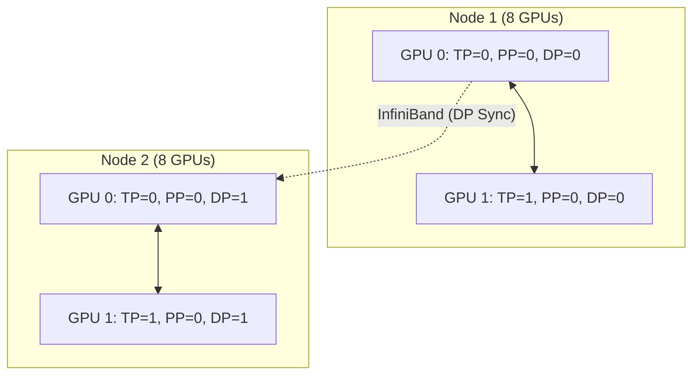

# Chapter 07: Megatron-LM Architecture

## WHY: Scaling to Trillions
PyTorch provides primitives (DDP, FSDP), but training the absolute largest models requires a hyper-optimized, custom implementation of the Transformer architecture built for 3D parallelism.

## WHAT: Megatron-LM
Megatron-LM is the foundational architecture for training massive LLMs. It shatters a single logical Transformer across thousands of GPUs using optimized CUDA kernels and complex NCCL groups.

## HOW: Rank Groups and Data Flow
Every GPU belongs to orthogonal Tensor Parallel (TP), Pipeline Parallel (PP), and Data Parallel (DP) groups simultaneously.

## WHEN: Adoption Decisions
Megatron-LM is necessary when pushing hardware limits, but it requires writing models the "Megatron way." It is intrusive but yields maximum efficiency on rigid, well-connected cluster topologies.

## TRADEOFFS: Megatron-LM vs FSDP

| Feature | Megatron-LM | FSDP / ZeRO-3 |
| :--- | :--- | :--- |
| **Philosophy** | Partition compute/data explicitly | Shard data natively |
| **Code Intrusiveness**| Extremely high | Moderate |
| **Usability** | Strict cluster requirements | Easier to adopt |

## PRODUCTION: Sequence Parallelism
To optimize production memory further, Megatron introduces Sequence Parallelism (SP). It splits the sequence dimension across the TP group for operations like LayerNorm, saving memory on very long contexts without extra All-Reduce overhead.

## TROUBLESHOOTING: Failure Scenarios

### Scenario 1: The "Hanging on Initialization" Issue
**Symptom:** Job starts, logs process groups, then hangs indefinitely with no error.
**Diagnosis:** Megatron asserts the process grid exactly equals WORLD_SIZE. A single node failing to communicate via InfiniBand will block NCCL forever.
**Resolution:** Enable `NCCL_DEBUG=INFO` to find the failing rank. Run `all_reduce_perf` to isolate hardware faults.

### Senior Interview Questions
**Q: Why is Megatron's first Linear layer split column-wise, but the second split row-wise?**
**A:** This minimizes communication. The first layer partitions outputs along the feature dimension, which the second layer takes directly to compute a partial sum. We only need a single All-Reduce at the end, saving massive bandwidth.

                        
                        
 
 
 
 
 
 
 
 
 
 
 
 
 
 
 
 
 
 
 
 
 
 
 
 
 
 
 
 
 
 
 
 
 
 
 
 
 
 
 
 
 
 
 
 
 
 
 
 
 
 
 
 
 
 
 
 
 
 
 
 
 
 
 
 
 
 
 
 
 
 
 
 
 
 
 
 
 
 
 
 
 
 
 
 
 
 
 
 
 
 
 
 
 
 
 
 
 
 
 
 
 
 
 
 
 
 
 
 
 
 
 
 
 
 
 
 
 
 
 
 
 
 
 
 
 
 
 
 
 
 
 
 
 
 
 
 
 
 
 
 
 
 
 
 
 
 
 
 
 
 
 
 
 
 
 
 
 
 
 
 
 
 
 
 
 
 
 
 
 
 
 
 
 
 
 
 
 
 
 
 
 
 
 
 
 
 
 
 
 
 
 
 
 
 
 
 
 
 
 
 
 
 
 
 
 
 
 
 
 
 
 
 
 
 
 
 
 
 
 
 
