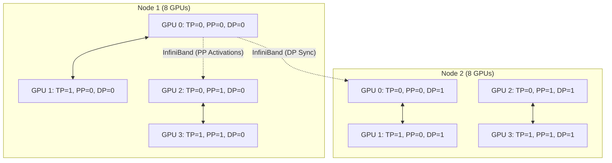

# Chapter 07: Megatron-LM Architecture

| Chapter metadata | Value |
|---|---|
| Volume | 13 — Distributed Training Foundations |
| Difficulty | Expert |
| Estimated reading time | 70 minutes |
| Primary audience | Infrastructure Engineers specializing in LLM training |
| Core question | How do we coordinate 3D parallelism across thousands of GPUs? |

## WHY

While PyTorch provides the primitives (DDP, FSDP, RPC), training the world's absolute largest models requires a hyper-optimized, custom implementation of the Transformer architecture built natively for 3D parallelism. You need extreme control over memory allocations, CUDA kernels, and communication overlap.

## WHAT

Megatron-LM, developed by NVIDIA's Applied Deep Learning Research team, is the foundational architecture for training massive LLMs. It is a highly optimized, 3D-parallel implementation that shatters a single logical Transformer across thousands of GPUs and stitches it back together using custom NCCL collectives.

## HOW

Megatron-LM is built around the concept of orthogonal process groups. Every GPU belongs to a Tensor Parallel (TP) group, a Pipeline Parallel (PP) group, and a Data Parallel (DP) group simultaneously.



In TP, Megatron splits the Multi-Head Attention (MHA) block column-wise and the MLP row-wise to minimize the number of required `All-Reduce` operations. In PP, it implements "1F1B" (One Forward, One Backward) pipeline scheduling to keep activation memory strictly bounded.

### Worked Example: Sizing a 175B-Parameter Training Run

Take a GPT-3-scale model: 175B parameters, 96 transformer layers, on a cluster of 1024 H100 GPUs (128 nodes × 8 GPUs/node).

**Step 1 — memory floor per GPU with pure data parallelism.** Using the mixed-precision Adam accounting established in Chapter 5 (FP32 weights 4 bytes/param + FP32 gradients 4 bytes/param + FP32 momentum/variance 8 bytes/param = 16 bytes/param total optimizer+model state):

```
175B params × 16 bytes/param = 2,800 GB of state

Even fully sharded (ZeRO-3) across 1024 GPUs: 2,800 GB / 1024 ≈ 2.7 GB/GPU for state alone.
```

That number alone looks trivial — the real constraint is activations and communication, not state, which is exactly why a 175B model still needs model parallelism rather than pure ZeRO-3: at this parameter count, ZeRO-3's constant All-Gather traffic on every forward and backward pass becomes the bottleneck (Chapter 5 covers why All-Gather-per-layer doesn't scale past a few hundred GPUs of network diameter).

**Step 2 — Megatron's 3D layout.** A representative configuration for this model:

```
TP = 8   (one full node's NVLink domain — matches GPU count per node)
PP = 16  (96 layers / 16 stages = 6 transformer layers per stage)
DP = 8   (1024 / (8 × 16) = 8-way data parallel replication)

Total: 8 × 16 × 8 = 1024 GPUs ✓
```

**Step 3 — per-GPU weight memory.** Each GPU now holds only 1/(TP×PP) of the model's parameters — the DP dimension replicates that shard, it doesn't shrink it further:

```
175B / (8 × 16) ≈ 1.37B params per GPU
Weights + gradients + optimizer state (16 bytes/param): 1.37B × 16 bytes ≈ 22 GB

This fits comfortably in an 80GB H100 alongside activations — the actual
reason 3D parallelism is chosen over pure ZeRO-3 at this scale: it turns an
intractable per-GPU footprint into a manageable one without relying on
constant cross-node All-Gathers.
```

**Step 4 — pipeline bubble at this configuration.** Following the bubble formula from Chapter 6, with a global batch size of 2048 and micro-batch size 1 (a common starting point for very large models where even one sample's activations are expensive):

```
Number of micro-batches = 2048 / 8 (DP groups process 256 samples each, split into micro-batches of 1) = 256 per DP replica
Bubble % = (PP - 1) / (micro_batches + PP - 1) = (16-1) / (256+16-1) = 15/271 ≈ 5.5%
```

A ~5.5% bubble on a 16-stage pipeline is reasonable; it would be far worse (roughly 27%, per Chapter 6's math) if the global batch were small enough to force only 32 total micro-batches.

## WHEN

You choose Megatron-LM when you are training a model that pushes the physical limits of your cluster, and you are willing to sacrifice ease-of-use for maximum theoretical efficiency. It is highly intrusive—you must write your model code the "Megatron way."

## TRADEOFFS

| Feature | Megatron-LM (3D Parallel) | DeepSpeed ZeRO-3 (FSDP) |
| :--- | :--- | :--- |
| **Philosophy** | Partition compute and data explicitly (TP/PP). | Shard data and materialize on the fly (DP only). |
| **Network Reliance** | Requires extreme intra-node bandwidth (NVLink) for TP. | Requires extreme inter-node bandwidth for constant All-Gathers. |
| **Max Model Size** | Virtually unlimited (scales to trillions of params). | Bounded by network bandwidth and collective latency. |
| **Code Intrusiveness** | Extremely high. | Moderate. Can wrap standard PyTorch models. |

## PRODUCTION

In production, Megatron introduces **Sequence Parallelism (SP)**. TP leaves certain operations (like LayerNorm and Dropout) unpartitioned, meaning every GPU in the TP group stores redundant activations. For very long context windows, this causes OOMs. SP splits the sequence dimension across the TP group for these operations, heavily reducing activation memory without adding extra `All-Reduce` overhead.

Megatron also implements **selective activation recomputation**, a refinement of the checkpointing tradeoff from Chapter 2. Instead of the binary choice ("checkpoint every layer" vs. "checkpoint nothing"), Megatron recomputes only the cheap-to-recompute, expensive-to-store operations — attention softmax and dropout masks — while keeping the expensive-to-recompute matrix multiplication outputs resident. In practice this recovers most of the memory savings of full activation checkpointing (roughly 70-80% of it, since attention/dropout intermediates are a large fraction of stored activation volume in a Transformer) for a much smaller fraction of the ~30-50% backward-pass slowdown that full recomputation costs (Chapter 2). The exact recovered percentage is workload- and sequence-length-dependent — always confirm on your own model shape with a profiler rather than assuming a fixed ratio.

## TROUBLESHOOTING

### Scenario 1: The "Hanging on Initialization" Issue

**Context:** Launching a 1024-GPU Megatron-LM job using Slurm.
**Symptom:** The job starts, outputs a few lines about building process groups, and then hangs indefinitely. No error is thrown.

**Diagnosis:** Megatron rigorously asserts that the process grid (`TP * PP * DP`) exactly equals the total `WORLD_SIZE`. If a single node fails to communicate due to a broken InfiniBand cable or a bad Slurm hostlist, NCCL will block forever trying to form the global ring.

**Resolution:**
Enable NCCL debug logging to isolate the failing rank, then test raw hardware communication bypassing Megatron.

```bash
# Set explicit debugging and error handling for NCCL
export NCCL_DEBUG=INFO
export NCCL_ASYNC_ERROR_HANDLING=1

# Run nccl-tests across nodes to identify the hardware fault
mpirun -np 16 -H node1:8,node2:8 ./build/all_reduce_perf -b 8 -e 128M -f 2 -g 1
```

### Scenario 2: Pipeline Stage Imbalance ("The Ghost Straggler")

**Context:** A 96-layer model split PP=16 (6 layers/stage), where the embedding table and final `lm_head` are both placed on the first and last stages respectively, as is default in many implementations.

**Symptom:** `nsys` profiling shows stage 0 and stage 15 consistently taking ~40% longer per micro-batch than stages 1-14, even though every stage has exactly 6 transformer layers.

**Diagnosis:** Layer *count* is balanced, but layer *cost* is not. Stage 0 carries the embedding lookup (memory-bound, large vocabulary table — for a 50K-vocabulary model at hidden size 12288, that's a 50K × 12288 × 2 bytes ≈ 1.2 GB table plus a gather operation over it) and stage 15 carries the `lm_head` projection back to vocabulary size (a large matmul, roughly the same FLOP cost as embedding but compute-bound). Both add work on top of their 6 regular transformer layers, so those two stages become the pipeline's slowest link — and because PP is only as fast as its slowest stage, the whole pipeline waits on them every micro-batch.

**Resolution:** Rebalance by giving the embedding/lm_head-carrying stages fewer transformer layers than the middle stages (e.g., 5 layers on stages 0 and 15, 6-7 on the middle stages), or tie/shard the embedding and `lm_head` weights and split the vocabulary projection itself across additional GPUs. Megatron's `--num-layers-per-virtual-pipeline-stage` (interleaved 1F1B) is the more general fix: it splits each physical stage into multiple virtual chunks so uneven work is smoothed out on average, at the cost of extra pipeline communication rounds.

## Interview Preparation

**Conceptual:** "In Megatron's Tensor Parallelism, why is the first Linear layer split column-wise, but the second Linear layer split row-wise?"

**Model Answer:** "This specific arrangement minimizes communication. If the first layer is split column-wise, its outputs are partitioned along the feature dimension — each GPU holds a different slice of the intermediate activation, and no synchronization is needed yet because the nonlinearity (GeLU, for example) can be applied independently per-slice. The second layer, split row-wise, can take these partitioned outputs directly as input without any communication in between. We only need a single `All-Reduce` at the very end of the second layer to sum the partial results and reconstruct the true output. If both layers were split the same way — say, both column-wise — we'd need an All-Reduce or All-Gather between them just to reassemble a full activation before the second matmul could proceed, doubling the communication per MLP block."

**Architecture:** "You're training a 175B-parameter model on 1024 H100s. Walk me through how you'd choose TP, PP, and DP degrees, and what breaks if you get the TP degree wrong."

**Model Answer:** "I'd start from the hardware topology, not the model size. TP requires an All-Reduce inside every layer, so it has to stay within the fastest interconnect I have — that's the 8-GPU NVLink domain inside one HGX node, so TP=8 is close to a hard ceiling; going to TP=16 would mean half of every layer's All-Reduce crosses InfiniBand, and Chapter 6 showed that can be an order of magnitude slower per collective. From there, PP absorbs the rest of the scale-out across nodes — with 96 layers, PP=16 gives 6 layers per stage, and DP fills whatever GPUs remain: 1024/(8×16) = 8-way data parallel. If I set TP=32 instead, spanning multiple nodes, every one of the roughly 200 All-Reduce operations per step now crosses InfiniBand instead of NVLink, and step time can degrade by an order of magnitude — I've seen this exact misconfiguration turn a 12-second step into a multi-minute one in Chapter 6's cross-node TP example."

**Troubleshooting:** "Your Megatron job trains fine for the first few hundred steps, then activation memory usage climbs steadily until it OOMs — but only on the pipeline's last stage. What's your hypothesis and how do you confirm it?"

**Model Answer:** "Steady, monotonic growth rather than an immediate OOM points at an accumulation bug rather than a static undersizing — if the config were simply too large, it would OOM on step one. Because it's isolated to the last pipeline stage, my first hypothesis is that activations for in-flight micro-batches are piling up faster than they're being consumed by backward passes — the last stage in 1F1B scheduling has to hold onto more in-flight micro-batch state relative to its compute time if the loss/backward hookup for the final stage isn't releasing its output tensors promptly, e.g., a metrics-logging step that holds a reference to logits across iterations. I'd confirm with `nvidia-smi` memory-over-time on that specific rank alongside `torch.cuda.memory_summary()` snapshots taken every N steps, looking for which tensor category (activations vs. cached allocator blocks) is actually growing, then check whether any Python-side reference — logging, a debug hook, an evaluation callback — is keeping tensors alive past when the pipeline schedule expects them to be freed."

## Related Chapters

- **Previous:** [Chapter 6 — Tensor, Pipeline, and Expert Parallelism](./chapter-06-tensor-pipeline-and-expert-parallelism.md)
- **Next:** [Chapter 8 — NCCL Collectives and Communication Paths](./chapter-08-nccl-collectives-and-communication-paths.md)
- **Related:** [Chapter 5 — DeepSpeed and ZeRO](./chapter-05-deepspeed-and-zero.md) — contrasting sharding-only vs. 3D-parallel approaches to the same memory problem
