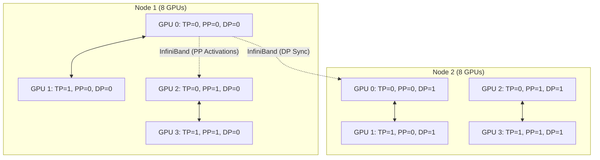

# Chapter 07: Megatron-LM Architecture

| Chapter metadata | Value |
|---|---|
| Volume | 13 — Distributed Training Foundations |
| Difficulty | Expert |
| Estimated reading time | 70 minutes |
| Primary audience | Infrastructure Engineers specializing in LLM training |
| Core question | How do we coordinate 3D parallelism across thousands of GPUs? |

## WHY

While PyTorch provides the primitives (DDP, FSDP, RPC), training the world's absolute largest models requires a hyper-optimized, custom implementation of the Transformer architecture built natively for 3D parallelism. You need extreme control over memory allocations, CUDA kernels, and communication overlap.

## WHAT

Megatron-LM, developed by NVIDIA's Applied Deep Learning Research team, is the foundational architecture for training massive LLMs. It is a highly optimized, 3D-parallel implementation that shatters a single logical Transformer across thousands of GPUs and stitches it back together using custom NCCL collectives.

## HOW

Megatron-LM is built around the concept of orthogonal process groups. Every GPU belongs to a Tensor Parallel (TP) group, a Pipeline Parallel (PP) group, and a Data Parallel (DP) group simultaneously.



In TP, Megatron splits the Multi-Head Attention (MHA) block column-wise and the MLP row-wise to minimize the number of required `All-Reduce` operations. In PP, it implements "1F1B" (One Forward, One Backward) pipeline scheduling to keep activation memory strictly bounded.

## WHEN

You choose Megatron-LM when you are training a model that pushes the physical limits of your cluster, and you are willing to sacrifice ease-of-use for maximum theoretical efficiency. It is highly intrusive—you must write your model code the "Megatron way."

## TRADEOFFS

| Feature | Megatron-LM (3D Parallel) | DeepSpeed ZeRO-3 (FSDP) |
| :--- | :--- | :--- |
| **Philosophy** | Partition compute and data explicitly (TP/PP). | Shard data and materialize on the fly (DP only). |
| **Network Reliance** | Requires extreme intra-node bandwidth (NVLink) for TP. | Requires extreme inter-node bandwidth for constant All-Gathers. |
| **Max Model Size** | Virtually unlimited (scales to trillions of params). | Bounded by network bandwidth and collective latency. |
| **Code Intrusiveness** | Extremely high. | Moderate. Can wrap standard PyTorch models. |

## PRODUCTION

In production, Megatron introduces **Sequence Parallelism (SP)**. TP leaves certain operations (like LayerNorm and Dropout) unpartitioned, meaning every GPU in the TP group stores redundant activations. For very long context windows, this causes OOMs. SP splits the sequence dimension across the TP group for these operations, heavily reducing activation memory without adding extra `All-Reduce` overhead.

## TROUBLESHOOTING

### Scenario 1: The "Hanging on Initialization" Issue

**Context:** Launching a 1024-GPU Megatron-LM job using Slurm.
**Symptom:** The job starts, outputs a few lines about building process groups, and then hangs indefinitely. No error is thrown.

**Diagnosis:** Megatron rigorously asserts that the process grid (`TP * PP * DP`) exactly equals the total `WORLD_SIZE`. If a single node fails to communicate due to a broken InfiniBand cable or a bad Slurm hostlist, NCCL will block forever trying to form the global ring.

**Resolution:**
Enable NCCL debug logging to isolate the failing rank, then test raw hardware communication bypassing Megatron.

```bash
# Set explicit debugging and error handling for NCCL
export NCCL_DEBUG=INFO
export NCCL_ASYNC_ERROR_HANDLING=1

# Run nccl-tests across nodes to identify the hardware fault
mpirun -np 16 -H node1:8,node2:8 ./build/all_reduce_perf -b 8 -e 128M -f 2 -g 1
```

### Senior Interview Questions

**Q: In Megatron's Tensor Parallelism, why is the first Linear layer split column-wise, but the second Linear layer split row-wise?**
**A:** This specific arrangement minimizes communication. If the first layer is split column-wise, its outputs are partitioned along the feature dimension. The second layer, split row-wise, can take these partitioned outputs directly as input. We only need a single `All-Reduce` at the very end of the second layer to sum the partial results. If both were split the same way, we would need two `All-Reduce` operations.
