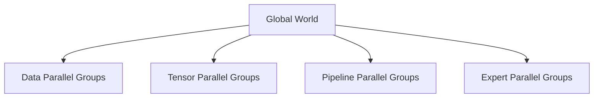

# Megatron-LM Architecture

Megatron-style training combines several parallelism dimensions so very large transformer models can use many GPUs efficiently.

## Rank Groups

Each process belongs to multiple communication groups. Incorrect world size, rank mapping, or topology can produce hangs or severe performance loss.

## Architecture Decisions

Choose tensor size to fit fast intra-node links, pipeline stages to balance layer cost, and data-parallel scale to match batch and optimization goals.

## Production Operations

Preserve launch configuration, topology, framework commit, container digest, dataset revision, and checkpoint metadata. Reproducibility depends on more than model code.

## Troubleshooting

A job that initializes but hangs at the first step often has inconsistent rank groups, unreachable peers, or mismatched configuration across nodes.
