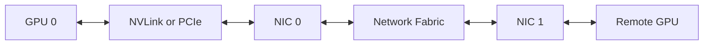

# NCCL Collectives and Communication Paths

Collectives move distributed state among ranks. Their performance depends on message size, algorithm, topology, transport, process placement, and the slowest participant.

## Core Operations

| Collective | Typical use |
|---|---|
| All-reduce | Aggregate gradients |
| Reduce-scatter | Reduce and shard results |
| All-gather | Reconstruct sharded parameters |
| Broadcast | Distribute common state |
| All-to-all | Expert or token exchange |

## Data Path



## Verification

```bash
nvidia-smi topo -m
./all_reduce_perf -b 8M -e 1G -f 2 -g 8
```

Compare bus bandwidth, algorithm bandwidth, errors, and consistency across nodes.

## Troubleshooting

NCCL timeouts are symptoms. Inspect rank health, interface selection, addressing, MTU, RDMA state, topology, firewall policy, and fabric counters.
