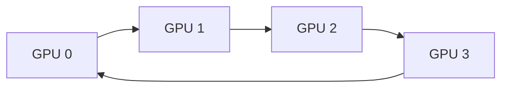
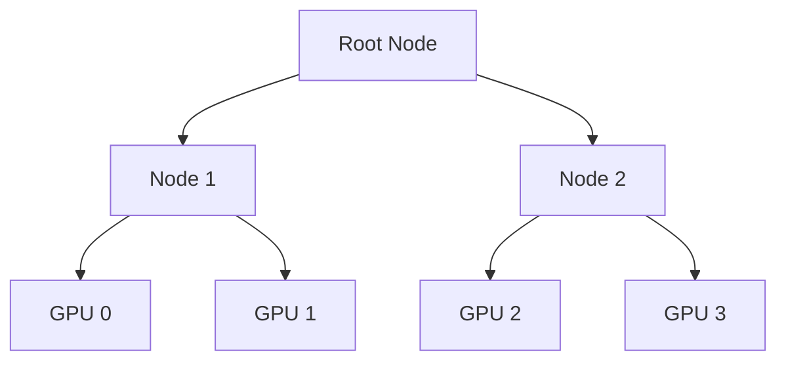

# NCCL Collectives and Communication Paths

| Chapter metadata | Value |
|---|---|
| Volume | 13 — Distributed Training Foundations |
| Difficulty | Advanced |
| Estimated reading time | 60 minutes |
| Primary audience | Infrastructure Engineers, Network specialists |
| Core question | How do billions of parameters move between GPUs efficiently? |

## WHY

When training deep neural networks across multiple GPUs, no single GPU holds the entire training state or data. They must constantly exchange gradients, optimizer states, and model parameters. If this communication is slow, your expensive GPUs spend more time waiting than calculating. The problem this solves is ensuring that data movement between GPUs happens as efficiently as physically possible.

Deep learning frameworks use distributed data parallelism and model parallelism to split work. However, the math requires the results to be unified. Imagine eight workers building a car; if they don't coordinate their parts continuously, the car won't fit together.

## WHAT

The **NVIDIA Collective Communication Library (NCCL)** (pronounced "Nickel") is a library of standard communication routines specifically optimized for NVIDIA GPUs. Instead of forcing each application to write custom code for how GPUs should talk over PCIe, NVLink, or InfiniBand, NCCL provides a unified API.

Think of NCCL as the logistics and shipping department of your GPU cluster. You tell it "distribute these gradients to everyone," and NCCL automatically determines the fastest route (using NVLink locally and InfiniBand across nodes) and the best algorithm.

A **collective** is an operation that involves all GPUs (or "ranks") in a communication group.

## HOW

NCCL dynamically selects how to route data based on your hardware topology using structures like Rings or Trees.

### Ring Topology

In a Ring algorithm, GPUs are arranged in a logical circle. Each GPU sends data to its right neighbor and receives from its left. This breaks large messages into smaller chunks, pipelining them around the ring.



### Tree Topology

For very large clusters, rings have high latency. Tree algorithms (like Double Binary Trees) arrange GPUs hierarchically, reducing the number of hops logarithmically at the cost of complexity.



## WHEN

You use specific NCCL collectives depending on the parallelization strategy:

| Collective | What it does | Typical Use Case (When) |
|---|---|---|
| **Broadcast** | Sends data from one GPU to all others. | Distributing initial weights. |
| **All-Reduce** | Reduces (e.g., sums) data from all GPUs, then broadcasts the result to all. | Aggregating gradients in Data Parallelism. |
| **Reduce-Scatter** | Reduces data from all GPUs, but shards the result across the GPUs. | FSDP or ZeRO phase 1 (sharded gradients). |
| **All-Gather** | Each GPU has a piece of data; everyone shares so everyone has the full picture. | FSDP or ZeRO phase 3 (gathering parameters). |
| **All-to-All** | Every GPU sends a unique piece of data to every other GPU. | Mixture of Experts (MoE) token routing. |

## TRADEOFFS

When deciding between Ring and Tree topologies, consider the following tradeoffs:

| Feature | Ring Topology | Tree Topology |
|---|---|---|
| **Latency** | High (proportional to total GPUs) | Low (logarithmic) |
| **Bandwidth Utilization** | Excellent for large messages | Better for small/medium messages |
| **Failure Domain** | One failed node breaks the entire ring | Complex recovery, but fewer hops |
| **Primary Use** | Standard All-Reduce on large tensors | High-scale clusters, latency-sensitive steps |

## PRODUCTION

In a production setting, understanding the physical layer is critical. NCCL will automatically discover the fastest paths between GPUs. NVLink provides magnitudes higher bandwidth than PCIe. For example, PCIe Gen4 x16 provides ~32 GB/s per direction, while NVLink 4 (Hopper) provides up to 450 GB/s per direction. If NCCL falls back to PCIe, your communication phase will become a massive bottleneck, crippling production MFU.

**Q: How would you design a distributed training job to overlap communication and computation?**
**A:** I would leverage framework features like PyTorch DDP's gradient bucketing. By grouping gradients into buckets, NCCL can start executing the All-Reduce collective on Bucket 1 while the GPU is still computing the backward pass for Bucket 2. This hides the network latency behind compute operations.

## TROUBLESHOOTING

### Scenario 1: NCCL Timeout (The Slowest Rank Problem)

**Symptom:** Training hangs indefinitely. After 30 minutes, you see a log like this:
```text
[1,0]<stdout>:[11910] NCCL WARN Watchdog caught network down!
[1,0]<stdout>:[11910] NCCL WARN Call to connect returned Connection timed out
```

**Diagnosis:** A collective operation requires all ranks to participate. If Rank 7 crashes, Rank 0 will wait forever.
**Evidence vs. Proof:** The `Connection timed out` log is evidence. It proves NCCL timed out waiting, but it does not prove the network is broken. The remote process could have OOM'd. 
**Resolution:** First, enable verbose NCCL logging and inspect system logs on the remote node for OOM kills.
```bash
export NCCL_DEBUG=INFO
export NCCL_DEBUG_SUBSYS=INIT,ENV
# On the remote node, check for OOM
dmesg -T | grep -i oom
```

### Scenario 2: Unexpected Fallback to PCIe

**Symptom:** Training runs, but it is much slower than expected. You see:
```text
NCCL INFO Using PCIe interface
```
**Diagnosis:** NCCL automatically fell back to slower interconnects.
**Evidence vs. Proof:** The log is evidence. It proves NCCL decided NVLink/IB was unusable, but it does not prove hardware failure. It could be a missing kernel module or disabled fabric manager.
**Resolution:** Verify the NVLink topology and ensure the NVIDIA Fabric Manager is active.
```bash
nvidia-smi topo -m
systemctl status nvidia-fabricmanager
sudo systemctl restart nvidia-fabricmanager
```
