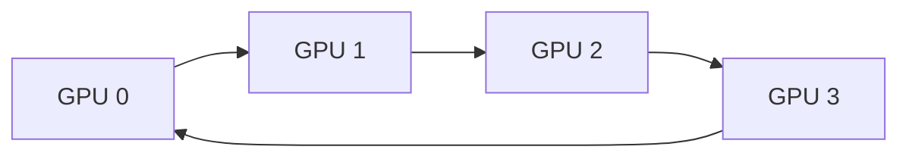
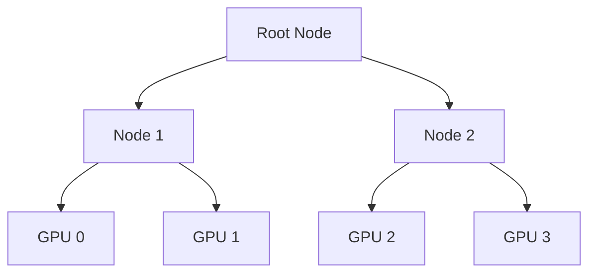

# NCCL Collectives and Communication Paths

| Chapter metadata | Value |
|---|---|
| Volume | 13 — Distributed Training Foundations |
| Difficulty | Advanced |
| Estimated reading time | 60 minutes |
| Primary audience | Infrastructure Engineers, Network specialists |
| Core question | How do billions of parameters move between GPUs efficiently? |

## WHY

When training deep neural networks across multiple GPUs, no single GPU holds the entire training state or data. They must constantly exchange gradients, optimizer states, and model parameters. If this communication is slow, your expensive GPUs spend more time waiting than calculating. The problem this solves is ensuring that data movement between GPUs happens as efficiently as physically possible.

Deep learning frameworks use distributed data parallelism and model parallelism to split work. However, the math requires the results to be unified. Imagine eight workers building a car; if they don't coordinate their parts continuously, the car won't fit together.

## WHAT

The **NVIDIA Collective Communication Library (NCCL)** (pronounced "Nickel") is a library of standard communication routines specifically optimized for NVIDIA GPUs. Instead of forcing each application to write custom code for how GPUs should talk over PCIe, NVLink, or InfiniBand, NCCL provides a unified API.

Think of NCCL as the logistics and shipping department of your GPU cluster. You tell it "distribute these gradients to everyone," and NCCL automatically determines the fastest route (using NVLink locally and InfiniBand across nodes) and the best algorithm.

A **collective** is an operation that involves all GPUs (or "ranks") in a communication group.

## HOW

NCCL dynamically selects how to route data based on your hardware topology using structures like Rings or Trees.

### Ring Topology

In a Ring algorithm, GPUs are arranged in a logical circle. Each GPU sends data to its right neighbor and receives from its left. This breaks large messages into smaller chunks, pipelining them around the ring.



### Tree Topology

For very large clusters, rings have high latency. Tree algorithms (like Double Binary Trees) arrange GPUs hierarchically, reducing the number of hops logarithmically at the cost of complexity.



### Worked Example: Comparing Ring vs. Tree Cost at Two Cluster Sizes

The ring All-Reduce cost model from Chapter 3 was: total data moved per GPU = 2 × (N-1)/N × size. This term dominates for small N, but the *latency* component (proportional to N hops) starts to dominate as clusters grow, which is exactly why NCCL switches strategies at scale.

**Case A — 8 GPUs (single node, NVLink, 900 GB/s aggregate), 7B-parameter model, gradients in FP32 (28 GB):**

```
Ring bandwidth term: 2 × (7/8) × 28 GB = 49 GB moved per GPU
Time on NVLink: 49 GB / 900 GB/s ≈ 54 ms
Ring hop latency: ~8 hops × ~1-5 µs/hop ≈ negligible (<0.1 ms) next to the 54 ms bandwidth term
```

At 8 GPUs, the ring is bandwidth-bound and near-optimal — this matches why Chapter 3's 4-GPU example also showed the ring dominated by bandwidth, not hop count.

**Case B — 512 GPUs (64 nodes, cross-node over InfiniBand, roughly 25-50 GB/s effective per-GPU link depending on NIC-to-GPU ratio and NDR/HDR generation), same 28 GB gradient tensor:**

```
Ring bandwidth term: 2 × (511/512) × 28 GB ≈ 55.9 GB moved per GPU
Time at ~25 GB/s effective: 55.9 GB / 25 GB/s ≈ 2.2 s
Ring hop latency: ~512 hops × ~1-5 µs/hop ≈ 0.5-2.5 ms — still small next to 2.2s,
                  but now every hop also carries per-message software overhead
                  (kernel launch, queueing) that a tree topology reduces by
                  cutting the hop count to O(log N) ≈ 9 hops instead of 512.
```

This is why NCCL's automatic algorithm selection (`NCCL_ALGO`) tends to favor tree-like or hierarchical (ring-within-node, tree-across-node) strategies as GPU count grows into the hundreds: the pure-ring hop count becomes a real latency and software-overhead tax even though the bandwidth-bound formula alone still looks fine. The exact effective inter-node bandwidth depends heavily on your specific NIC count, IB generation, and rail configuration — treat the 25-50 GB/s figure above as an illustrative order-of-magnitude, not a spec to cite verbatim, and always measure with `nccl-tests` on your actual fabric.

## WHEN

You use specific NCCL collectives depending on the parallelization strategy:

| Collective | What it does | Typical Use Case (When) |
|---|---|---|
| **Broadcast** | Sends data from one GPU to all others. | Distributing initial weights. |
| **All-Reduce** | Reduces (e.g., sums) data from all GPUs, then broadcasts the result to all. | Aggregating gradients in Data Parallelism. |
| **Reduce-Scatter** | Reduces data from all GPUs, but shards the result across the GPUs. | FSDP or ZeRO phase 1 (sharded gradients). |
| **All-Gather** | Each GPU has a piece of data; everyone shares so everyone has the full picture. | FSDP or ZeRO phase 3 (gathering parameters). |
| **All-to-All** | Every GPU sends a unique piece of data to every other GPU. | Mixture of Experts (MoE) token routing. |

## TRADEOFFS

When deciding between Ring and Tree topologies, consider the following tradeoffs:

| Feature | Ring Topology | Tree Topology |
|---|---|---|
| **Latency** | High (proportional to total GPUs) | Low (logarithmic) |
| **Bandwidth Utilization** | Excellent for large messages | Better for small/medium messages |
| **Failure Domain** | One failed node breaks the entire ring | Complex recovery, but fewer hops |
| **Primary Use** | Standard All-Reduce on large tensors | High-scale clusters, latency-sensitive steps |

## PRODUCTION

In a production setting, understanding the physical layer is critical. NCCL will automatically discover the fastest paths between GPUs. NVLink provides magnitudes higher bandwidth than PCIe. For example, PCIe Gen4 x16 provides ~32 GB/s per direction, while NVLink 4 (Hopper) provides up to 450 GB/s per direction. If NCCL falls back to PCIe, your communication phase will become a massive bottleneck, crippling production MFU.

**Q: How would you design a distributed training job to overlap communication and computation?**
**A:** I would leverage framework features like PyTorch DDP's gradient bucketing. By grouping gradients into buckets, NCCL can start executing the All-Reduce collective on Bucket 1 while the GPU is still computing the backward pass for Bucket 2. This hides the network latency behind compute operations.

## TROUBLESHOOTING

### Scenario 1: NCCL Timeout (The Slowest Rank Problem)

**Symptom:** Training hangs indefinitely. After 30 minutes, you see a log like this:
```text
[1,0]<stdout>:[11910] NCCL WARN Watchdog caught network down!
[1,0]<stdout>:[11910] NCCL WARN Call to connect returned Connection timed out
```

**Diagnosis:** A collective operation requires all ranks to participate. If Rank 7 crashes, Rank 0 will wait forever.
**Evidence vs. Proof:** The `Connection timed out` log is evidence. It proves NCCL timed out waiting, but it does not prove the network is broken. The remote process could have OOM'd. 
**Resolution:** First, enable verbose NCCL logging and inspect system logs on the remote node for OOM kills.
```bash
export NCCL_DEBUG=INFO
export NCCL_DEBUG_SUBSYS=INIT,ENV
# On the remote node, check for OOM
dmesg -T | grep -i oom
```

### Scenario 2: Unexpected Fallback to PCIe

**Symptom:** Training runs, but it is much slower than expected. You see:
```text
NCCL INFO Using PCIe interface
```
**Diagnosis:** NCCL automatically fell back to slower interconnects.
**Evidence vs. Proof:** The log is evidence. It proves NCCL decided NVLink/IB was unusable, but it does not prove hardware failure. It could be a missing kernel module or disabled fabric manager.
**Resolution:** Verify the NVLink topology and ensure the NVIDIA Fabric Manager is active.
```bash
nvidia-smi topo -m
systemctl status nvidia-fabricmanager
sudo systemctl restart nvidia-fabricmanager
```

### Scenario 3: All-to-All Collapse in MoE Training

**Symptom:** A Mixture-of-Experts model with Expert Parallelism (Chapter 6) runs at 25% of the expected throughput, but `nvidia-smi` shows GPUs at only 40-50% utilization with no obvious straggler — every rank looks equally idle.

**Diagnosis:** Unlike All-Reduce, where every GPU sends/receives a roughly equal, predictable amount of data, All-to-All in MoE routing depends on token-to-expert assignment, which is data-dependent and can be highly imbalanced. If the router sends a disproportionate share of tokens to a handful of experts (a well-known MoE failure mode absent a load-balancing auxiliary loss), the GPUs hosting those "hot" experts become a communication and compute bottleneck, while every other GPU sits waiting on the same collective to complete — since All-to-All requires every participant to finish before any can proceed to the next layer.

**Evidence vs. Proof:** Uniformly low GPU utilization *without* a single obvious straggler is evidence of a load-balance problem rather than a hardware or network fault (which usually manifests as one or two ranks looking different from the rest, as in Chapter 3's straggler examples). It does not by itself prove which experts are overloaded — that requires instrumenting the router.

**Resolution:** Log per-expert token counts during training and check for skew; if present, verify the load-balancing auxiliary loss coefficient is nonzero and appropriately weighted. As a network-layer mitigation, ensure `NCCL_ALGO` and buffer sizes are tuned for the smaller, more numerous messages that All-to-All produces (unlike All-Reduce's few large messages).

```bash
# Inspect per-expert routing distribution (framework-specific; example for a Megatron-style MoE)
python -c "import torch; print(torch.load('router_stats.pt')['tokens_per_expert'])"

# Confirm NCCL is not falling back to a suboptimal algorithm for many small messages
NCCL_DEBUG=INFO NCCL_ALGO=Tree python train_moe.py 2>&1 | grep -i "alltoall"
```

## Interview Preparation

**Conceptual:** "Why is All-to-All generally harder to optimize than All-Reduce?"

**Model Answer:** "All-Reduce has a fixed, predictable communication pattern — every GPU sends and receives roughly the same amount of data, following a ring or tree that NCCL can plan for and pipeline efficiently ahead of time. All-to-All, by contrast, is where every GPU sends a potentially different-sized piece of data to every other GPU — in a Mixture-of-Experts model, that pattern is determined by the router's token assignments, which change every batch and can be imbalanced. That means the communication volume per GPU-pair is dynamic and data-dependent rather than fixed, so NCCL can't apply the same static bandwidth-optimal schedule it uses for All-Reduce. On top of that, All-to-All tends to involve many smaller messages rather than one big one, which shifts the bottleneck from pure bandwidth toward per-message latency and switch buffering — a fundamentally harder problem to schedule around."

**Architecture:** "You're seeing NCCL fall back from NVLink to PCIe on a subset of GPU pairs on an otherwise healthy 8-GPU node. Walk through your diagnostic path."

**Model Answer:** "First I'd confirm the topology NCCL actually sees versus what I expect: `nvidia-smi topo -m` shows the matrix of connection types between every GPU pair — `NV#` for an active NVLink connection, `PIX` or `PXB` for PCIe-only paths through different numbers of switches. If a pair I expect to be `NV#` shows as `PIX`, that tells me the physical NVLink bridge, the fabric manager, or a driver-level negotiation failed for that specific pair rather than the whole node. From there I'd check `systemctl status nvidia-fabricmanager` — if it's not running or recently restarted, GPUs can silently negotiate down to PCIe without throwing an error. I'd also check `dmesg` for any NVLink training or link-down events around the time the job started. The key diagnostic principle is: a partial failure (some pairs fine, others degraded) points at a specific link or negotiation issue, not a systemic driver or firmware problem, which would typically affect all pairs uniformly."

**Troubleshooting:** "A training job that used to run at 950 tokens/sec now runs at 310 tokens/sec after a routine node reboot, with no code changes. `nccl-tests` shows All-Reduce bandwidth at 90 GB/s instead of the expected ~800 GB/s. What's your hypothesis?"

**Model Answer:** "A large, sudden drop after a reboot with no code change points at something environmental rather than algorithmic — most likely NCCL silently negotiated down to a slower transport. My first check is `nvidia-smi topo -m` to confirm NVLink is still showing `NV#` between all GPU pairs post-reboot; a firmware or driver mismatch after reboot can sometimes leave NVLink uninitialized. Second, I'd check whether the Fabric Manager service came back up automatically — it's a common miss in reboot automation, and NCCL degrades gracefully (and silently) to PCIe rather than failing loudly when NVLink isn't available, which matches an 800 GB/s to 90 GB/s drop reasonably well since that's roughly in PCIe Gen4 x16 territory (~32 GB/s per direction, with `nccl-tests` reporting bidirectional or algorithm-adjusted numbers that can land in that ballpark). Third, if topology and Fabric Manager both look healthy, I'd check for a GPU that dropped out of a P2P-capable state, which `nvidia-smi topo -m` combined with `nvidia-smi -q -d PERFORMANCE` would surface as a clock or power-state anomaly on one specific GPU."

## Related Chapters

- **Previous:** [Chapter 7 — Megatron-LM Architecture](./chapter-07-megatron-lm-architecture.md)
- **Next:** [Chapter 9 — Checkpointing and Recovery](./chapter-09-checkpointing-and-recovery.md)
- **Related:** [Chapter 3 — Data Parallelism and DDP](./chapter-03-data-parallelism-and-ddp.md) — the ring All-Reduce cost model this chapter builds on
