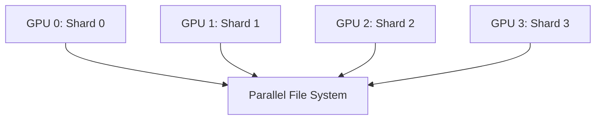
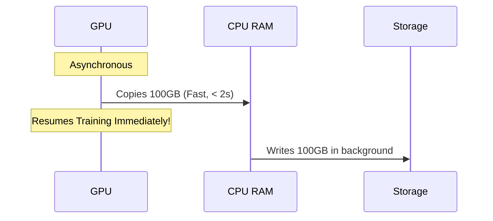

# Chapter 09: Checkpointing and Recovery

| Chapter metadata | Value |
|---|---|
| Volume | 13 — Distributed Training Foundations |
| Difficulty | Advanced |
| Estimated reading time | 55 minutes |
| Primary audience | MLOps, Infrastructure Engineers, SREs |
| Core question | How do we save and resume training across thousands of GPUs with minimal time loss? |

## WHY

In large-scale distributed training, hardware failures are not a possibility—they are a mathematical certainty. If you are training a model on 1,024 GPUs for 30 days, the probability of at least one component (GPU, NIC, power supply, memory) failing approaches 100%. If you haven't saved your progress, a single crash could wipe out millions of dollars of compute time. The problem this solves is finding the optimal balance between saving state frequently enough to minimize lost work, and infrequently enough that saving doesn't consume all your expensive GPU time.

## WHAT

A checkpoint is a snapshot of the complete state required to resume training exactly where it left off.

A modern large-language model (LLM) checkpoint contains:
1. **Model Weights:** The actual parameters of the neural network.
2. **Optimizer State:** Variables like momentum and variance used by AdamW or SGD.
3. **Data Loader State:** The exact position in the dataset.
4. **Random Number Generator (RNG) State:** Ensures reproducibility.
5. **Learning Rate Scheduler State:** The current position in the warmup/decay curve.

Think of checkpointing like saving your progress in a video game before a boss fight.

## HOW

When using Fully Sharded Data Parallel (FSDP) or ZeRO, the model state is distributed across all GPUs. Gathering it to one node to save it is extremely inefficient.

Instead, each GPU writes its own shard of the checkpoint directly to a parallel file system (like Lustre) or object storage.



### Worked Example: Sizing a Checkpoint Write for a 70B Model

Take a 70B-parameter model training on 128 H100 GPUs with FSDP. Using the same mixed-precision Adam accounting as Chapter 5 and Chapter 7 (16 bytes/param: 4 FP32 weights + 4 FP32 gradients + 8 FP32 optimizer momentum/variance):

```
Total checkpoint payload: 70B × 16 bytes = 1,120 GB (~1.09 TB)
Sharded evenly across 128 GPUs: 1,120 GB / 128 ≈ 8.75 GB per GPU shard
```

**Naive (gather-to-rank-0) approach:** All 128 shards are gathered onto a single node before writing.

```
Network cost to gather: 1,120 GB moved to one node
Even at a generous 25 GB/s effective inbound rate to that one node: 1,120 / 25 ≈ 45 s
Plus the single-node write at, say, 5 GB/s to local/parallel storage: 1,120 / 5 ≈ 224 s
Total: ~269 s (4.5 minutes) — and the whole cluster sits idle while it happens
```

**Distributed (each-GPU-writes-its-own-shard) approach**, assuming a parallel filesystem that can sustain roughly 5 GB/s per concurrent writer up to an aggregate ceiling of, say, 400 GB/s across the whole filesystem (illustrative figures — actual Lustre/GPFS/object-store throughput varies enormously by deployment and must be measured, not assumed):

```
Per-GPU shard write: 8.75 GB / 5 GB/s ≈ 1.75 s
Aggregate demand: 128 GPUs × 5 GB/s = 640 GB/s, which exceeds the 400 GB/s filesystem ceiling,
  so writes queue and the effective per-GPU rate drops to roughly 400/128 ≈ 3.1 GB/s
Realistic write time: 8.75 GB / 3.1 GB/s ≈ 2.8 s
```

Even bottlenecked by filesystem aggregate bandwidth, the distributed approach (~3 seconds) is roughly two orders of magnitude faster than the naive gather (~270 seconds), which is exactly why every framework covered in this volume (FSDP, DeepSpeed/ZeRO, Megatron) defaults to sharded, parallel checkpoint writes rather than gathering to one rank.

## WHEN

You determine *when* to checkpoint using Daly's Formula for optimal checkpoint intervals:
`$T_{opt} = \sqrt{2 \cdot M \cdot T_c} - T_c$`
Where:
- $M$ = Mean Time Between Failures (MTBF) of the cluster.
- $T_c$ = Time required to write the checkpoint.

If MTBF is low (frequent crashes), you must checkpoint more frequently.

**Applying the formula:** Suppose a 1024-GPU cluster has an observed MTBF of 8 hours (28,800 s) — a plausible, illustrative figure for a large cluster where any one of a thousand-plus GPUs, NICs, or power supplies failing counts as an interrupting event; real MTBF must be measured from your own incident history, not assumed. Using the distributed write time from above, scaled to a larger model where $T_c$ ≈ 180 s:

```
T_opt = sqrt(2 × 28,800 × 180) - 180
      = sqrt(10,368,000) - 180
      ≈ 3,220 - 180
      = 3,040 s ≈ 50.7 minutes
```

So under these illustrative assumptions, checkpointing roughly every 50 minutes minimizes total expected lost work across the run — checkpointing every 5 minutes wastes GPU-hours on write overhead, and checkpointing every 4 hours risks losing most of an MTBF interval's worth of progress on a crash.

## TRADEOFFS

The tradeoffs between checkpoint frequency and overhead:

| Strategy | Risk of Lost Work | Compute Overhead | Storage Cost |
|---|---|---|---|
| **Frequent (Every hour)** | Low (&lt; 1 hour) | High | Massive |
| **Infrequent (Every 24h)** | High (Up to 24 hours) | Low | Moderate |
| **Asynchronous Checkpointing**| Low | Very Low (Hidden) | High (Requires RAM buffering) |

## PRODUCTION

In a production environment, synchronous checkpointing is often replaced by asynchronous checkpointing to maximize MFU.

**Synchronous:** Training completely halts. All GPUs transfer their state to CPU RAM, which then writes to storage. GPUs sit idle (0% utilization).

**Asynchronous:** State is quickly copied from GPU VRAM to CPU RAM. The GPUs immediately resume training. A background CPU process writes the RAM buffer to persistent storage while the GPUs calculate the next forward pass.



**Q: How do you handle checkpointing when changing the number of GPUs?**
**A:** This requires dynamic checkpoint resharding. Modern frameworks save the tensor metadata alongside the shards. When resuming, the framework reads the metadata and redistributes the shards dynamically.

## TROUBLESHOOTING

### Scenario 1: Corrupted Checkpoint on Crash

**Symptom:** The cluster crashes during a checkpoint write. Upon recovery, you see:
```text
RuntimeError: Error(s) in loading state_dict for ResNet:
    Unexpected key(s) in state_dict: ...
    size mismatch for ...
```
**Diagnosis:** The checkpoint file was partially written and is corrupted.
**Evidence vs. Proof:** The `size mismatch` error is evidence. It proves the file on disk is invalid, but it does not prove a hardware failure. It simply means the process was killed mid-write.
**Resolution:** Always implement Atomic Writes using temporary files. If a file is corrupted, delete it and fallback to the previous checkpoint manually.
```bash
# Check if the file is incomplete (size mismatch)
ls -lh /checkpoints/model_step_1000.pt
# Remove corrupted checkpoint
rm -f /checkpoints/model_step_1000.pt
# Resume training from previous valid step
python train.py --resume_from /checkpoints/model_step_900.pt
```

### Scenario 2: OOM During Asynchronous Checkpoint

**Symptom:** Training crashes exactly when a checkpoint is triggered, with:
```text
[Node 3] dmesg: Out of memory: Killed process 1234 (python)
```
**Diagnosis:** Asynchronous checkpointing copies GPU state to CPU RAM. If the buffered states exceed physical RAM, the Linux OOM Killer triggers.
**Evidence vs. Proof:** The log proves the system ran out of RAM. It doesn't prove a memory leak; it might be the intended design exceeding limits.
**Resolution:** Add swap space temporarily to prevent OOM while saving, or configure the job to use synchronous checkpointing.
```bash
# Create a temporary 100GB swap file
sudo fallocate -l 100G /swapfile
sudo chmod 600 /swapfile
sudo mkswap /swapfile
sudo swapon /swapfile
# Verify memory and swap limits
free -m
```

### Scenario 3: Resharding Mismatch After Cluster Resize

**Symptom:** Training was checkpointed on a 64-GPU allocation (FSDP, 64-way shard). After a node failure (Chapter 10's Slurm node-drain scenario), the job resubmits onto a fresh 48-GPU allocation — fewer nodes were available — and resume fails:
```text
RuntimeError: Number of shards in checkpoint (64) does not match world size (48)
```
**Diagnosis:** Naive sharded checkpoints save state 1:1 with the GPU topology that wrote them — shard 0 belongs to rank 0 of a 64-rank world, and there is no rank 48-63 in the new allocation to own the remaining shards. This is exactly the failure mode this chapter's WHEN section referenced under "dynamic checkpoint resharding": a checkpoint format that hard-codes world size cannot survive a topology change, which is precisely the situation Chapter 10 hands off when it says Slurm's job is "detecting the failure and freeing the node," not preserving the shard-to-rank mapping.
**Evidence vs. Proof:** The shard-count mismatch error is evidence the checkpoint format is topology-coupled. It does not by itself prove data loss — the underlying tensors are almost always still valid and resharding is possible if the checkpoint stored full tensor metadata (shape, dtype, sharding spec) rather than only raw shard bytes.
**Resolution:** Use a checkpoint format that stores global tensor metadata alongside each shard (PyTorch Distributed Checkpoint / `torch.distributed.checkpoint`, or DeepSpeed's universal checkpoint format both do this) so the framework can compute a new 48-way sharding plan from the same underlying tensors at load time, rather than requiring an exact world-size match.
```bash
# Inspect checkpoint metadata to confirm it stores full tensor shape/sharding info,
# not just raw per-rank shard bytes
python -c "from torch.distributed.checkpoint import FileSystemReader; \
r = FileSystemReader('/checkpoints/step_5000'); print(r.read_metadata())"
```

## Interview Preparation

**Conceptual:** "Why does asynchronous checkpointing reduce GPU idle time, and what new failure mode does it introduce that synchronous checkpointing doesn't have?"

**Model Answer:** "Synchronous checkpointing halts the training loop completely — all GPU compute stops while the state is transferred to CPU RAM and then written to storage, so the write time is pure overhead subtracted from useful training time. Asynchronous checkpointing splits this into two phases: a fast GPU-to-CPU-RAM copy, which is quick because it's a local, high-bandwidth transfer, and then a background CPU thread or process writes that RAM buffer to persistent storage while the GPUs have already resumed the next forward pass. The GPUs are blocked only for the RAM copy, not the full storage write, which is usually the much slower and more variable part. The new failure mode is memory pressure: if you trigger a new checkpoint before the previous one has finished flushing to storage, or if the buffered state is larger than available system RAM, you get a straightforward CPU-side out-of-memory condition — which is a different, and honestly less familiar, failure mode for a team used to debugging GPU OOMs."

**Architecture:** "Design a checkpointing strategy for a 400B-parameter model training on 2048 GPUs, where you've observed an MTBF of roughly 6 hours and a distributed checkpoint write takes about 4 minutes."

**Model Answer:** "I'd start from Daly's formula to get a principled starting interval: with M = 6 hours = 21,600 seconds and Tc = 240 seconds, T_opt = sqrt(2 × 21,600 × 240) − 240 = sqrt(10,368,000) − 240 ≈ 3,220 − 240 ≈ 2,980 seconds, just under 50 minutes. I'd round that down somewhat for safety margin, since MTBF is an average and actual failures cluster more than a pure exponential model predicts, so maybe checkpoint every 30-40 minutes rather than exactly 50. Given the write time is a meaningful 4 minutes, I'd make it asynchronous so those 4 minutes overlap with training rather than blocking it, and I'd use a sharded, metadata-rich checkpoint format — not a gather-to-rank-0 approach, which at this model size would mean moving hundreds of gigabytes to a single node, exactly the bottleneck this chapter's worked example showed being roughly two orders of magnitude slower than a distributed write. I'd also verify the parallel filesystem's aggregate bandwidth can sustain 2048 concurrent writers without collapsing to a fraction of expected per-writer throughput, the same aggregate-ceiling effect from the worked example."

**Troubleshooting:** "A checkpoint write that used to take 90 seconds is now taking 12 minutes, with no change to model size or GPU count. What do you check first?"

**Model Answer:** "A 90-second to 12-minute jump — roughly 8x — with no configuration change points at the storage layer rather than the training code, since nothing about the checkpoint payload size changed. First, I'd check whether the parallel filesystem is now shared with more concurrent tenants than before; this chapter's worked example showed that once aggregate writer demand exceeds the filesystem's bandwidth ceiling, per-writer throughput drops proportionally, and that's a very common silent cause on shared HPC storage. Second, I'd check for a degraded storage node or OST/OSS in the parallel filesystem — a single slow storage target can bottleneck writes from any GPU shard that happens to land on it, similar in spirit to the straggler-node problem from earlier chapters but on the storage side instead of the compute side. Third, I'd rule out a checkpoint format regression — if someone recently changed from a sharded write to an inadvertent gather-based one, that alone reproduces almost exactly this kind of order-of-magnitude slowdown."

## Related Chapters

- **Previous:** [Chapter 8 — NCCL Collectives and Communication Paths](./chapter-08-nccl-collectives-and-communication-paths.md)
- **Next:** [Chapter 10 — Multi-Node Training Architecture](./chapter-10-multi-node-training-architecture.md) — Slurm-driven job restart onto a fresh allocation after the node failures this chapter plans for
- **Related:** [Chapter 5 — DeepSpeed and ZeRO](./chapter-05-deepspeed-and-zero.md) — the sharding schemes whose state this chapter's checkpoints must serialize
