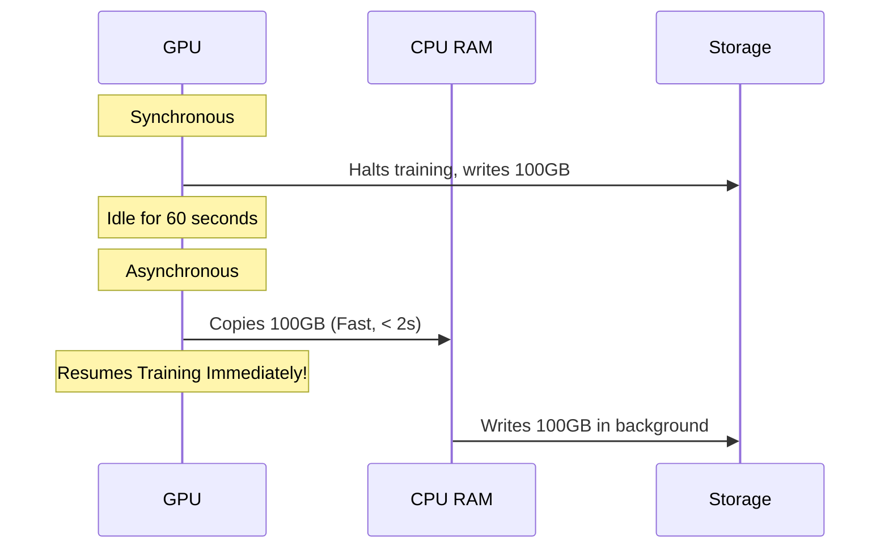
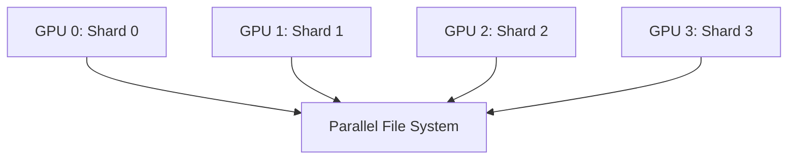

# Checkpointing and Recovery

## The Problem: The Inevitability of Failure

In large-scale distributed training, hardware failures are not a possibility—they are a mathematical certainty. If you are training a model on 1,024 GPUs for 30 days, the probability of at least one component (GPU, NIC, power supply, memory) failing approaches 100%. If you haven't saved your progress, a single crash could wipe out millions of dollars of compute time. 

The problem this solves is finding the optimal balance between saving state frequently enough to minimize lost work, but infrequently enough that the saving process itself doesn't consume all your expensive GPU time.

## What is a Checkpoint?

A checkpoint is a snapshot of the complete state required to resume training exactly where it left off.

A modern large-language model (LLM) checkpoint contains:
1. **Model Weights:** The actual parameters of the neural network.
2. **Optimizer State:** Variables like momentum and variance used by AdamW or SGD. This is often larger than the model weights!
3. **Data Loader State:** The exact position in the dataset, ensuring no data is skipped or repeated.
4. **Random Number Generator (RNG) State:** Ensures reproducibility of dropout and augmentation.
5. **Learning Rate Scheduler State:** The current position in the warmup or decay curve.

### Analogy: Video Game Save Points

Think of checkpointing like saving your progress in a video game before a boss fight. 
- **Too few saves:** If you die, you lose hours of gameplay.
- **Too many saves:** The game constantly pauses to write to the memory card, ruining the experience.
- **Corrupted save:** The worst-case scenario. You need a backup (keeping multiple checkpoints).

## Checkpoint Frequency Optimization

The math for optimal checkpoint frequency balances the time spent writing the checkpoint vs. the time lost when a failure occurs.

Using Daly's Formula for optimal checkpoint intervals:
$T_{opt} = \sqrt{2 \cdot M \cdot T_c} - T_c$
Where:
- $M$ = Mean Time Between Failures (MTBF) of the cluster.
- $T_c$ = Time required to write the checkpoint.

### Tradeoff: Frequency vs Overhead

| Strategy | Risk of Lost Work | Compute Overhead | Storage Cost |
|---|---|---|---|
| **Frequent (Every hour)** | Low (< 1 hour) | High | Massive (unless rotated) |
| **Infrequent (Every 24h)** | High (Up to 24 hours) | Low | Moderate |
| **Asynchronous Checkpointing**| Low | Very Low (Hidden behind compute) | High (Requires RAM buffering) |

## Distributed Checkpointing Architectures

In a multi-node setup, you cannot simply have Rank 0 gather hundreds of gigabytes of data and write it to a single disk. 

### Synchronous vs Asynchronous Checkpointing

**Synchronous:**
Training completely halts. All GPUs transfer their state to CPU RAM, which then writes to storage. The GPUs sit idle (0% utilization) during this process.

**Asynchronous:**
State is quickly copied from GPU VRAM to CPU RAM. The GPUs immediately resume training. A background CPU process writes the RAM buffer to persistent storage (e.g., NVMe or S3) while the GPUs calculate the next forward pass.



## Checkpoint Sharding (Distributed Checkpoints)

When using Fully Sharded Data Parallel (FSDP) or ZeRO, the model state is distributed across all GPUs. Gathering it to one node to save it is extremely inefficient.

Instead, each GPU writes its own shard of the checkpoint directly to a parallel file system (like Lustre) or object storage.



## Check Your Understanding

**Question 1:** Why is the optimizer state often larger than the model weights in a checkpoint?
*Answer:* Optimizers like Adam keep track of moving averages for every single parameter. Adam keeps a first moment (momentum) and second moment (variance) for each weight, meaning it requires 2x or even 3x the storage of the raw weights themselves.

**Question 2:** If a cluster has a very low MTBF (frequent crashes), how should this affect your checkpoint frequency?
*Answer:* You must checkpoint more frequently to minimize lost compute time, but you should also implement asynchronous checkpointing to hide the overhead.

## Failure Scenarios

### Scenario 1: Corrupted Checkpoint on Crash

**Symptom:** The cluster crashes during a checkpoint write. Upon recovery, the training script throws:
```text
RuntimeError: Error(s) in loading state_dict for ResNet:
    Unexpected key(s) in state_dict: ...
    size mismatch for ...
```

**Diagnosis:** The checkpoint file was partially written. It is corrupted and unusable.

**Evidence vs. Proof:** 
- *Evidence:* The `size mismatch` or unexpected EOF error. 
- *Proof:* This proves the file on disk is invalid, but it *does not* prove a hardware storage failure. It simply means the process was killed mid-write.

**Resolution:**
Always implement Atomic Writes. Write the checkpoint to a temporary file (e.g., `checkpoint_tmp.pt`), and once the write is 100% complete, rename it to the final filename (`checkpoint_1000.pt`). Rename operations are atomic on POSIX filesystems. Delete corrupted files and resume from the *previous* valid checkpoint.

### Scenario 2: OOM During Asynchronous Checkpoint

**Symptom:** Training crashes exactly when a checkpoint is triggered, with:
```text
[Node 3] dmesg: Out of memory: Killed process 1234 (python)
```

**Diagnosis:** Asynchronous checkpointing requires copying GPU state to CPU RAM. If your node has 512GB of CPU RAM, and the buffered states for all 8 GPUs exceed that, the Linux OOM Killer will terminate the process.

**Evidence vs. Proof:**
- *Evidence:* The `Out of memory: Killed process` log in `dmesg`.
- *Proof:* This proves the system ran out of RAM. It does not prove a memory leak; it might just be the intended design exceeding physical limits.

**Resolution:**
Reduce the size of the checkpoint shards, disable asynchronous checkpointing (reverting to synchronous), or increase swap space/RAM on the nodes.

## Senior Interview Questions

**Q: How do you handle checkpointing when changing the number of GPUs (e.g., resuming a 1024-GPU job on 512 GPUs)?**
**A:** This requires dynamic checkpoint resharding. Modern frameworks (like PyTorch Distributed Checkpoint - DCP) save the tensor metadata alongside the shards. When resuming on a different cluster size, the framework reads the metadata and redistributes the shards dynamically across the new number of ranks.

**Q: You notice a massive spike in cluster-wide network traffic exactly when checkpoints are saved, slowing down other jobs. What is the cause?**
**A:** The nodes are likely writing their checkpoints to a centralized NFS or object storage, saturating the network fabric. I would investigate switching to a local-disk-first strategy (writing to local NVMe, then uploading to S3 in the background) or ensuring the parallel file system has enough dedicated bandwidth isolated from the primary compute fabric.

## Glossary

- **MTBF (Mean Time Between Failures):** The average time a system runs before a component fails.
- **Atomic Write:** An operation that either completes entirely or not at all, preventing partial/corrupted files.
- **OOM (Out Of Memory):** When a process is killed by the OS because the system exhausted physical RAM.

## Ready to Continue Checklist

- [ ] I can explain the contents of a full training checkpoint.
- [ ] I understand the tradeoff calculation for checkpoint frequency.
- [ ] I know how to use atomic writes to prevent checkpoint corruption.
- [ ] I can describe the difference between synchronous and asynchronous checkpointing.


