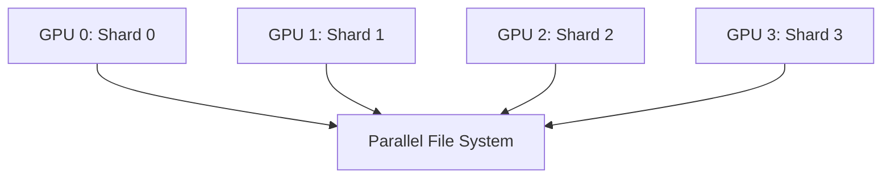
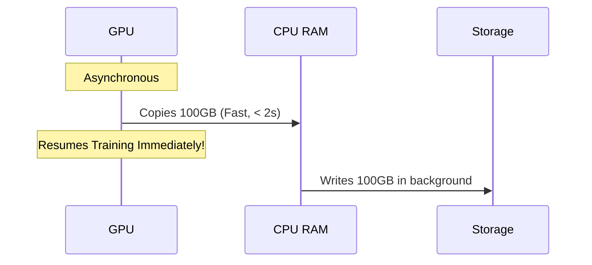

# Checkpointing and Recovery

## WHY

In large-scale distributed training, hardware failures are not a possibility—they are a mathematical certainty. If you are training a model on 1,024 GPUs for 30 days, the probability of at least one component (GPU, NIC, power supply, memory) failing approaches 100%. If you haven't saved your progress, a single crash could wipe out millions of dollars of compute time. The problem this solves is finding the optimal balance between saving state frequently enough to minimize lost work, and infrequently enough that saving doesn't consume all your expensive GPU time.

## WHAT

A checkpoint is a snapshot of the complete state required to resume training exactly where it left off.

A modern large-language model (LLM) checkpoint contains:
1. **Model Weights:** The actual parameters of the neural network.
2. **Optimizer State:** Variables like momentum and variance used by AdamW or SGD.
3. **Data Loader State:** The exact position in the dataset.
4. **Random Number Generator (RNG) State:** Ensures reproducibility.
5. **Learning Rate Scheduler State:** The current position in the warmup/decay curve.

Think of checkpointing like saving your progress in a video game before a boss fight.

## HOW

When using Fully Sharded Data Parallel (FSDP) or ZeRO, the model state is distributed across all GPUs. Gathering it to one node to save it is extremely inefficient.

Instead, each GPU writes its own shard of the checkpoint directly to a parallel file system (like Lustre) or object storage.



## WHEN

You determine *when* to checkpoint using Daly's Formula for optimal checkpoint intervals:
$T_{opt} = \sqrt{2 \cdot M \cdot T_c} - T_c$
Where:
- $M$ = Mean Time Between Failures (MTBF) of the cluster.
- $T_c$ = Time required to write the checkpoint.

If MTBF is low (frequent crashes), you must checkpoint more frequently.

## TRADEOFFS

The tradeoffs between checkpoint frequency and overhead:

| Strategy | Risk of Lost Work | Compute Overhead | Storage Cost |
|---|---|---|---|
| **Frequent (Every hour)** | Low (< 1 hour) | High | Massive |
| **Infrequent (Every 24h)** | High (Up to 24 hours) | Low | Moderate |
| **Asynchronous Checkpointing**| Low | Very Low (Hidden) | High (Requires RAM buffering) |

## PRODUCTION

In a production environment, synchronous checkpointing is often replaced by asynchronous checkpointing to maximize MFU.

**Synchronous:** Training completely halts. All GPUs transfer their state to CPU RAM, which then writes to storage. GPUs sit idle (0% utilization).

**Asynchronous:** State is quickly copied from GPU VRAM to CPU RAM. The GPUs immediately resume training. A background CPU process writes the RAM buffer to persistent storage while the GPUs calculate the next forward pass.



**Q: How do you handle checkpointing when changing the number of GPUs?**
**A:** This requires dynamic checkpoint resharding. Modern frameworks save the tensor metadata alongside the shards. When resuming, the framework reads the metadata and redistributes the shards dynamically.

## TROUBLESHOOTING

### Scenario 1: Corrupted Checkpoint on Crash

**Symptom:** The cluster crashes during a checkpoint write. Upon recovery, you see:
```text
RuntimeError: Error(s) in loading state_dict for ResNet:
    Unexpected key(s) in state_dict: ...
    size mismatch for ...
```
**Diagnosis:** The checkpoint file was partially written and is corrupted.
**Evidence vs. Proof:** The `size mismatch` error is evidence. It proves the file on disk is invalid, but it does not prove a hardware failure. It simply means the process was killed mid-write.
**Resolution:** Always implement Atomic Writes using temporary files. If a file is corrupted, delete it and fallback to the previous checkpoint manually.
```bash
# Check if the file is incomplete (size mismatch)
ls -lh /checkpoints/model_step_1000.pt
# Remove corrupted checkpoint
rm -f /checkpoints/model_step_1000.pt
# Resume training from previous valid step
python train.py --resume_from /checkpoints/model_step_900.pt
```

### Scenario 2: OOM During Asynchronous Checkpoint

**Symptom:** Training crashes exactly when a checkpoint is triggered, with:
```text
[Node 3] dmesg: Out of memory: Killed process 1234 (python)
```
**Diagnosis:** Asynchronous checkpointing copies GPU state to CPU RAM. If the buffered states exceed physical RAM, the Linux OOM Killer triggers.
**Evidence vs. Proof:** The log proves the system ran out of RAM. It doesn't prove a memory leak; it might be the intended design exceeding limits.
**Resolution:** Add swap space temporarily to prevent OOM while saving, or configure the job to use synchronous checkpointing.
```bash
# Create a temporary 100GB swap file
sudo fallocate -l 100G /swapfile
sudo chmod 600 /swapfile
sudo mkswap /swapfile
sudo swapon /swapfile
# Verify memory and swap limits
free -m
```


