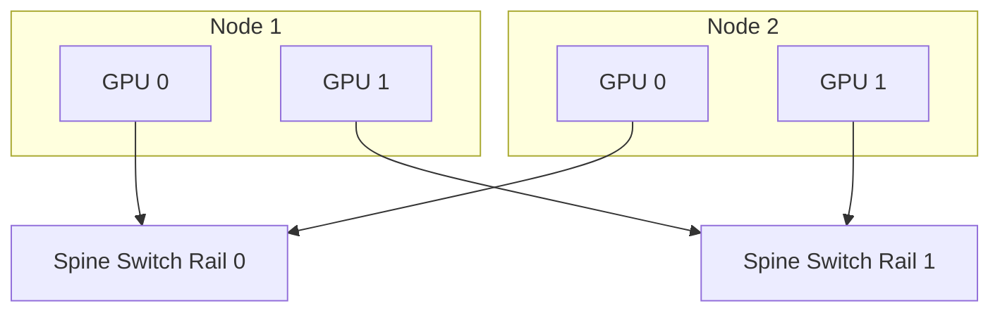
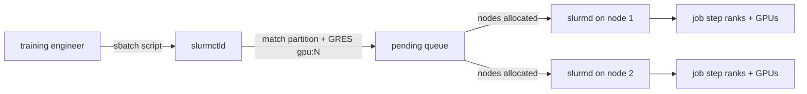

# Chapter 10: Multi-Node Training Architecture

| Chapter metadata | Value |
|---|---|
| Volume | 13 — Distributed Training Foundations |
| Difficulty | Advanced |
| Estimated reading time | 80 minutes |
| Primary audience | Infrastructure Architects, Network Engineers, Platform Teams, Training Engineers |
| Core question | How do we design networks for thousands-of-GPU training clusters, and how does a training job actually get placed onto them? |

## WHY

A single HGX node (like an NVIDIA DGX) has 8 GPUs tightly coupled with NVLink, providing massive bandwidth. However, training a foundation model requires hundreds or thousands of GPUs. The problem this solves is how to connect these independent 8-GPU islands into a single, cohesive supercomputer without the network becoming a crippling bottleneck.

If the network connecting the nodes is slow, the GPUs will spend the majority of their time idling, waiting for data to arrive from other nodes.

## WHAT

To achieve scale, we use a **Rail-Optimized** network topology.

In a standard data center, servers connect to a Top-of-Rack (ToR) switch. If Server A talks to Server B, traffic flows through that single switch. For AI training, this is insufficient. A Rail-Optimized design creates 8 separate, parallel network fabrics (Rail 1 through Rail 8).

- GPU 0 on Node 1 connects to Rail 1.
- GPU 0 on Node 2 connects to Rail 1.

This means GPU 0 only talks to other GPU 0s across the cluster through a dedicated, non-blocking switch.

## HOW

When NCCL performs an All-Reduce across nodes, it uses a hierarchical approach. First, it reduces data locally via NVLink. Then, all GPU 0s talk to each other over Rail 0, GPU 1s over Rail 1, etc. Because they are physically separate switches, there is zero contention.



### Worked Example: Cross-Node Bandwidth vs. Intra-Node NVLink

Take an 8-GPU H100 node where each GPU is paired 1:1 with its own 400 Gbps InfiniBand NDR NIC in a rail-optimized fabric (the standard DGX SuperPOD-style layout).

```
Per-GPU cross-node bandwidth: 400 Gbps = 50 GB/s (using 1 Gbps = 0.125 GB/s)
Aggregate cross-node bandwidth for all 8 GPUs in the node: 8 × 50 GB/s = 400 GB/s

Compare to intra-node NVLink: ~900 GB/s aggregate per GPU (established in Chapter 3)
```

Cross-node bandwidth (400 GB/s aggregate across 8 GPUs, i.e. 50 GB/s per GPU) is roughly 18x lower *per GPU* than intra-node NVLink (900 GB/s per GPU). This is precisely why Chapter 6's TP-across-nodes failure scenario showed a 16.7x slowdown when Tensor Parallelism — which needs an All-Reduce every layer — was mistakenly allowed to cross the node boundary: the math above is the hardware reason that misconfiguration is so costly, and it's why the rail-optimized design in this chapter exists specifically to make the *inter-node* hop (Pipeline Parallelism activations, Data Parallelism gradient sync) as cheap as possible, while leaving the latency-sensitive TP All-Reduce confined to NVLink. The 400 Gbps/NIC figure is representative of an NDR InfiniBand rail-optimized design; actual per-GPU cross-node bandwidth varies by IB generation (HDR = 200 Gbps, NDR = 400 Gbps) and NIC-to-GPU ratio, so always confirm against your specific fabric's `ibstat` output rather than assuming a fixed number.

## WHEN

You must use RDMA (Remote Direct Memory Access) over InfiniBand or RoCE v2 when standard TCP/IP over Ethernet is too slow. At 400Gbps, the CPU overhead of processing the TCP stack would overwhelm the system. RDMA allows GPU 0 on Node 1 to write data directly into the memory of GPU 0 on Node 2, completely bypassing the CPU and OS kernel.

## TRADEOFFS

There are two main ways to run RDMA. Here is the tradeoff:

| Feature | InfiniBand (IB) | RoCE v2 (RDMA over Converged Ethernet) |
|---|---|---|
| **Protocol** | Purpose-built lossless fabric | RDMA encapsulated in UDP over Ethernet |
| **Performance** | Historically the gold standard | Highly competitive with proper tuning |
| **Cost & Hardware** | Expensive, requires IB switches | Uses standard Ethernet switches |
| **Complexity** | Centralized Subnet Manager (SM) | Distributed routing (BGP, ECMP), QoS tuning |

## PRODUCTION

In production, you must ensure a 1:1 ratio of GPUs to NICs, and strictly map PCIe affinity. GPU-Direct RDMA uses the PCIe switch to route data directly from the GPU VRAM to the NIC's buffers, bypassing the CPU completely.

**Q: In a RoCE v2 network, what happens if Priority Flow Control (PFC) is disabled?**
**A:** RoCE v2 expects a lossless network. Without PFC, if a switch buffer fills up, packets are dropped. RDMA handles packet loss very poorly compared to TCP; it relies on Go-Back-N retransmission, which severely tanks performance and can cause the network to stall completely.

## Running NVIDIA Training Workloads with Slurm

Everything above describes the fabric: rail-optimized switching, RDMA, GPU-NIC affinity. None of it matters if you can't get your training job placed onto the right set of nodes in the first place. On NVIDIA reference architectures like DGX SuperPOD, the layer that decides "these 32 nodes, this network partition, these GPUs, right now" is **Slurm** — not Kubernetes. This section covers what a training engineer (not a cluster administrator) needs to know to launch, monitor, and reason about a distributed job on a Slurm-managed GPU cluster.

This is deliberately scoped to the launch mechanics. Slurm's own bare-metal administration — controller/database HA, fairshare accounting, node lifecycle provisioning via BCM — is covered in Volume 10; it is not repeated here.

### Architecture, from a Training Job's Point of View

Slurm has two daemons you need a mental model of:

- **`slurmctld`** — the controller. One (or an HA pair) per cluster. It owns the queue, decides which nodes satisfy a job's resource request, and hands out allocations.
- **`slurmd`** — runs on every compute node. It's what actually forks your job's processes on that node, enforces the cgroup/GRES limits the controller assigned, and reports node health back to `slurmctld`.

Two more concepts matter for GPU jobs specifically:

- **Partitions** — named pools of nodes with their own limits and access rules (e.g., a `gpu-a100` partition vs. a `cpu-preprocess` partition). You submit into a partition, not directly to nodes.
- **GRES (Generic Resource Scheduling)** — how Slurm tracks and allocates non-CPU resources. GPUs are configured as a GRES type (`gres.conf` maps `gpu:0` through `gpu:7` to actual devices on each node), and your job requests them the same way it requests CPU or memory: as a countable resource the scheduler binds to your allocation.



### The Job-Launch Workflow

A distributed training job on Slurm has two distinct commands doing two distinct jobs: `sbatch` reserves the resources, `srun` runs the processes inside that reservation.

**1. `sbatch` — request the allocation.** This is a shell script with `#SBATCH` directives that describe what the job needs:

```bash
#!/bin/bash
#SBATCH --job-name=llama-70b-fsdp
#SBATCH --nodes=4                 # 4 physical nodes
#SBATCH --gpus-per-node=8         # all 8 GPUs per node
#SBATCH --ntasks-per-node=8       # one process per GPU (matches gpus-per-node)
#SBATCH --gres=gpu:8              # explicit GRES request, belt-and-suspenders with gpus-per-node
#SBATCH --cpus-per-task=16        # CPU threads per rank (dataloader workers, etc.)
#SBATCH --time=24:00:00
#SBATCH --partition=gpu-h100
#SBATCH --output=logs/%x-%j.out

srun torchrun \
    --nnodes=$SLURM_NNODES \
    --nproc_per_node=8 \
    --node_rank=$SLURM_NODEID \
    --rdzv_id=$SLURM_JOB_ID \
    --rdzv_backend=c10d \
    --rdzv_endpoint=$(scontrol show hostnames "$SLURM_NODELIST" | head -n1):29500 \
    train_fsdp.py --resume-from checkpoints/latest.pt
```

`--nodes=4` plus `--ntasks-per-node=8` gives 32 total tasks — one per GPU across the whole job, which is exactly the world size FSDP/DDP expect. `--gres=gpu:8` is what actually causes `slurmd` to bind 8 physical GPUs (via cgroups) to this job's processes on each node; without it, the job could land on GPU nodes and see zero GPUs.

**2. `srun` — launch the processes.** `srun` is what turns an allocation into running processes across all allocated nodes. Here it's launching `torchrun` once per node (Slurm's `--ntasks-per-node=8` combined with `torchrun --nproc_per_node=8` means Slurm places one `torchrun` supervisor per node, and `torchrun` fans that out to 8 local worker processes — this is the standard pattern for Slurm + torchrun, distinct from running `srun` with one task per GPU directly).

**3. Rank assignment.** Slurm sets environment variables inside every task it launches; a training script (or `torchrun`, as shown above) reads them to build the distributed process group:

| Variable | Meaning |
|---|---|
| `SLURM_PROCID` | Global rank of this task across the entire job (0 to `SLURM_NTASKS-1`) |
| `SLURM_NTASKS` | Total number of tasks — the world size |
| `SLURM_NODEID` | Index of the node this task is running on (0 to `SLURM_NNODES-1`) |
| `SLURM_LOCALID` | Rank of this task within its node (maps to `LOCAL_RANK`) |
| `SLURM_NODELIST` | Compact hostlist of allocated nodes (expand with `scontrol show hostnames`) |

`torchrun`'s own `--node_rank`/rendezvous logic reuses these to derive PyTorch's `RANK`/`LOCAL_RANK`/`WORLD_SIZE` — the same variables Chapter 3's DDP and this volume's labs read directly when launching without Slurm. Slurm doesn't replace `torchrun`'s process-group bootstrap; it's the layer that decides which physical nodes run it and feeds it the topology.

**4. Checking status.**

```bash
squeue -u $USER
# JOBID   PARTITION   NAME             USER   ST   TIME   NODES  NODELIST
# 481203  gpu-h100    llama-70b-fsdp   jdoe   R    2:14:07  4     dgx-[012-015]

sinfo -p gpu-h100 -o "%N %T %G"
# NODELIST      STATE   GRES
# dgx-[012-015] alloc   gpu:8
# dgx-[016-019] idle    gpu:8
```

`ST=R` means running; `PD` means pending (queued, waiting on resources). `sinfo`'s `STATE` column shows `idle`, `alloc`, `mix` (partially allocated), or `drain`/`down` for unhealthy nodes.

**5. Node failure mid-job.** If a node in the allocation dies or is marked `drain` by Slurm's health checks, the job step fails on all ranks — a distributed process group has no concept of "continue without rank 3." `slurmctld` marks the node unavailable for future scheduling; your job either fails and needs resubmission, or — if you're using PyTorch elastic (`torchrun --max-restarts`) and periodic checkpointing — restarts a new allocation and resumes from the last saved state. That save/resume mechanics (what's in a checkpoint, how sharded FSDP/ZeRO checkpoints are reassembled) is Chapter 9's material — Slurm's job here is only to notice the failure and hand you a fresh allocation, not to preserve training state itself.

### Enroot: Unprivileged Containers for HPC Nodes

Compute nodes in a Slurm cluster are shared, multi-tenant, and — critically — you typically don't get root on them. Plain Docker needs a privileged daemon running as root on every node, which is both a security liability in a multi-tenant HPC environment and often simply unavailable. **Enroot** solves this: it's a lightweight, unprivileged container runtime built for HPC. It unpacks a standard Docker/OCI image into a sandboxed root filesystem and runs it using user namespaces — no daemon, no root required, and the resulting process looks like any other unprivileged job to the rest of the system.

```bash
# Pull and convert an NGC image into an Enroot squash filesystem
enroot import docker://nvcr.io#nvidia/pytorch:24.01-py3

# Materialize a runnable container root filesystem from the imported image
enroot create --name pytorch-2401 nvidia+pytorch+24.01-py3.sqsh

# Start it (unprivileged, as your own user)
enroot start --mount /data:/data pytorch-2401 python train.py
```

This is the manual workflow — useful for interactive debugging on a single node. On a real cluster you don't drive Enroot by hand for every job; Slurm does it for you via Pyxis.

### Pyxis: Slurm-Native Container Launch

**Pyxis** is a Slurm SPANK plugin that hooks Enroot directly into `srun`/`sbatch`. Instead of manually importing, creating, and starting an Enroot container inside your job script, you pass container flags straight to `srun` and Pyxis handles the Enroot lifecycle inside the allocation Slurm already gave you:

```bash
srun --container-image=nvcr.io#nvidia/pytorch:24.01-py3 \
     --container-mounts=/data:/data,/checkpoints:/checkpoints \
     --container-workdir=/workspace \
     torchrun --nnodes=$SLURM_NNODES --nproc_per_node=8 \
              --node_rank=$SLURM_NODEID \
              train_fsdp.py
```

Pyxis imports and starts one Enroot container per node inside the job's existing GPU/CPU/memory allocation — the container inherits whatever GRES (GPUs) Slurm already bound to that task, so `nvidia-smi` inside the container sees exactly the GPUs the scheduler assigned, nothing more.

### End-to-End Worked Workflow

Putting the whole stack together, a training engineer's mental model for "launch a 4-node FSDP job in a container" is:

1. `sbatch` submits the script; `slurmctld` matches `--nodes=4 --gres=gpu:8` against the `gpu-h100` partition and queues the job.
2. Once 4 nodes are free, `slurmctld` allocates them and `slurmd` on each node starts the job step.
3. Pyxis intercepts the `srun --container-image=...` call, has Enroot import/start the PyTorch container on each of the 4 nodes, scoped to that node's assigned GPUs.
4. Inside each container, `torchrun` reads `SLURM_NODEID`/`SLURM_PROCID` (via the launch script) to set `RANK`, `LOCAL_RANK`, and `WORLD_SIZE`, and forms the NCCL process group across all 32 ranks — using the rail-optimized fabric described earlier in this chapter for cross-node All-Reduce.
5. Training runs; the job periodically writes sharded checkpoints (Chapter 9) to shared storage.
6. On completion (or failure), Slurm finalizes accounting. `sacct -j 481203 --format=JobID,Elapsed,State,ExitCode,NNodes,AllocGRES` shows wall time, exit status, and GPU-hours consumed — the number finance and capacity planning actually care about.

### Interview Answer

**Q: "Walk me through how you'd launch a multi-node training job on a Slurm-managed GPU cluster."**

**Model Answer (first-person):** "I think of it as three layers stacked on top of each other. At the bottom, Slurm is the scheduler — I write an `sbatch` script requesting the nodes and GPUs I need, say `--nodes=4 --gres=gpu:8`, and `slurmctld` queues it until it can allocate 4 whole GPU nodes together. On top of that allocation, if I need a specific container image — say the NGC PyTorch container with a pinned CUDA/NCCL version — I don't manage that by hand; I let Pyxis do it, by passing `--container-image` to `srun`. Pyxis uses Enroot to start that container on every allocated node, unprivileged, scoped to exactly the GPUs Slurm gave that node. Inside the container, I launch `torchrun`, and that's the third layer: it reads the Slurm-provided environment — `SLURM_NODEID`, `SLURM_PROCID`, the node list — to figure out each process's rank and the job's world size, and forms the actual NCCL process group for gradient All-Reduce. So the mental chain is: Slurm decides *which physical GPUs*, Pyxis/Enroot decides *what software environment runs on them*, and `torchrun`/NCCL decides *how the processes talk to each other*. If a node dies mid-job, Slurm can't repair the running process group — the job fails and I rely on periodic checkpointing to resume on a fresh allocation rather than losing all progress."

## Interview Preparation

**Conceptual:** "Why does a rail-optimized network topology exist instead of just connecting every node to a single large switch?"

**Model Answer:** "A single large switch has to arbitrate traffic from every GPU on every node contending for the same shared fabric, which creates unpredictable congestion as cluster size grows — that's fine for general data center traffic, but distributed training generates a very specific, structured communication pattern where GPU 0 across all nodes needs to talk to other GPU 0s at the same time, GPU 1s to GPU 1s, and so on, because that's how hierarchical All-Reduce and pipeline communication are structured. Rail-optimized design gives each GPU index its own dedicated, non-blocking switch fabric, so GPU 0's traffic across the whole cluster never contends with GPU 1's traffic. Combined with a 1:1 GPU-to-NIC mapping and GPU-Direct RDMA, this turns what would be a shared, congested resource into 8 independent, predictable, high-bandwidth fabrics — which matters enormously because collective operations are synchronous: if any one rail is congested, every GPU using that rail stalls, and because collectives block on the slowest participant, the whole training step stalls with it."

**Troubleshooting:** "You've confirmed via `nvidia-smi topo -m` that GPU-NIC affinity is correct on every node, and `ibstat` shows all IB ports active. Cross-node All-Reduce is still 3x slower than expected. What do you check next?"

**Model Answer:** "With topology and link state both healthy, I'd move up a layer, from 'is the physical path there' to 'is it lossless and uncongested.' For RoCE v2 specifically, I'd check whether Priority Flow Control is actually enabled end-to-end on every switch hop, not just configured on paper — a single hop with PFC disabled turns the fabric lossy, and RDMA's retransmission behavior under packet loss is far worse than TCP's, so even occasional drops tank throughput disproportionately. For InfiniBand, I'd check the Subnet Manager's routing table and switch port counters (`ibportstate ... LinkErrorRecoveryCounter`) for symbol errors or discards, which point at a marginal cable or transceiver rather than a full link failure — the link can report 'active' while still degrading throughput. I'd also rule out noisy-neighbor contention: if this is a shared multi-tenant fabric, another job's traffic sharing the same physical rail can silently steal bandwidth even when your own topology and link health are perfect."

## TROUBLESHOOTING

### Scenario 1: Suboptimal Routing (The Noisy Neighbor)

**Symptom:** Training speed fluctuates wildly. Sometimes an iteration takes 2 seconds, sometimes 10 seconds.
**Diagnosis:** Network congestion. In RoCE or poorly configured IB, traffic from Job A might cross the same physical cables as Job B.
**Evidence vs. Proof:** Variable iteration times and high switch discard counters are evidence. This proves network contention, but it does not prove hardware is faulty. It proves the routing algorithm is failing to isolate traffic.
**Resolution:** Check the InfiniBand link status and counters using `ibstat` or `ibv_devinfo`. Reconfigure the Subnet Manager if paths are congested.
```bash
# Check the state of the IB ports
ibstat
# Query counters for symbol errors or packet drops
ibportstate mlx5_0 1 | grep "LinkErrorRecoveryCounter"
```

### Scenario 2: GPU to NIC Affinity Mismatch

**Symptom:** You run `nccl-tests` and get 40GB/s instead of 300GB/s.
```text
NCCL INFO NET/IB : GPU 0 uses NIC 3
```
**Diagnosis:** GPU 0 should use NIC 0 because they are physically on the same PCIe switch. If GPU 0 uses NIC 3, the traffic must travel across the CPU's QPI/UPI link.
**Evidence vs. Proof:** The NCCL log is evidence. It proves NCCL mapped the devices incorrectly. It doesn't prove the hardware is broken, but rather the OS topology mapping is misconfigured.
**Resolution:** Inspect the hardware topology and enforce strict PCIe locality for NCCL.
```bash
# Verify the GPU to NIC mapping
nvidia-smi topo -m
# Export environment variables to force GDR
export NCCL_NET_GDR_LEVEL=5
export NCCL_IGNORE_CPU_AFFINITY=1
```

### Scenario 3: Node Drains Mid-Job, Distributed Job Hangs Then Dies

**Symptom:** A 4-node `torchrun`/Slurm job that was running fine suddenly shows one rank silently missing from the NCCL logs, and the remaining ranks hang at the next All-Reduce instead of failing immediately.
```text
squeue -j 481203
# JOBID   PARTITION  NAME            USER  ST  TIME     NODES  NODELIST
# 481203  gpu-h100   llama-70b-fsdp  jdoe  R   2:41:18   3      dgx-[012,014-015]

sinfo -N -p gpu-h100 | grep dgx-013
# dgx-013  gpu-h100  drained
```
**Diagnosis:** `slurmd` on `dgx-013` stopped responding (hardware fault, health-check failure, or a crashed daemon), and `slurmctld` marked the node `drained`. Slurm's scheduler-level fault detection doesn't propagate into the running NCCL process group — the surviving ranks have no way to know rank 3 is gone, so they block waiting on a collective that will never complete until NCCL's own watchdog timeout fires.
**Evidence vs. Proof:** `sinfo` showing `drained` is evidence Slurm evicted the node from scheduling; it is not proof of what killed `slurmd` there — that requires checking `slurmd` logs and hardware health on `dgx-013` itself, same as any single-node fault investigation.
**Resolution:** A distributed process group has no partial-membership mode — there is no way to "continue without rank 3." The job step fails (or is killed after the NCCL timeout), and the fix is resubmission onto a fresh allocation, not repair of the running job. This is exactly why periodic checkpointing matters: see Chapter 9 for what a checkpoint contains and how a sharded FSDP/ZeRO checkpoint is reassembled on restart — Slurm's role here stops at detecting the failure and freeing the node for the next allocation.
```bash
# Confirm the drain reason before resubmitting
scontrol show node dgx-013 | grep -i reason
```


