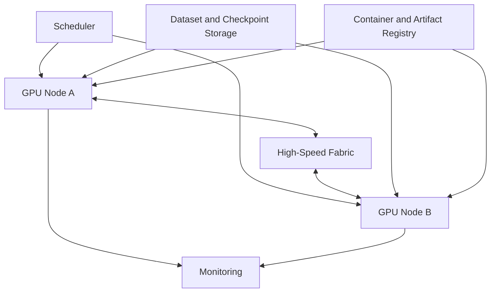

# Multi-Node Training Architecture

A multi-node cluster combines scale-up GPU topology, scale-out fabric, storage, scheduler, images, observability, and checkpoint recovery.

## Architecture

## Production Principles

- homogeneous node pools;
- topology-aware placement;
- dedicated or governed compute fabric;
- storage sized for synchronized reads and checkpoints;
- version-pinned environment;
- job preflight and health validation;
- spare capacity and drain procedures.

## Failure Domains

A single bad GPU, NIC, cable, switch path, or storage target can slow or stop the entire job. Quarantine and qualification are as important as scheduler placement.
