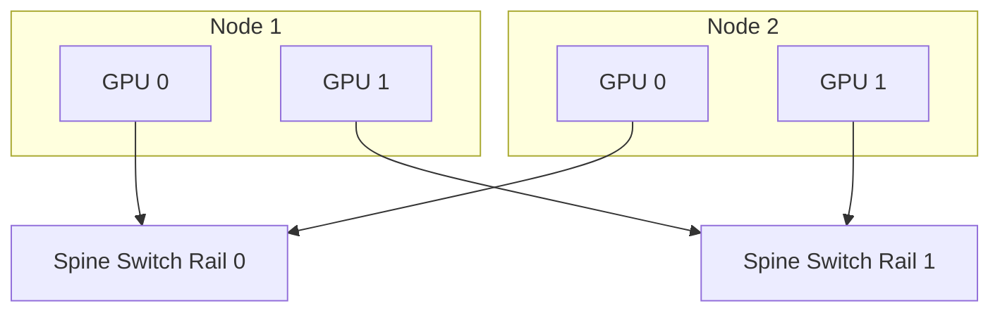

# Multi-Node Training Architecture

## WHY

A single HGX node (like an NVIDIA DGX) has 8 GPUs tightly coupled with NVLink, providing massive bandwidth. However, training a foundation model requires hundreds or thousands of GPUs. The problem this solves is how to connect these independent 8-GPU islands into a single, cohesive supercomputer without the network becoming a crippling bottleneck.

If the network connecting the nodes is slow, the GPUs will spend the majority of their time idling, waiting for data to arrive from other nodes.

## WHAT

To achieve scale, we use a **Rail-Optimized** network topology.

In a standard data center, servers connect to a Top-of-Rack (ToR) switch. If Server A talks to Server B, traffic flows through that single switch. For AI training, this is insufficient. A Rail-Optimized design creates 8 separate, parallel network fabrics (Rail 1 through Rail 8).

- GPU 0 on Node 1 connects to Rail 1.
- GPU 0 on Node 2 connects to Rail 1.

This means GPU 0 only talks to other GPU 0s across the cluster through a dedicated, non-blocking switch.

## HOW

When NCCL performs an All-Reduce across nodes, it uses a hierarchical approach. First, it reduces data locally via NVLink. Then, all GPU 0s talk to each other over Rail 0, GPU 1s over Rail 1, etc. Because they are physically separate switches, there is zero contention.



## WHEN

You must use RDMA (Remote Direct Memory Access) over InfiniBand or RoCE v2 when standard TCP/IP over Ethernet is too slow. At 400Gbps, the CPU overhead of processing the TCP stack would overwhelm the system. RDMA allows GPU 0 on Node 1 to write data directly into the memory of GPU 0 on Node 2, completely bypassing the CPU and OS kernel.

## TRADEOFFS

There are two main ways to run RDMA. Here is the tradeoff:

| Feature | InfiniBand (IB) | RoCE v2 (RDMA over Converged Ethernet) |
|---|---|---|
| **Protocol** | Purpose-built lossless fabric | RDMA encapsulated in UDP over Ethernet |
| **Performance** | Historically the gold standard | Highly competitive with proper tuning |
| **Cost & Hardware** | Expensive, requires IB switches | Uses standard Ethernet switches |
| **Complexity** | Centralized Subnet Manager (SM) | Distributed routing (BGP, ECMP), QoS tuning |

## PRODUCTION

In production, you must ensure a 1:1 ratio of GPUs to NICs, and strictly map PCIe affinity. GPU-Direct RDMA uses the PCIe switch to route data directly from the GPU VRAM to the NIC's buffers, bypassing the CPU completely.

**Q: In a RoCE v2 network, what happens if Priority Flow Control (PFC) is disabled?**
**A:** RoCE v2 expects a lossless network. Without PFC, if a switch buffer fills up, packets are dropped. RDMA handles packet loss very poorly compared to TCP; it relies on Go-Back-N retransmission, which severely tanks performance and can cause the network to stall completely.

## TROUBLESHOOTING

### Scenario 1: Suboptimal Routing (The Noisy Neighbor)

**Symptom:** Training speed fluctuates wildly. Sometimes an iteration takes 2 seconds, sometimes 10 seconds.
**Diagnosis:** Network congestion. In RoCE or poorly configured IB, traffic from Job A might cross the same physical cables as Job B.
**Evidence vs. Proof:** Variable iteration times and high switch discard counters are evidence. This proves network contention, but it does not prove hardware is faulty. It proves the routing algorithm is failing to isolate traffic.
**Resolution:** Check the InfiniBand link status and counters using `ibstat` or `ibv_devinfo`. Reconfigure the Subnet Manager if paths are congested.
```bash
# Check the state of the IB ports
ibstat
# Query counters for symbol errors or packet drops
ibportstate mlx5_0 1 | grep "LinkErrorRecoveryCounter"
```

### Scenario 2: GPU to NIC Affinity Mismatch

**Symptom:** You run `nccl-tests` and get 40GB/s instead of 300GB/s.
```text
NCCL INFO NET/IB : GPU 0 uses NIC 3
```
**Diagnosis:** GPU 0 should use NIC 0 because they are physically on the same PCIe switch. If GPU 0 uses NIC 3, the traffic must travel across the CPU's QPI/UPI link.
**Evidence vs. Proof:** The NCCL log is evidence. It proves NCCL mapped the devices incorrectly. It doesn't prove the hardware is broken, but rather the OS topology mapping is misconfigured.
**Resolution:** Inspect the hardware topology and enforce strict PCIe locality for NCCL.
```bash
# Verify the GPU to NIC mapping
nvidia-smi topo -m
# Export environment variables to force GDR
export NCCL_NET_GDR_LEVEL=5
export NCCL_IGNORE_CPU_AFFINITY=1
```


