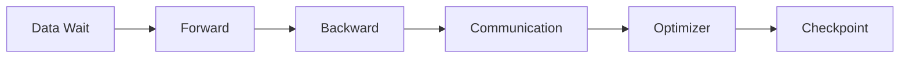

# Performance Engineering and Troubleshooting

Training optimization begins with step-time decomposition.

## Step-Time Model

Measure each stage and overlap rather than relying on aggregate GPU utilization.

## Stragglers

Synchronized jobs progress at the speed of the slowest rank. Compare rank-level kernel time, collective time, CPU load, storage wait, network counters, thermals, and error events.

## Common Root Causes

- data loader or metadata bottleneck;
- rank mapped to wrong GPU or NIC;
- one degraded link;
- collective algorithm mismatch;
- power or thermal throttling;
- checkpoint serialization;
- software version drift;
- background workload contention.

## Incident Workflow

Capture launch configuration, world size, topology, logs by rank, NCCL debug output, GPU telemetry, fabric counters, and storage metrics before restarting.
