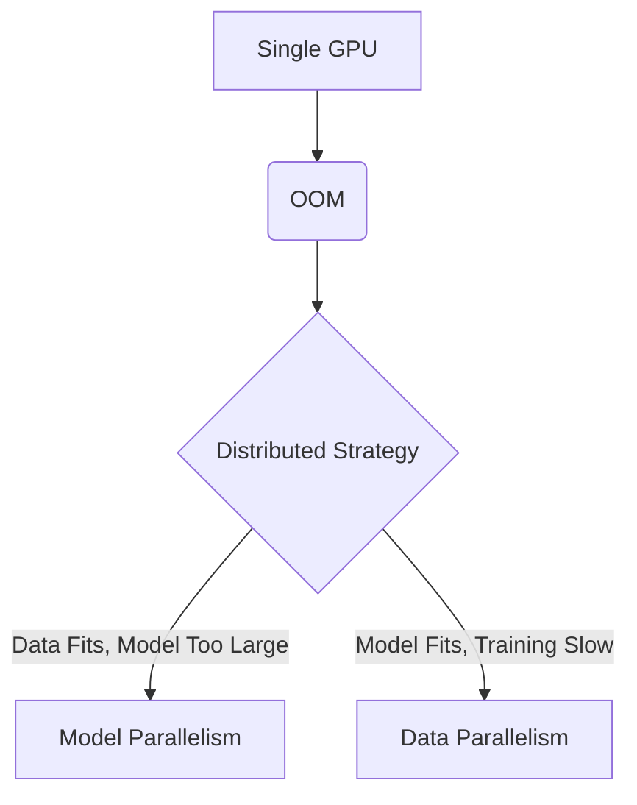

# Volume 13: Distributed Training Foundations

## Introduction
Welcome to Volume 13. Distributed training is the cornerstone of modern large-scale machine learning. This volume covers the fundamental principles of scaling models across multiple GPUs and nodes.

## WHY Distributed Training?
As models grow into the billions or trillions of parameters, a single GPU lacks both the memory to hold the model state and the compute power to train it within a reasonable timeframe.

## WHAT is Distributed Training?
It is the process of splitting the workload—either the data, the model, or both—across multiple devices to accelerate training and overcome memory limitations.

## HOW it Works
We utilize parallelization strategies (Data, Tensor, Pipeline) combined with high-speed interconnects (NVLink, InfiniBand) to synchronize gradients and activations.

## WHEN to Use
- **Single GPU:** Model and batch size fit in memory, training time is acceptable.
- **Multi-GPU (Data Parallel):** Model fits, but training is too slow or batch size needs to be larger.
- **Model Parallel:** Model exceeds single GPU memory.

## TRADEOFFS
| Strategy | Pros | Cons |
|---|---|---|
| DDP | Simple, fast for compute-bound | High memory redundancy |
| FSDP | Memory efficient | Higher communication overhead |
| TP | Reduces activation memory | Requires high bandwidth (NVLink) |

## PRODUCTION
In production, Kubernetes (via PyTorchJob or MPIJob) combined with SLURM handles orchestration. Checkpointing and fast-recovery mechanisms are critical.

## TROUBLESHOOTING
**Failure Scenario 1: NCCL Timeout**
- **Log:** `RuntimeError: NCCL communicator was aborted`
- **Command:** `export NCCL_DEBUG=INFO`
- **Fix:** Check network interfaces, MTU mismatches, or hanging nodes.

**Failure Scenario 2: OOM during broadcast**
- **Log:** `CUDA out of memory`
- **Fix:** Enable activation checkpointing or reduce batch size.

## Senior Interview Questions
**Q:** How does ZeRO-1 differ from traditional DDP?
**A:** ZeRO-1 shards optimizer states across data-parallel ranks, whereas DDP replicates them. This reduces memory footprint significantly without extra communication overhead during the forward/backward pass.

**Q:** What is the bottleneck in DDP?
**A:** The All-Reduce operation for gradient synchronization, which can be bottlenecked by inter-node network bandwidth (e.g., InfiniBand).

# Volume 13: Distributed Training Foundations

## Introduction
Welcome to Volume 13. Distributed training is the cornerstone of modern large-scale machine learning. This volume covers the fundamental principles of scaling models across multiple GPUs and nodes.

## WHY Distributed Training?
As models grow into the billions or trillions of parameters, a single GPU lacks both the memory to hold the model state and the compute power to train it within a reasonable timeframe.

## WHAT is Distributed Training?
It is the process of splitting the workload—either the data, the model, or both—across multiple devices to accelerate training and overcome memory limitations.

## HOW it Works
We utilize parallelization strategies (Data, Tensor, Pipeline) combined with high-speed interconnects (NVLink, InfiniBand) to synchronize gradients and activations.

## WHEN to Use
- **Single GPU:** Model and batch size fit in memory, training time is acceptable.
- **Multi-GPU (Data Parallel):** Model fits, but training is too slow or batch size needs to be larger.
- **Model Parallel:** Model exceeds single GPU memory.

## TRADEOFFS
| Strategy | Pros | Cons |
|---|---|---|
| DDP | Simple, fast for compute-bound | High memory redundancy |
| FSDP | Memory efficient | Higher communication overhead |
| TP | Reduces activation memory | Requires high bandwidth (NVLink) |

## PRODUCTION
In production, Kubernetes (via PyTorchJob or MPIJob) combined with SLURM handles orchestration. Checkpointing and fast-recovery mechanisms are critical.

## TROUBLESHOOTING
**Failure Scenario 1: NCCL Timeout**
- **Log:** `RuntimeError: NCCL communicator was aborted`
- **Command:** `export NCCL_DEBUG=INFO`
- **Fix:** Check network interfaces, MTU mismatches, or hanging nodes.

**Failure Scenario 2: OOM during broadcast**
- **Log:** `CUDA out of memory`
- **Fix:** Enable activation checkpointing or reduce batch size.

## Senior Interview Questions
**Q:** How does ZeRO-1 differ from traditional DDP?
**A:** ZeRO-1 shards optimizer states across data-parallel ranks, whereas DDP replicates them. This reduces memory footprint significantly without extra communication overhead during the forward/backward pass.

**Q:** What is the bottleneck in DDP?
**A:** The All-Reduce operation for gradient synchronization, which can be bottlenecked by inter-node network bandwidth (e.g., InfiniBand).

# Volume 13: Distributed Training Foundations

## Introduction
Welcome to Volume 13. Distributed training is the cornerstone of modern large-scale machine learning. This volume covers the fundamental principles of scaling models across multiple GPUs and nodes.

## WHY Distributed Training?
As models grow into the billions or trillions of parameters, a single GPU lacks both the memory to hold the model state and the compute power to train it within a reasonable timeframe.

## WHAT is Distributed Training?
It is the process of splitting the workload—either the data, the model, or both—across multiple devices to accelerate training and overcome memory limitations.

## HOW it Works
We utilize parallelization strategies (Data, Tensor, Pipeline) combined with high-speed interconnects (NVLink, InfiniBand) to synchronize gradients and activations.

## WHEN to Use
- **Single GPU:** Model and batch size fit in memory, training time is acceptable.
- **Multi-GPU (Data Parallel):** Model fits, but training is too slow or batch size needs to be larger.
- **Model Parallel:** Model exceeds single GPU memory.

## TRADEOFFS
| Strategy | Pros | Cons |
|---|---|---|
| DDP | Simple, fast for compute-bound | High memory redundancy |
| FSDP | Memory efficient | Higher communication overhead |
| TP | Reduces activation memory | Requires high bandwidth (NVLink) |

## PRODUCTION
In production, Kubernetes (via PyTorchJob or MPIJob) combined with SLURM handles orchestration. Checkpointing and fast-recovery mechanisms are critical.

## TROUBLESHOOTING
**Failure Scenario 1: NCCL Timeout**
- **Log:** `RuntimeError: NCCL communicator was aborted`
- **Command:** `export NCCL_DEBUG=INFO`
- **Fix:** Check network interfaces, MTU mismatches, or hanging nodes.

**Failure Scenario 2: OOM during broadcast**
- **Log:** `CUDA out of memory`
- **Fix:** Enable activation checkpointing or reduce batch size.

## Senior Interview Questions
**Q:** How does ZeRO-1 differ from traditional DDP?
**A:** ZeRO-1 shards optimizer states across data-parallel ranks, whereas DDP replicates them. This reduces memory footprint significantly without extra communication overhead during the forward/backward pass.

**Q:** What is the bottleneck in DDP?
**A:** The All-Reduce operation for gradient synchronization, which can be bottlenecked by inter-node network bandwidth (e.g., InfiniBand).

# Volume 13: Distributed Training Foundations

## Introduction
Welcome to Volume 13. Distributed training is the cornerstone of modern large-scale machine learning. This volume covers the fundamental principles of scaling models across multiple GPUs and nodes.

## WHY Distributed Training?
As models grow into the billions or trillions of parameters, a single GPU lacks both the memory to hold the model state and the compute power to train it within a reasonable timeframe.

## WHAT is Distributed Training?
It is the process of splitting the workload—either the data, the model, or both—across multiple devices to accelerate training and overcome memory limitations.

## HOW it Works
We utilize parallelization strategies (Data, Tensor, Pipeline) combined with high-speed interconnects (NVLink, InfiniBand) to synchronize gradients and activations.

## WHEN to Use
- **Single GPU:** Model and batch size fit in memory, training time is acceptable.
- **Multi-GPU (Data Parallel):** Model fits, but training is too slow or batch size needs to be larger.
- **Model Parallel:** Model exceeds single GPU memory.

## TRADEOFFS
| Strategy | Pros | Cons |
|---|---|---|
| DDP | Simple, fast for compute-bound | High memory redundancy |
| FSDP | Memory efficient | Higher communication overhead |
| TP | Reduces activation memory | Requires high bandwidth (NVLink) |

## PRODUCTION
In production, Kubernetes (via PyTorchJob or MPIJob) combined with SLURM handles orchestration. Checkpointing and fast-recovery mechanisms are critical.

## TROUBLESHOOTING
**Failure Scenario 1: NCCL Timeout**
- **Log:** `RuntimeError: NCCL communicator was aborted`
- **Command:** `export NCCL_DEBUG=INFO`
- **Fix:** Check network interfaces, MTU mismatches, or hanging nodes.

**Failure Scenario 2: OOM during broadcast**
- **Log:** `CUDA out of memory`
- **Fix:** Enable activation checkpointing or reduce batch size.

## Senior Interview Questions
**Q:** How does ZeRO-1 differ from traditional DDP?
**A:** ZeRO-1 shards optimizer states across data-parallel ranks, whereas DDP replicates them. This reduces memory footprint significantly without extra communication overhead during the forward/backward pass.

**Q:** What is the bottleneck in DDP?
**A:** The All-Reduce operation for gradient synchronization, which can be bottlenecked by inter-node network bandwidth (e.g., InfiniBand).

# Volume 13: Distributed Training Foundations

## Introduction
Welcome to Volume 13. Distributed training is the cornerstone of modern large-scale machine learning. This volume covers the fundamental principles of scaling models across multiple GPUs and nodes.

## WHY Distributed Training?
As models grow into the billions or trillions of parameters, a single GPU lacks both the memory to hold the model state and the compute power to train it within a reasonable timeframe.

## WHAT is Distributed Training?
It is the process of splitting the workload—either the data, the model, or both—across multiple devices to accelerate training and overcome memory limitations.

## HOW it Works
We utilize parallelization strategies (Data, Tensor, Pipeline) combined with high-speed interconnects (NVLink, InfiniBand) to synchronize gradients and activations.

## WHEN to Use
- **Single GPU:** Model and batch size fit in memory, training time is acceptable.
- **Multi-GPU (Data Parallel):** Model fits, but training is too slow or batch size needs to be larger.
- **Model Parallel:** Model exceeds single GPU memory.

## TRADEOFFS
| Strategy | Pros | Cons |
|---|---|---|
| DDP | Simple, fast for compute-bound | High memory redundancy |
| FSDP | Memory efficient | Higher communication overhead |
| TP | Reduces activation memory | Requires high bandwidth (NVLink) |

## PRODUCTION
In production, Kubernetes (via PyTorchJob or MPIJob) combined with SLURM handles orchestration. Checkpointing and fast-recovery mechanisms are critical.

## TROUBLESHOOTING
**Failure Scenario 1: NCCL Timeout**
- **Log:** `RuntimeError: NCCL communicator was aborted`
- **Command:** `export NCCL_DEBUG=INFO`
- **Fix:** Check network interfaces, MTU mismatches, or hanging nodes.

**Failure Scenario 2: OOM during broadcast**
- **Log:** `CUDA out of memory`
- **Fix:** Enable activation checkpointing or reduce batch size.

## Senior Interview Questions
**Q:** How does ZeRO-1 differ from traditional DDP?
**A:** ZeRO-1 shards optimizer states across data-parallel ranks, whereas DDP replicates them. This reduces memory footprint significantly without extra communication overhead during the forward/backward pass.

**Q:** What is the bottleneck in DDP?
**A:** The All-Reduce operation for gradient synchronization, which can be bottlenecked by inter-node network bandwidth (e.g., InfiniBand).

# Volume 13: Distributed Training Foundations

## Introduction
Welcome to Volume 13. Distributed training is the cornerstone of modern large-scale machine learning. This volume covers the fundamental principles of scaling models across multiple GPUs and nodes.

## WHY Distributed Training?
As models grow into the billions or trillions of parameters, a single GPU lacks both the memory to hold the model state and the compute power to train it within a reasonable timeframe.

## WHAT is Distributed Training?
It is the process of splitting the workload—either the data, the model, or both—across multiple devices to accelerate training and overcome memory limitations.

## HOW it Works
We utilize parallelization strategies (Data, Tensor, Pipeline) combined with high-speed interconnects (NVLink, InfiniBand) to synchronize gradients and activations.

## WHEN to Use
- **Single GPU:** Model and batch size fit in memory, training time is acceptable.
- **Multi-GPU (Data Parallel):** Model fits, but training is too slow or batch size needs to be larger.
- **Model Parallel:** Model exceeds single GPU memory.

## TRADEOFFS
| Strategy | Pros | Cons |
|---|---|---|
| DDP | Simple, fast for compute-bound | High memory redundancy |
| FSDP | Memory efficient | Higher communication overhead |
| TP | Reduces activation memory | Requires high bandwidth (NVLink) |

## PRODUCTION
In production, Kubernetes (via PyTorchJob or MPIJob) combined with SLURM handles orchestration. Checkpointing and fast-recovery mechanisms are critical.

## TROUBLESHOOTING
**Failure Scenario 1: NCCL Timeout**
- **Log:** `RuntimeError: NCCL communicator was aborted`
- **Command:** `export NCCL_DEBUG=INFO`
- **Fix:** Check network interfaces, MTU mismatches, or hanging nodes.

**Failure Scenario 2: OOM during broadcast**
- **Log:** `CUDA out of memory`
- **Fix:** Enable activation checkpointing or reduce batch size.

## Senior Interview Questions
**Q:** How does ZeRO-1 differ from traditional DDP?
**A:** ZeRO-1 shards optimizer states across data-parallel ranks, whereas DDP replicates them. This reduces memory footprint significantly without extra communication overhead during the forward/backward pass.

**Q:** What is the bottleneck in DDP?
**A:** The All-Reduce operation for gradient synchronization, which can be bottlenecked by inter-node network bandwidth (e.g., InfiniBand).

# Volume 13: Distributed Training Foundations

## Introduction
Welcome to Volume 13. Distributed training is the cornerstone of modern large-scale machine learning. This volume covers the fundamental principles of scaling models across multiple GPUs and nodes.

## WHY Distributed Training?
As models grow into the billions or trillions of parameters, a single GPU lacks both the memory to hold the model state and the compute power to train it within a reasonable timeframe.

## WHAT is Distributed Training?
It is the process of splitting the workload—either the data, the model, or both—across multiple devices to accelerate training and overcome memory limitations.

## HOW it Works
We utilize parallelization strategies (Data, Tensor, Pipeline) combined with high-speed interconnects (NVLink, InfiniBand) to synchronize gradients and activations.

## WHEN to Use
- **Single GPU:** Model and batch size fit in memory, training time is acceptable.
- **Multi-GPU (Data Parallel):** Model fits, but training is too slow or batch size needs to be larger.
- **Model Parallel:** Model exceeds single GPU memory.

## TRADEOFFS
| Strategy | Pros | Cons |
|---|---|---|
| DDP | Simple, fast for compute-bound | High memory redundancy |
| FSDP | Memory efficient | Higher communication overhead |
| TP | Reduces activation memory | Requires high bandwidth (NVLink) |
