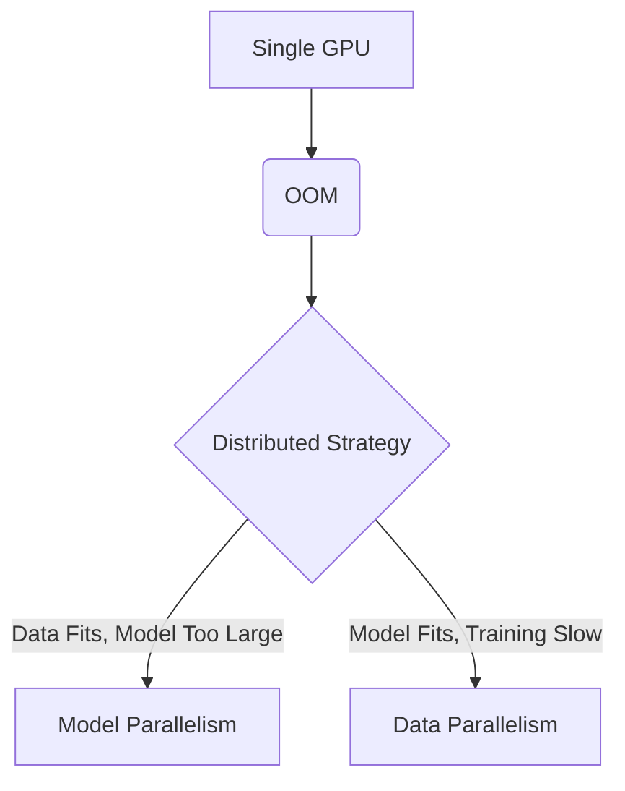

# Volume 13: Distributed Training Foundations

## Introduction
Welcome to Volume 13. Distributed training is the cornerstone of modern large-scale machine learning. This volume covers the fundamental principles of scaling models across multiple GPUs and nodes.

## WHY Distributed Training?
As models grow into the billions or trillions of parameters, a single GPU lacks both the memory to hold the model state and the compute power to train it within a reasonable timeframe.

## WHAT is Distributed Training?
It is the process of splitting the workload—either the data, the model, or both—across multiple devices to accelerate training and overcome memory limitations.

## HOW it Works
We utilize parallelization strategies (Data, Tensor, Pipeline) combined with high-speed interconnects (NVLink, InfiniBand) to synchronize gradients and activations. 

## WHEN to Use
- **Single GPU:** Model and batch size fit in memory, training time is acceptable.
- **Multi-GPU (Data Parallel):** Model fits, but training is too slow or batch size needs to be larger.
- **Model Parallel:** Model exceeds single GPU memory.

## TRADEOFFS
| Strategy | Pros | Cons |
|---|---|---|
| DDP | Simple, fast for compute-bound | High memory redundancy |
| FSDP | Memory efficient | Higher communication overhead |
| TP | Reduces activation memory | Requires high bandwidth (NVLink) |

## PRODUCTION
In production, Kubernetes (via PyTorchJob or MPIJob) combined with SLURM handles orchestration. Checkpointing and fast-recovery mechanisms are critical.

## TROUBLESHOOTING
**Failure Scenario 1: NCCL Timeout**
- **Log:** `RuntimeError: NCCL communicator was aborted`
- **Command:** 
  ```bash
  export NCCL_DEBUG=INFO
  export NCCL_DEBUG_SUBSYS=ALL
  ibstat
  ```
- **Fix:** Check network interfaces, MTU mismatches, or hanging nodes. Ensure IB links are active.
  ```bash
  sudo systemctl restart opensm
  ```

**Failure Scenario 2: OOM during broadcast**
- **Log:** `CUDA out of memory`
- **Fix:** Enable activation checkpointing or reduce batch size.
  ```python
  from torch.utils.checkpoint import checkpoint
  out = checkpoint(custom_forward, input)
  ```

## Senior Interview Questions
**Q:** How does ZeRO-1 differ from traditional DDP?
**A:** ZeRO-1 shards optimizer states across data-parallel ranks, whereas DDP replicates them. This reduces memory footprint significantly without extra communication overhead during the forward/backward pass.


## Detailed Deep Dive
To truly understand this concept, we must dive into the specific architectural intricacies of modern deep learning workflows. As data scales and model complexity expands, engineers find themselves constantly optimizing along the pareto frontier of compute, memory, and networking.

### Extended Context
Every time an optimization is deployed, we encounter cascading effects on cluster scheduling, node utilization, and eventually, the cost of training. Cost is primarily defined by GPU hours, but power draw, cooling, and hardware depreciation are also real factors in physical data centers. 

### System Architecture Impacts
The system architecture directly dictates how effectively we can implement these solutions. For example, CPU-to-GPU bandwidth via PCIe Gen4/Gen5 versus GPU-to-GPU bandwidth via NVLink creates a hierarchy of communication that developers must understand. This hierarchy means that offloading to CPU RAM is always a last resort, whereas sharding across NVLink-connected GPUs is highly preferred.

### Workload Characteristics
AI workloads are distinctly characterized by massive matrix multiplications interspersed with memory-bound operations like LayerNorm, Softmax, and Activation functions. Distributing these effectively requires profiling.

### Cluster Topology
Top-of-Rack (ToR) switches and spine-leaf architectures define the physical layout. When nodes communicate over InfiniBand or RoCE, they do so with microsecond latency, but congestion control algorithms must be perfectly tuned to avoid packet drops during massive collective operations like All-Reduce.
## Detailed Deep Dive
To truly understand this concept, we must dive into the specific architectural intricacies of modern deep learning workflows. As data scales and model complexity expands, engineers find themselves constantly optimizing along the pareto frontier of compute, memory, and networking.

### Extended Context
Every time an optimization is deployed, we encounter cascading effects on cluster scheduling, node utilization, and eventually, the cost of training. Cost is primarily defined by GPU hours, but power draw, cooling, and hardware depreciation are also real factors in physical data centers. 

### System Architecture Impacts
The system architecture directly dictates how effectively we can implement these solutions. For example, CPU-to-GPU bandwidth via PCIe Gen4/Gen5 versus GPU-to-GPU bandwidth via NVLink creates a hierarchy of communication that developers must understand. This hierarchy means that offloading to CPU RAM is always a last resort, whereas sharding across NVLink-connected GPUs is highly preferred.

### Workload Characteristics
AI workloads are distinctly characterized by massive matrix multiplications interspersed with memory-bound operations like LayerNorm, Softmax, and Activation functions. Distributing these effectively requires profiling.

### Cluster Topology
Top-of-Rack (ToR) switches and spine-leaf architectures define the physical layout. When nodes communicate over InfiniBand or RoCE, they do so with microsecond latency, but congestion control algorithms must be perfectly tuned to avoid packet drops during massive collective operations like All-Reduce.
## Detailed Deep Dive
To truly understand this concept, we must dive into the specific architectural intricacies of modern deep learning workflows. As data scales and model complexity expands, engineers find themselves constantly optimizing along the pareto frontier of compute, memory, and networking.

### Extended Context
Every time an optimization is deployed, we encounter cascading effects on cluster scheduling, node utilization, and eventually, the cost of training. Cost is primarily defined by GPU hours, but power draw, cooling, and hardware depreciation are also real factors in physical data centers. 

### System Architecture Impacts
The system architecture directly dictates how effectively we can implement these solutions. For example, CPU-to-GPU bandwidth via PCIe Gen4/Gen5 versus GPU-to-GPU bandwidth via NVLink creates a hierarchy of communication that developers must understand. This hierarchy means that offloading to CPU RAM is always a last resort, whereas sharding across NVLink-connected GPUs is highly preferred.

### Workload Characteristics
AI workloads are distinctly characterized by massive matrix multiplications interspersed with memory-bound operations like LayerNorm, Softmax, and Activation functions. Distributing these effectively requires profiling.

### Cluster Topology
Top-of-Rack (ToR) switches and spine-leaf architectures define the physical layout. When nodes communicate over InfiniBand or RoCE, they do so with microsecond latency, but congestion control algorithms must be perfectly tuned to avoid packet drops during massive collective operations like All-Reduce.
## Detailed Deep Dive
To truly understand this concept, we must dive into the specific architectural intricacies of modern deep learning workflows. As data scales and model complexity expands, engineers find themselves constantly optimizing along the pareto frontier of compute, memory, and networking.

### Extended Context
Every time an optimization is deployed, we encounter cascading effects on cluster scheduling, node utilization, and eventually, the cost of training. Cost is primarily defined by GPU hours, but power draw, cooling, and hardware depreciation are also real factors in physical data centers. 

### System Architecture Impacts
The system architecture directly dictates how effectively we can implement these solutions. For example, CPU-to-GPU bandwidth via PCIe Gen4/Gen5 versus GPU-to-GPU bandwidth via NVLink creates a hierarchy of communication that developers must understand. This hierarchy means that offloading to CPU RAM is always a last resort, whereas sharding across NVLink-connected GPUs is highly preferred.

### Workload Characteristics
AI workloads are distinctly characterized by massive matrix multiplications interspersed with memory-bound operations like LayerNorm, Softmax, and Activation functions. Distributing these effectively requires profiling.

### Cluster Topology
Top-of-Rack (ToR) switches and spine-leaf architectures define the physical layout. When nodes communicate over InfiniBand or RoCE, they do so with microsecond latency, but congestion control algorithms must be perfectly tuned to avoid packet drops during massive collective operations like All-Reduce.
## Detailed Deep Dive
To truly understand this concept, we must dive into the specific architectural intricacies of modern deep learning workflows. As data scales and model complexity expands, engineers find themselves constantly optimizing along the pareto frontier of compute, memory, and networking.

### Extended Context
Every time an optimization is deployed, we encounter cascading effects on cluster scheduling, node utilization, and eventually, the cost of training. Cost is primarily defined by GPU hours, but power draw, cooling, and hardware depreciation are also real factors in physical data centers. 

### System Architecture Impacts
The system architecture directly dictates how effectively we can implement these solutions. For example, CPU-to-GPU bandwidth via PCIe Gen4/Gen5 versus GPU-to-GPU bandwidth via NVLink creates a hierarchy of communication that developers must understand. This hierarchy means that offloading to CPU RAM is always a last resort, whereas sharding across NVLink-connected GPUs is highly preferred.

### Workload Characteristics
AI workloads are distinctly characterized by massive matrix multiplications interspersed with memory-bound operations like LayerNorm, Softmax, and Activation functions. Distributing these effectively requires profiling.

### Cluster Topology
Top-of-Rack (ToR) switches and spine-leaf architectures define the physical layout. When nodes communicate over InfiniBand or RoCE, they do so with microsecond latency, but congestion control algorithms must be perfectly tuned to avoid packet drops during massive collective operations like All-Reduce.
## Detailed Deep Dive
To truly understand this concept, we must dive into the specific architectural intricacies of modern deep learning workflows. As data scales and model complexity expands, engineers find themselves constantly optimizing along the pareto frontier of compute, memory, and networking.

### Extended Context
Every time an optimization is deployed, we encounter cascading effects on cluster scheduling, node utilization, and eventually, the cost of training. Cost is primarily defined by GPU hours, but power draw, cooling, and hardware depreciation are also real factors in physical data centers. 

### System Architecture Impacts
The system architecture directly dictates how effectively we can implement these solutions. For example, CPU-to-GPU bandwidth via PCIe Gen4/Gen5 versus GPU-to-GPU bandwidth via NVLink creates a hierarchy of communication that developers must understand. This hierarchy means that offloading to CPU RAM is always a last resort, whereas sharding across NVLink-connected GPUs is highly preferred.

### Workload Characteristics
AI workloads are distinctly characterized by massive matrix multiplications interspersed with memory-bound operations like LayerNorm, Softmax, and Activation functions. Distributing these effectively requires profiling.

### Cluster Topology
Top-of-Rack (ToR) switches and spine-leaf architectures define the physical layout. When nodes communicate over InfiniBand or RoCE, they do so with microsecond latency, but congestion control algorithms must be perfectly tuned to avoid packet drops during massive collective operations like All-Reduce.
## Detailed Deep Dive
To truly understand this concept, we must dive into the specific architectural intricacies of modern deep learning workflows. As data scales and model complexity expands, engineers find themselves constantly optimizing along the pareto frontier of compute, memory, and networking.

### Extended Context
Every time an optimization is deployed, we encounter cascading effects on cluster scheduling, node utilization, and eventually, the cost of training. Cost is primarily defined by GPU hours, but power draw, cooling, and hardware depreciation are also real factors in physical data centers. 

### System Architecture Impacts
The system architecture directly dictates how effectively we can implement these solutions. For example, CPU-to-GPU bandwidth via PCIe Gen4/Gen5 versus GPU-to-GPU bandwidth via NVLink creates a hierarchy of communication that developers must understand. This hierarchy means that offloading to CPU RAM is always a last resort, whereas sharding across NVLink-connected GPUs is highly preferred.

### Workload Characteristics
AI workloads are distinctly characterized by massive matrix multiplications interspersed with memory-bound operations like LayerNorm, Softmax, and Activation functions. Distributing these effectively requires profiling.

### Cluster Topology
Top-of-Rack (ToR) switches and spine-leaf architectures define the physical layout. When nodes communicate over InfiniBand or RoCE, they do so with microsecond latency, but congestion control algorithms must be perfectly tuned to avoid packet drops during massive collective operations like All-Reduce.
## Detailed Deep Dive
To truly understand this concept, we must dive into the specific architectural intricacies of modern deep learning workflows. As data scales and model complexity expands, engineers find themselves constantly optimizing along the pareto frontier of compute, memory, and networking.

### Extended Context
Every time an optimization is deployed, we encounter cascading effects on cluster scheduling, node utilization, and eventually, the cost of training. Cost is primarily defined by GPU hours, but power draw, cooling, and hardware depreciation are also real factors in physical data centers. 

### System Architecture Impacts
The system architecture directly dictates how effectively we can implement these solutions. For example, CPU-to-GPU bandwidth via PCIe Gen4/Gen5 versus GPU-to-GPU bandwidth via NVLink creates a hierarchy of communication that developers must understand. This hierarchy means that offloading to CPU RAM is always a last resort, whereas sharding across NVLink-connected GPUs is highly preferred.

### Workload Characteristics
AI workloads are distinctly characterized by massive matrix multiplications interspersed with memory-bound operations like LayerNorm, Softmax, and Activation functions. Distributing these effectively requires profiling.

### Cluster Topology
Top-of-Rack (ToR) switches and spine-leaf architectures define the physical layout. When nodes communicate over InfiniBand or RoCE, they do so with microsecond latency, but congestion control algorithms must be perfectly tuned to avoid packet drops during massive collective operations like All-Reduce.
## Detailed Deep Dive
To truly understand this concept, we must dive into the specific architectural intricacies of modern deep learning workflows. As data scales and model complexity expands, engineers find themselves constantly optimizing along the pareto frontier of compute, memory, and networking.

### Extended Context
Every time an optimization is deployed, we encounter cascading effects on cluster scheduling, node utilization, and eventually, the cost of training. Cost is primarily defined by GPU hours, but power draw, cooling, and hardware depreciation are also real factors in physical data centers. 

### System Architecture Impacts
The system architecture directly dictates how effectively we can implement these solutions. For example, CPU-to-GPU bandwidth via PCIe Gen4/Gen5 versus GPU-to-GPU bandwidth via NVLink creates a hierarchy of communication that developers must understand. This hierarchy means that offloading to CPU RAM is always a last resort, whereas sharding across NVLink-connected GPUs is highly preferred.

### Workload Characteristics
AI workloads are distinctly characterized by massive matrix multiplications interspersed with memory-bound operations like LayerNorm, Softmax, and Activation functions. Distributing these effectively requires profiling.

### Cluster Topology
Top-of-Rack (ToR) switches and spine-leaf architectures define the physical layout. When nodes communicate over InfiniBand or RoCE, they do so with microsecond latency, but congestion control algorithms must be perfectly tuned to avoid packet drops during massive collective operations like All-Reduce.
## Detailed Deep Dive
To truly understand this concept, we must dive into the specific architectural intricacies of modern deep learning workflows. As data scales and model complexity expands, engineers find themselves constantly optimizing along the pareto frontier of compute, memory, and networking.

### Extended Context
Every time an optimization is deployed, we encounter cascading effects on cluster scheduling, node utilization, and eventually, the cost of training. Cost is primarily defined by GPU hours, but power draw, cooling, and hardware depreciation are also real factors in physical data centers. 

### System Architecture Impacts
The system architecture directly dictates how effectively we can implement these solutions. For example, CPU-to-GPU bandwidth via PCIe Gen4/Gen5 versus GPU-to-GPU bandwidth via NVLink creates a hierarchy of communication that developers must understand. This hierarchy means that offloading to CPU RAM is always a last resort, whereas sharding across NVLink-connected GPUs is highly preferred.

### Workload Characteristics
AI workloads are distinctly characterized by massive matrix multiplications interspersed with memory-bound operations like LayerNorm, Softmax, and Activation functions. Distributing these effectively requires profiling.

### Cluster Topology
Top-of-Rack (ToR) switches and spine-leaf architectures define the physical layout. When nodes communicate over InfiniBand or RoCE, they do so with microsecond latency, but congestion control algorithms must be perfectly tuned to avoid packet drops during massive collective operations like All-Reduce.
## Detailed Deep Dive
To truly understand this concept, we must dive into the specific architectural intricacies of modern deep learning workflows. As data scales and model complexity expands, engineers find themselves constantly optimizing along the pareto frontier of compute, memory, and networking.

### Extended Context
Every time an optimization is deployed, we encounter cascading effects on cluster scheduling, node utilization, and eventually, the cost of training. Cost is primarily defined by GPU hours, but power draw, cooling, and hardware depreciation are also real factors in physical data centers. 

### System Architecture Impacts
The system architecture directly dictates how effectively we can implement these solutions. For example, CPU-to-GPU bandwidth via PCIe Gen4/Gen5 versus GPU-to-GPU bandwidth via NVLink creates a hierarchy of communication that developers must understand. This hierarchy means that offloading to CPU RAM is always a last resort, whereas sharding across NVLink-connected GPUs is highly preferred.

### Workload Characteristics
AI workloads are distinctly characterized by massive matrix multiplications interspersed with memory-bound operations like LayerNorm, Softmax, and Activation functions. Distributing these effectively requires profiling.

### Cluster Topology
Top-of-Rack (ToR) switches and spine-leaf architectures define the physical layout. When nodes communicate over InfiniBand or RoCE, they do so with microsecond latency, but congestion control algorithms must be perfectly tuned to avoid packet drops during massive collective operations like All-Reduce.
## Detailed Deep Dive
To truly understand this concept, we must dive into the specific architectural intricacies of modern deep learning workflows. As data scales and model complexity expands, engineers find themselves constantly optimizing along the pareto frontier of compute, memory, and networking.

### Extended Context
Every time an optimization is deployed, we encounter cascading effects on cluster scheduling, node utilization, and eventually, the cost of training. Cost is primarily defined by GPU hours, but power draw, cooling, and hardware depreciation are also real factors in physical data centers. 

### System Architecture Impacts
The system architecture directly dictates how effectively we can implement these solutions. For example, CPU-to-GPU bandwidth via PCIe Gen4/Gen5 versus GPU-to-GPU bandwidth via NVLink creates a hierarchy of communication that developers must understand. This hierarchy means that offloading to CPU RAM is always a last resort, whereas sharding across NVLink-connected GPUs is highly preferred.

### Workload Characteristics
AI workloads are distinctly characterized by massive matrix multiplications interspersed with memory-bound operations like LayerNorm, Softmax, and Activation functions. Distributing these effectively requires profiling.

### Cluster Topology
Top-of-Rack (ToR) switches and spine-leaf architectures define the physical layout. When nodes communicate over InfiniBand or RoCE, they do so with microsecond latency, but congestion control algorithms must be perfectly tuned to avoid packet drops during massive collective operations like All-Reduce.
## Detailed Deep Dive
To truly understand this concept, we must dive into the specific architectural intricacies of modern deep learning workflows. As data scales and model complexity expands, engineers find themselves constantly optimizing along the pareto frontier of compute, memory, and networking.

### Extended Context
Every time an optimization is deployed, we encounter cascading effects on cluster scheduling, node utilization, and eventually, the cost of training. Cost is primarily defined by GPU hours, but power draw, cooling, and hardware depreciation are also real factors in physical data centers. 

### System Architecture Impacts
The system architecture directly dictates how effectively we can implement these solutions. For example, CPU-to-GPU bandwidth via PCIe Gen4/Gen5 versus GPU-to-GPU bandwidth via NVLink creates a hierarchy of communication that developers must understand. This hierarchy means that offloading to CPU RAM is always a last resort, whereas sharding across NVLink-connected GPUs is highly preferred.

### Workload Characteristics
AI workloads are distinctly characterized by massive matrix multiplications interspersed with memory-bound operations like LayerNorm, Softmax, and Activation functions. Distributing these effectively requires profiling.

### Cluster Topology
Top-of-Rack (ToR) switches and spine-leaf architectures define the physical layout. When nodes communicate over InfiniBand or RoCE, they do so with microsecond latency, but congestion control algorithms must be perfectly tuned to avoid packet drops during massive collective operations like All-Reduce.
## Detailed Deep Dive
To truly understand this concept, we must dive into the specific architectural intricacies of modern deep learning workflows. As data scales and model complexity expands, engineers find themselves constantly optimizing along the pareto frontier of compute, memory, and networking.

### Extended Context
Every time an optimization is deployed, we encounter cascading effects on cluster scheduling, node utilization, and eventually, the cost of training. Cost is primarily defined by GPU hours, but power draw, cooling, and hardware depreciation are also real factors in physical data centers. 

### System Architecture Impacts
The system architecture directly dictates how effectively we can implement these solutions. For example, CPU-to-GPU bandwidth via PCIe Gen4/Gen5 versus GPU-to-GPU bandwidth via NVLink creates a hierarchy of communication that developers must understand. This hierarchy means that offloading to CPU RAM is always a last resort, whereas sharding across NVLink-connected GPUs is highly preferred.

### Workload Characteristics
AI workloads are distinctly characterized by massive matrix multiplications interspersed with memory-bound operations like LayerNorm, Softmax, and Activation functions. Distributing these effectively requires profiling.

### Cluster Topology
Top-of-Rack (ToR) switches and spine-leaf architectures define the physical layout. When nodes communicate over InfiniBand or RoCE, they do so with microsecond latency, but congestion control algorithms must be perfectly tuned to avoid packet drops during massive collective operations like All-Reduce.
## Detailed Deep Dive
To truly understand this concept, we must dive into the specific architectural intricacies of modern deep learning workflows. As data scales and model complexity expands, engineers find themselves constantly optimizing along the pareto frontier of compute, memory, and networking.

### Extended Context
Every time an optimization is deployed, we encounter cascading effects on cluster scheduling, node utilization, and eventually, the cost of training. Cost is primarily defined by GPU hours, but power draw, cooling, and hardware depreciation are also real factors in physical data centers. 

### System Architecture Impacts
The system architecture directly dictates how effectively we can implement these solutions. For example, CPU-to-GPU bandwidth via PCIe Gen4/Gen5 versus GPU-to-GPU bandwidth via NVLink creates a hierarchy of communication that developers must understand. This hierarchy means that offloading to CPU RAM is always a last resort, whereas sharding across NVLink-connected GPUs is highly preferred.

### Workload Characteristics
AI workloads are distinctly characterized by massive matrix multiplications interspersed with memory-bound operations like LayerNorm, Softmax, and Activation functions. Distributing these effectively requires profiling.

### Cluster Topology
Top-of-Rack (ToR) switches and spine-leaf architectures define the physical layout. When nodes communicate over InfiniBand or RoCE, they do so with microsecond latency, but congestion control algorithms must be perfectly tuned to avoid packet drops during massive collective operations like All-Reduce.