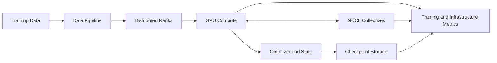

# Volume 13 — AI Training

Large-model training is a systems problem. Compute, memory, collectives, checkpointing, storage, process placement, and failure recovery must progress together. A cluster can contain powerful GPUs and still deliver poor training efficiency when one rank, one link, or one data stage becomes the slowest participant.

This volume builds the architecture from single-model memory anatomy through data parallelism, sharding, tensor and pipeline parallelism, NCCL communication, checkpointing, multi-node design, observability, and incident response.

| Volume field | Value |
|---|---|
| Difficulty | Expert |
| Estimated reading time | 22–28 hours |
| Prerequisites | Volumes 01–12 |
| Primary focus | Distributed training architecture and operations |
| Outcome | Design, benchmark, recover, and optimize production training clusters |

## Big Picture

**Figure 13.0.1 — Training progress depends on synchronized layers.** The slowest rank or subsystem determines step time.

## Chapters

1. [Why Distributed Training Exists](./chapter-01-why-distributed-training-exists)
2. [Training Memory and Compute Anatomy](./chapter-02-training-memory-and-compute-anatomy)
3. [Data Parallelism and DDP](./chapter-03-data-parallelism-and-ddp)
4. [FSDP and Parameter Sharding](./chapter-04-fsdp-and-parameter-sharding)
5. [DeepSpeed and ZeRO](./chapter-05-deepspeed-and-zero)
6. [Tensor, Pipeline, and Expert Parallelism](./chapter-06-tensor-pipeline-and-expert-parallelism)
7. [Megatron-LM Architecture](./chapter-07-megatron-lm-architecture)
8. [NCCL Collectives and Communication Paths](./chapter-08-nccl-collectives-and-communication-paths)
9. [Checkpointing and Recovery](./chapter-09-checkpointing-and-recovery)
10. [Multi-Node Training Architecture](./chapter-10-multi-node-training-architecture)
11. [Performance Engineering and Troubleshooting](./chapter-11-performance-engineering-and-troubleshooting)
12. [Volume 13 Summary](./chapter-12-volume-13-summary)

## Labs

- [Run Multi-GPU DDP Training](./labs/lab-01-run-multi-gpu-ddp-training)
- [Benchmark NCCL Collectives](./labs/lab-02-benchmark-nccl-collectives)
- [Test Sharded Training with FSDP](./labs/lab-03-test-sharded-training-with-fsdp)
- [Recover a Distributed Training Job](./labs/lab-04-recover-a-distributed-training-job)
