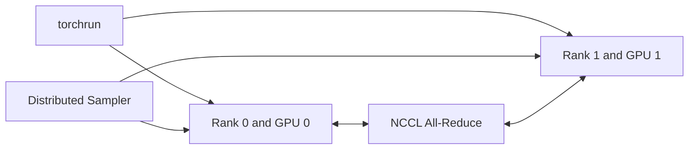

# Lab 01 — Run Multi-GPU DDP Training

## 1. Objective
Run a small approved PyTorch DDP workload across multiple GPUs, prove rank-to-device mapping, compare one- and multi-GPU throughput, and clean up.

## 2. Target Audience
This lab is intended for AI Infrastructure Engineers, Platform Engineers, and ML Researchers who need to manage and optimize distributed training workloads.

## 3. Prerequisites
- Access to a multi-GPU node (e.g., 2+ NVIDIA A100 or H100 GPUs).
- NVIDIA Container Toolkit installed and functioning.
- A functional PyTorch distributed environment (PyTorch 2.x).
- Basic understanding of NCCL and Linux process management.

## 4. Architecture Diagram


## 5. Environment Setup
Verify the environment before running the primary commands:
```bash
nvidia-smi
python -c "import torch; print(torch.cuda.is_available())"
```

## 6. Execution Specifications
**Purpose:** Launch a distributed data parallel training job using torchrun.
**Command:**
```bash
torchrun --nproc_per_node=2 train.py --epochs 5 --batch-size 32
```
**Expected Evidence:** Outputs showing rank 0 and rank 1 initializing process groups and printing decreasing loss values.
**Explanation:** torchrun sets up distributed environment variables (RANK, WORLD_SIZE). train.py initializes NCCL process group and synchronizes gradients via DDP.
**Common Failure:** NCCL Timeout or Address already in use if another process is running.

## 7. Expected Evidence
Each rank should print its own `RANK`/`LOCAL_RANK`/`WORLD_SIZE` on startup, followed by per-epoch loss values that are identical (or within floating-point tolerance) across both ranks — that identical loss trajectory is the proof that gradient synchronization is actually happening, not just that two independent processes are running. Confirm rank-to-device mapping with `nvidia-smi dmon` showing both GPU 0 and GPU 1 active simultaneously (not sequentially), and cross-check against `CUDA_VISIBLE_DEVICES` inside each rank's logs.

## 8. Explanation of Behavior
`torchrun` spawns one process per GPU and sets `RANK`, `LOCAL_RANK`, and `WORLD_SIZE` as environment variables. Each rank builds an identical model, then `DistributedDataParallel` wraps it so that after `loss.backward()` computes local gradients, DDP triggers an All-Reduce across ranks to average them before the optimizer step — this is why loss values converge identically across ranks even though each rank sees a different shard of the batch (via `DistributedSampler`). The All-Reduce is a synchronization barrier: every rank blocks until all ranks have contributed their gradients.

## 9. Performance Benchmarking
Compare wall-clock time per epoch (or tokens/sec) between a single-GPU run (`python train.py`) and the 2-GPU `torchrun` run. Ideal scaling would be 2x throughput; in practice, expect 80-95% scaling efficiency depending on model size, batch size, and interconnect (NVLink vs PCIe) — the gap is the All-Reduce gradient-sync cost from Chapter 3's ring-AllReduce formula (`2×(N-1)/N × gradient_size`). If scaling efficiency is well below 80%, suspect a small batch size (communication not overlapped with compute) or a PCIe-only interconnect.

## 10. Common Failures
- **NCCL Timeout during All-Reduce:** Usually caused by one rank crashing or hanging (e.g., an exception inside the forward pass on only one rank) while the other rank blocks waiting at the collective boundary forever.
- **"Unused parameters" hang:** If the model has conditional branches where some parameters don't participate in every forward pass, DDP's default `find_unused_parameters=False` will cause a permanent hang at the All-Reduce step (see Chapter 3's "Unused Parameters Bug").
- **OOM (Out of Memory):** Batch size (per-GPU, not global) is too large for the available VRAM.

## 11. Safe Failure Injection
**Action:** Manually kill one of the worker processes (e.g., `kill -9 <PID>`) to simulate a node or GPU crash.
**Expected Result:** The process group should hang or crash with an explicit NCCL error.

## 12. Recovery Steps
Restart the job using `torchrun`. PyTorch's Elastic launcher can also be configured to restart automatically if `--max_restarts` is set.

## 13. Troubleshooting Guide
- If ranks hang at startup, confirm both processes can resolve `MASTER_ADDR`/`MASTER_PORT` and that no stale process is already bound to that port (`Address already in use`).
- Enable NCCL debug logs with `export NCCL_DEBUG=INFO` to see which transport (NVLink, PCIe, or socket) NCCL selected for the All-Reduce.
- If loss values diverge between ranks (rather than matching), check that `DistributedSampler` is used (not a plain `DataLoader`) — without it, both ranks train on the same data instead of complementary shards.
- Check `dmesg -T` for Xid errors (e.g., Xid 79, Xid 13) if a rank silently disappears mid-training.

## 14. Validation
Validate the outcome by confirming that (a) both ranks report the same loss value at each epoch boundary, proving gradient synchronization occurred, and (b) multi-GPU throughput is within the expected 80-95% scaling-efficiency band computed in Section 9.

## 15. Real-World Pitfalls
- Forgetting to synchronize the random number generator (RNG) seeds across ranks can cause model initialization to diverge before training even starts.
- Unmatched tensor shapes or execution paths across ranks (e.g., conditional layers) will hang DDP's All-Reduce unless wrapped with `.join()` or `find_unused_parameters=True`.
- Using a global (not per-GPU) batch size in `--batch-size` silently changes the effective batch size per rank and skews the scaling-efficiency comparison in Section 9.

## 16. Cleanup Procedures
```bash
# Terminate lingering torchrun/worker processes
pkill -f torchrun
# Remove checkpoints written during this run
rm -rf ./checkpoints/*
```

## 17. Knowledge Check
- What happens if one rank crashes during an All-Reduce operation, and why do the surviving ranks hang instead of erroring immediately?
- How does `torchrun` assign `RANK`, `LOCAL_RANK`, and `WORLD_SIZE`, and what's the difference between `RANK` and `LOCAL_RANK` on a multi-node job?
- Why must `DistributedSampler` (not a plain shuffle) be used with DDP, and what happens to correctness if it's omitted?

## 18. Additional References
- [PyTorch Distributed Overview](https://pytorch.org/tutorials/beginner/dist_overview.html)
- [NVIDIA NCCL Documentation](https://docs.nvidia.com/deeplearning/nccl/user-guide/docs/index.html)
