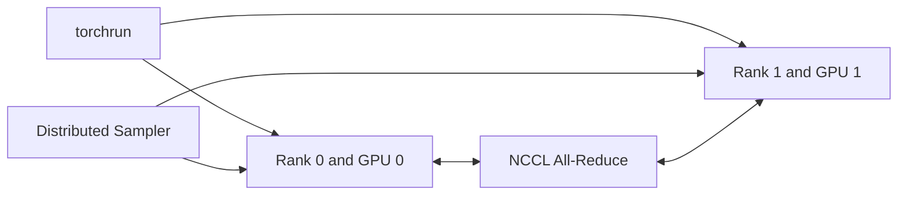

# Lab 01 — Run Multi-GPU DDP Training

## Objective

Run a small approved PyTorch DDP workload across multiple GPUs, prove rank-to-device mapping, compare one- and multi-GPU throughput, and clean up.

## Architecture

## Prerequisites

Two or more GPUs, pinned container, matching driver and framework, a deterministic sample model, and no competing workloads.

## Deployment

Launch with `torchrun` using one process per GPU. Log global rank, local rank, device ID, batch assignment, and loss.

## Validation

Confirm unique data shards, identical model state after synchronization, stable loss, and expected device mapping.

## Performance

Measure samples per second and scaling efficiency from one to the available GPU count.

## Failure Injection

Terminate one rank in a disposable run and observe how the process group fails.

## Troubleshooting

Inspect rank logs, environment variables, NCCL output, sampler behavior, and process exit codes.
