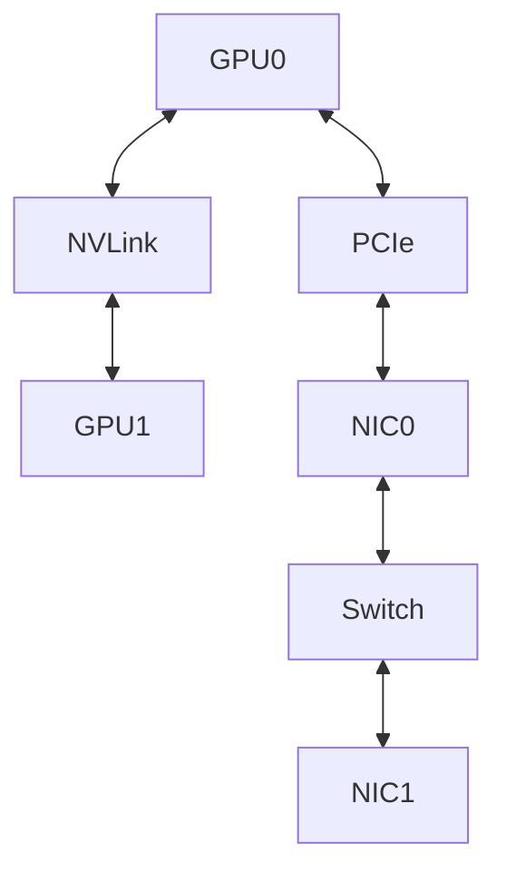

# Lab 02 — Benchmark NCCL Collectives

## 1. Objective
Establish a repeatable collective-communication baseline for one node and multiple nodes.

## 2. Target Audience
This lab is intended for AI Infrastructure Engineers, Platform Engineers, and ML Researchers who need to manage and optimize distributed training workloads.

## 3. Prerequisites
- Access to a multi-GPU node (e.g., 2+ NVIDIA A100 or H100 GPUs).
- NVIDIA Container Toolkit installed and functioning.
- A functional PyTorch distributed environment (PyTorch 2.x).
- Basic understanding of NCCL and Linux process management.

## 4. Architecture Diagram


## 5. Environment Setup
Verify the environment before running the primary commands:
```bash
nvidia-smi
python -c "import torch; print(torch.cuda.is_available())"
```

## 6. Execution Specifications
**Purpose:** Run NCCL all_reduce_perf to measure collective bandwidth.
**Command:**
```bash
./build/all_reduce_perf -b 8 -e 128M -f 2 -g 8
```
**Expected Evidence:** A table showing message size, algorithm bandwidth, and bus bandwidth scaling up to near-hardware limits.
**Explanation:** This test measures out-of-box NCCL performance by performing all-reduce operations across 8 GPUs, scaling message size from 8 bytes to 128 MB.
**Common Failure:** Low bandwidth due to falling back to PCIe instead of NVLink, often caused by ACS being enabled or topology issues.

## 7. Expected Evidence
The `all_reduce_perf` output prints one row per message size with columns for `algbw` (algorithm bandwidth) and `busbw` (bus bandwidth — the number that should be compared against the hardware's rated link speed, e.g. ~900 GB/s aggregate for NVLink4 on H100). At large message sizes (≥32MB), `busbw` should approach the theoretical peak of the interconnect; at small message sizes, bandwidth will be much lower because fixed per-message latency dominates.

## 8. Explanation of Behavior
`all_reduce_perf` is a standalone NCCL micro-benchmark — it launches NCCL communicators directly across `-g N` GPUs and runs ring All-Reduce at increasing message sizes (`-b` start size to `-e` end size), with no PyTorch, no model, and no training loop involved. Per Chapter 3's ring-AllReduce formula, each GPU moves `2×(N-1)/N × message_size` bytes total; `busbw` is `algbw × 2×(N-1)/N`, which normalizes the measured time so it's directly comparable to the physical link bandwidth regardless of GPU count.

## 9. Performance Benchmarking
Plot `busbw` against message size. Compare the plateau value to the hardware's rated bandwidth: NVLink4 (~450 GB/s per direction, ~900 GB/s bidirectional aggregate across links) should show `busbw` in the 80-90%+ range of the theoretical ceiling for a healthy single-node config; PCIe Gen4 x16 (~32 GB/s per direction) is over an order of magnitude slower — if you see PCIe-class numbers on a system you expect to have NVLink, that's the signal to investigate topology (Section 10).

## 10. Common Failures
- **Bandwidth stuck at PCIe levels despite NVLink hardware being present:** Usually caused by ACS (Access Control Services) being enabled in the BIOS, which forces GPU-to-GPU traffic through the CPU root complex instead of peer-to-peer NVLink, or by `NCCL_P2P_DISABLE` being set.
- **Low bandwidth only at small message sizes:** Expected behavior — fixed collective-launch latency dominates below a few MB; not a bug.
- **Process hangs instead of completing:** Usually a GPU topology mismatch between `-g` (GPUs requested) and GPUs actually visible/healthy on the node — check `nvidia-smi topo -m` first.

## 11. Safe Failure Injection
**Action:** Disable NVLink or export `NCCL_P2P_DISABLE=1` to force PCIe fallback and observe the bandwidth drop.
**Expected Result:** The process group should hang or crash with an explicit NCCL error.

## 12. Recovery Steps
Unset the environment variables or re-enable NVLink, then rerun the benchmark to confirm bandwidth is restored to baseline.

## 13. Troubleshooting Guide
- Run `nvidia-smi topo -m` first to see the actual GPU-to-GPU connectivity matrix (NV# links vs PIX/PXB/SYS PCIe paths) before assuming a software misconfiguration.
- Enable `export NCCL_DEBUG=INFO` (or `NCCL_DEBUG=TRACE` for maximum detail) to see which transport NCCL selected per GPU pair and whether it fell back from NVLink to PCIe or sockets.
- If running across multiple nodes, confirm the InfiniBand/RoCE fabric is reachable (`ib_write_bw` or similar RDMA-layer test) before blaming NCCL — a fabric-level problem will look identical to a NCCL misconfiguration from `all_reduce_perf` output alone.
- Check `dmesg -T` for PCIe AER (Advanced Error Reporting) errors, which indicate hardware-level link degradation rather than a config issue.

## 14. Validation
Validate the outcome by confirming `busbw` at large message sizes is within the expected range of the interconnect's rated bandwidth (per Section 9) and that bandwidth scales consistently across repeated runs (`-f 2` doubles message size each step) rather than showing erratic drops at specific sizes, which would indicate an unstable link.

## 15. Real-World Pitfalls
- Comparing `algbw` instead of `busbw` against the hardware spec sheet — `algbw` under-reports the true link utilization for All-Reduce because it doesn't account for the `2×(N-1)/N` data-movement multiplier; always compare `busbw`.
- Running the benchmark with a `-g` GPU count that doesn't match the actual NVLink domain size (e.g., testing 8 GPUs across two 4-GPU NVLink domains connected only by PCIe) produces a misleadingly low number that looks like a hardware fault but is actually a topology-appropriate result.
- Single-node numbers don't predict multi-node numbers — inter-node collectives are bounded by the NIC/fabric bandwidth (InfiniBand/RoCE), which is typically far below intra-node NVLink bandwidth.

## 16. Cleanup Procedures
```bash
# Terminate any lingering all_reduce_perf or mpirun processes
pkill -f all_reduce_perf
# Remove benchmark output logs if written to disk
rm -f ./nccl-bench-*.log
```

## 17. Knowledge Check
- What's the difference between `algbw` and `busbw` in NCCL benchmark output, and which one should you compare against the NVLink/InfiniBand spec sheet?
- Why does bandwidth stay low at small message sizes even on a healthy NVLink fabric?
- What BIOS or driver setting most commonly causes GPU traffic to silently fall back from NVLink to PCIe?

## 18. Additional References
- [PyTorch Distributed Overview](https://pytorch.org/tutorials/beginner/dist_overview.html)
- [NVIDIA NCCL Documentation](https://docs.nvidia.com/deeplearning/nccl/user-guide/docs/index.html)
