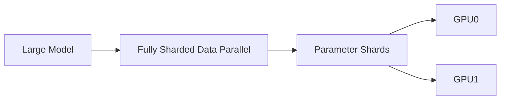

# Lab 03 — Test Sharded Training with FSDP

## 1. Objective
Run the same model with DDP and FSDP, compare peak memory and throughput, and validate a sharded checkpoint restore.

## 2. Target Audience
This lab is intended for AI Infrastructure Engineers, Platform Engineers, and ML Researchers who need to manage and optimize distributed training workloads.

## 3. Prerequisites
- Access to a multi-GPU node (e.g., 2+ NVIDIA A100 or H100 GPUs).
- NVIDIA Container Toolkit installed and functioning.
- A functional PyTorch distributed environment (PyTorch 2.x).
- Basic understanding of NCCL and Linux process management.

## 4. Architecture Diagram


## 5. Environment Setup
Verify the environment before running the primary commands:
```bash
nvidia-smi
python -c "import torch; print(torch.cuda.is_available())"
```

## 6. Execution Specifications
**Purpose:** Run an FSDP script and monitor peak memory usage.
**Command:**
```bash
torchrun --nproc_per_node=4 train_fsdp.py --sharding-strategy FULL_SHARD
```
**Expected Evidence:** Memory consumption per GPU is roughly 1/4 of the total model size, gradients all-gather during forward/backward passes.
**Explanation:** FSDP shards the model parameters, gradients, and optimizer states across all participating GPUs, reducing per-GPU memory footprint at the cost of communication overhead.
**Common Failure:** OOM (Out of Memory) if the model is still too large or if CPU offloading is required but not enabled.

## 7. Expected Evidence
Beyond the CLI output, you should observe corresponding GPU utilization using `nvidia-smi dmon` or `nvtop` matching the expected parallel workload behavior.

## 8. Explanation of Behavior
The distributed process group coordinates across the GPUs using NCCL. When synchronized, all ranks wait at collective boundaries (like All-Reduce or All-Gather).

## 9. Performance Benchmarking
Monitor throughput metrics (e.g., items/sec or tokens/sec). The multi-GPU throughput should scale efficiently relative to the single-GPU baseline, typically >80% scaling efficiency.

## 10. Common Failures
- **NCCL Timeout:** Usually caused by a network partition or a rank crashing silently without tearing down the process group.
- **OOM (Out of Memory):** Batch size is too large for the available VRAM.

## 11. Safe Failure Injection
**Action:** Attempt to restore an FSDP checkpoint onto a different number of GPUs without configuring the correct state dict mapping.
**Expected Result:** The process group should hang or crash with an explicit NCCL error.

## 12. Recovery Steps
Use PyTorch's distributed checkpointing API to properly stitch and reshard the checkpoint for the new world size.

## 13. Troubleshooting Guide
- Check `dmesg -T` for Xid errors (e.g., Xid 79, Xid 13).
- Enable NCCL debug logs by setting `export NCCL_DEBUG=INFO`.
- Ensure firewall rules are not blocking inter-node communication if running across multiple nodes.

## 14. Validation
Validate the outcome by confirming the checkpoint integrity or by ensuring the model loss continues to converge at the expected rate without spikes.

## 15. Real-World Pitfalls
- Forgetting to synchronize the random number generator (RNG) seeds across ranks can cause divergence.
- Unmatched tensor shapes in DDP models if dynamic control flow is used without `.join()`.

## 16. Cleanup Procedures
```bash
# Terminate lingering torchrun processes
pkill -f torchrun
# Remove temporary checkpoints
rm -rf ./checkpoints/*
```

## 17. Knowledge Check
- What happens if one rank crashes during an all-reduce operation?
- How does `torchrun` assign `RANK` and `LOCAL_RANK`?
- What is the difference between NVLink and PCIe data transfers?

## 18. Additional References
- [PyTorch Distributed Overview](https://pytorch.org/tutorials/beginner/dist_overview.html)
- [NVIDIA NCCL Documentation](https://docs.nvidia.com/deeplearning/nccl/user-guide/docs/index.html)
