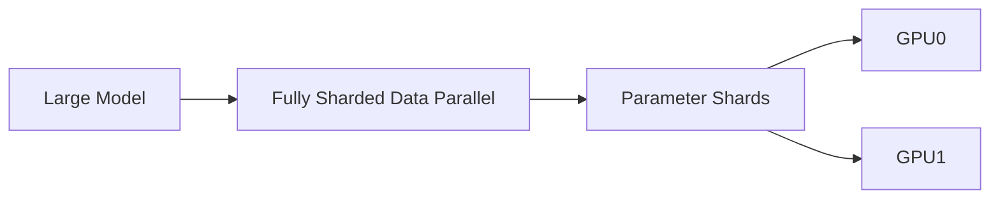

# Lab 03 — Test Sharded Training with FSDP

## 1. Objective
Run the same model with DDP and FSDP, compare peak memory and throughput, and validate a sharded checkpoint restore.

## 2. Target Audience
This lab is intended for AI Infrastructure Engineers, Platform Engineers, and ML Researchers who need to manage and optimize distributed training workloads.

## 3. Prerequisites
- Access to a multi-GPU node (e.g., 2+ NVIDIA A100 or H100 GPUs).
- NVIDIA Container Toolkit installed and functioning.
- A functional PyTorch distributed environment (PyTorch 2.x).
- Basic understanding of NCCL and Linux process management.

## 4. Architecture Diagram


## 5. Environment Setup
Verify the environment before running the primary commands:
```bash
nvidia-smi
python -c "import torch; print(torch.cuda.is_available())"
```

## 6. Execution Specifications
**Purpose:** Run an FSDP script and monitor peak memory usage.
**Command:**
```bash
torchrun --nproc_per_node=4 train_fsdp.py --sharding-strategy FULL_SHARD
```
**Expected Evidence:** Memory consumption per GPU is roughly 1/4 of the total model size, gradients all-gather during forward/backward passes.
**Explanation:** FSDP shards the model parameters, gradients, and optimizer states across all participating GPUs, reducing per-GPU memory footprint at the cost of communication overhead.
**Common Failure:** OOM (Out of Memory) if the model is still too large or if CPU offloading is required but not enabled.

## 7. Expected Evidence
Run the same model first under DDP and then under FSDP (`FULL_SHARD`), recording peak allocated memory with `torch.cuda.max_memory_allocated()` or `nvidia-smi --query-gpu=memory.used --format=csv -l 1`. Per Chapter 4's formula, DDP peak memory should stay flat as GPU count increases (each GPU replicates everything), while FSDP peak memory per GPU should drop roughly proportional to `1/N` for the parameter/gradient/optimizer-state portion of the footprint.

## 8. Explanation of Behavior
Unlike DDP (which only synchronizes gradients via All-Reduce), FSDP shards parameters, gradients, and optimizer states across all GPUs at rest. Before each layer's forward or backward pass, FSDP issues an All-Gather to reassemble that layer's full weights temporarily, computes, then immediately frees the gathered copy and keeps only its local 1/N shard — this is why FSDP trades lower steady-state memory for materially higher communication volume than DDP (an All-Gather per layer per pass, vs. one All-Reduce per step for DDP).

## 9. Performance Benchmarking
Compare step time and peak memory between the DDP baseline (Lab 01) and this FSDP run on the same model and batch size. Expect FSDP to use substantially less peak memory per GPU but run measurably slower per step due to the extra All-Gather traffic — this is the memory-vs-communication tradeoff formalized in Chapter 4/5's Stage 1/2/3 comparison tables. If FSDP shows both higher memory *and* slower throughput than DDP, suspect an overly coarse wrapping policy (e.g., wrapping the whole model as one FSDP unit instead of per-transformer-block) that forces the entire model to be gathered at once.

## 10. Common Failures
- **OOM despite sharding:** Usually caused by a wrapping policy that's too coarse — if FSDP wraps the whole model in a single unit, the All-Gather step temporarily reconstructs the *entire* model on every GPU, defeating the purpose of sharding.
- **Checkpoint/resume mismatch:** Saving with `FULL_STATE_DICT` (which gathers the entire model onto rank 0) and then trying to load with `SHARDED_STATE_DICT` on a different world size without PyTorch's distributed checkpointing API will fail with key/shape mismatches.

## 11. Safe Failure Injection
**Action:** Attempt to restore an FSDP checkpoint onto a different number of GPUs without configuring the correct state dict mapping.
**Expected Result:** The process group should hang or crash with an explicit NCCL error.

## 12. Recovery Steps
Use PyTorch's distributed checkpointing API to properly stitch and reshard the checkpoint for the new world size.

## 13. Troubleshooting Guide
- If peak memory doesn't drop as expected when moving from DDP to FSDP, inspect the `auto_wrap_policy` — a policy that wraps too few sub-modules (or none) means most of the model is still treated as one giant unmovable block.
- Enable `export NCCL_DEBUG=INFO` to confirm the expected pattern of frequent All-Gather calls (one per wrapped unit per pass) rather than the single per-step All-Reduce you'd see under DDP.
- If resuming a sharded checkpoint fails with key-mismatch errors, confirm both the save and load side use PyTorch's `torch.distributed.checkpoint` (DCP) APIs rather than mixing a plain `torch.save` of a `FULL_STATE_DICT` with a sharded load.
- Check `dmesg -T` for Xid errors if a rank disappears mid-All-Gather, which will hang the remaining ranks indefinitely.

## 14. Validation
Validate the outcome two ways: (1) confirm peak per-GPU memory under FSDP is measurably lower than the DDP baseline and roughly tracks the `1/N` sharding math from Chapter 4, and (2) confirm a sharded checkpoint saved mid-run can be restored (potentially onto a different `--nproc_per_node` world size) and that training resumes with a matching loss trajectory.

## 15. Real-World Pitfalls
- Wrapping the model too coarsely (e.g., one `FSDPUnit` for the entire model) gives you FSDP's communication overhead without its memory benefit, since the All-Gather reconstructs everything at once anyway.
- Saving with `FULL_STATE_DICT` on a large model gathers the *entire* model onto rank 0's CPU/GPU memory, which can OOM even though the sharded training itself fit fine — prefer `SHARDED_STATE_DICT` for large-model checkpointing.
- Resharding across a different GPU count (e.g., 4 GPUs to 8) requires the distributed checkpointing API's resharding logic; a manual `torch.load` will silently produce wrong shard boundaries.

## 16. Cleanup Procedures
```bash
# Terminate lingering torchrun processes
pkill -f torchrun
# Remove sharded checkpoint directories (one shard file per rank)
rm -rf ./checkpoints/*
```

## 17. Knowledge Check
- Why does FSDP need an All-Gather before *every* layer's forward pass, while DDP only needs one All-Reduce per training step?
- What's the difference between `FULL_STATE_DICT` and `SHARDED_STATE_DICT` when checkpointing an FSDP model, and why does the former risk an OOM that the latter avoids?
- How does the `auto_wrap_policy` granularity affect the memory/communication tradeoff described in Chapter 4?

## 18. Additional References
- [PyTorch Distributed Overview](https://pytorch.org/tutorials/beginner/dist_overview.html)
- [NVIDIA NCCL Documentation](https://docs.nvidia.com/deeplearning/nccl/user-guide/docs/index.html)
