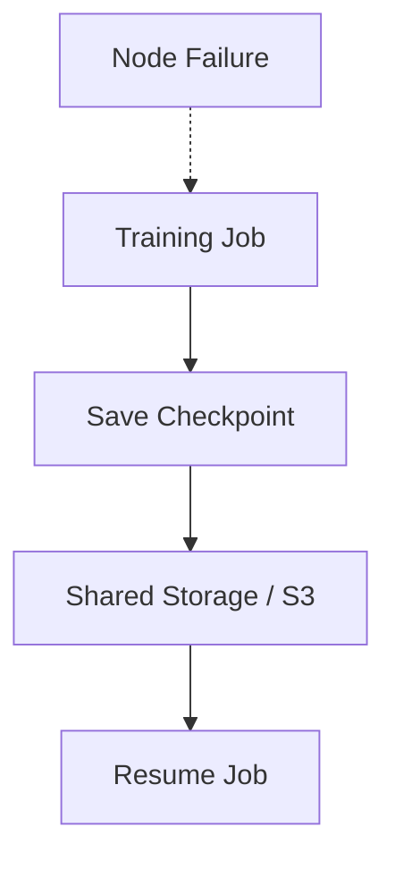

# Lab 04 — Recover a Distributed Training Job

## 1. Objective
Prove that a distributed job can recover after a controlled rank or node failure without silently losing state.

## 2. Target Audience
This lab is intended for AI Infrastructure Engineers, Platform Engineers, and ML Researchers who need to manage and optimize distributed training workloads.

## 3. Prerequisites
- Access to a multi-GPU node (e.g., 2+ NVIDIA A100 or H100 GPUs).
- NVIDIA Container Toolkit installed and functioning.
- A functional PyTorch distributed environment (PyTorch 2.x).
- Basic understanding of NCCL and Linux process management.

## 4. Architecture Diagram


## 5. Environment Setup
Verify the environment before running the primary commands:
```bash
nvidia-smi
python -c "import torch; print(torch.cuda.is_available())"
```

## 6. Execution Specifications
**Purpose:** Resume training from a specific checkpoint file.
**Command:**
```bash
torchrun --nproc_per_node=4 train.py --resume-from ./checkpoints/epoch_3.pt
```
**Expected Evidence:** Training resumes at epoch 4, loss matches exactly the loss recorded in the control run.
**Explanation:** Restoring from a checkpoint loads model weights, optimizer state, LR scheduler, and RNG state to ensure deterministic continuation.
**Common Failure:** Checkpoint corrupted, missing keys, or mismatch in tensor sizes.

## 7. Expected Evidence
Run a "control" job uninterrupted for 5 epochs and record the loss at each epoch boundary. Then run an "interrupted" job that is killed after epoch 3, resumed from `./checkpoints/epoch_3.pt`, and continued to epoch 5. The evidence of a correct recovery is that the resumed run's epoch 4 and epoch 5 loss values match the control run's, not just that training "continues without error."

## 8. Explanation of Behavior
A correct checkpoint/resume cycle must restore four things, not just model weights: (1) model parameters, (2) optimizer state (Adam's momentum/variance buffers — without these, the optimizer effectively restarts "cold" and loss will spike after resume), (3) the LR scheduler's step count, and (4) RNG state (Python/NumPy/CUDA), so that data shuffling and any stochastic ops (dropout) continue exactly as they would have in the uninterrupted run. Missing any of these produces a resume that "works" (no crash) but silently diverges from the control run.

## 9. Performance Benchmarking
Measure checkpoint save latency (time to write `epoch_3.pt` to disk) and restore latency (time from process start to first training step after loading the checkpoint) separately from steady-state training throughput. For large models, synchronous full-state-dict checkpointing can stall training for seconds to minutes; this is the tradeoff Chapter 9's sync-vs-async checkpointing material covers — note whether your checkpoint call blocks the training loop or overlaps with the next forward pass.

## 10. Common Failures
- **Loss spike immediately after resume:** Optimizer state (momentum/variance) wasn't saved or loaded, so Adam restarts from zero state on a mid-training weight configuration.
- **Silent divergence from the control run without an error:** RNG state wasn't restored, so data ordering or dropout masks differ after resume even though weights loaded correctly.
- **Checkpoint corrupted or missing keys:** A rank was killed mid-write (`kill -9` during `torch.save`), leaving a truncated/unreadable file.

## 11. Safe Failure Injection
**Action:** Delete a chunk of the checkpoint file or rename a parameter key in the state dict and attempt to resume.
**Expected Result:** The process group should hang or crash with an explicit NCCL error.

## 12. Recovery Steps
Identify the missing shard, restore it from backup storage or a previous epoch, and relaunch the job.

## 13. Troubleshooting Guide
- Before assuming a bug, verify the checkpoint file itself is readable: `torch.load(path, map_location="cpu")` and check that `optimizer_state_dict`, `model_state_dict`, `scheduler_state_dict`, and `rng_state` keys are all present.
- If loss diverges after resume but the checkpoint loads without error, diff the restored optimizer state against what you'd expect at epoch 3 — a common bug is saving the checkpoint *before* the optimizer step instead of after, off-by-one epoch.
- In a multi-rank job, confirm checkpoint writes are gated behind a barrier (`dist.barrier()`) so one rank isn't still writing while another has already moved on — a torn write on one rank's shard will corrupt the resume for everyone.
- Check `dmesg -T` for OOM-killer or Xid events if the interruption was meant to simulate a crash rather than a clean `kill`.

## 14. Validation
Validate the outcome by diffing the resumed run's per-epoch loss values against the uninterrupted control run's — they should match to within floating-point tolerance for epochs 4-5. A resume that "runs without error" but produces different loss values than the control is a failed recovery, even though nothing crashed.

## 15. Real-World Pitfalls
- Saving only `model.state_dict()` and forgetting optimizer/scheduler/RNG state is the single most common checkpointing bug — it "works" (no crash) but silently produces a different, non-reproducible training run after every resume.
- Writing the checkpoint from every rank independently without a `dist.barrier()` beforehand can let ranks write inconsistent snapshots of an in-flight gradient sync.
- Checkpoint format drift: loading a checkpoint saved by an older version of the training script (different model architecture or renamed parameters) fails with cryptic key-mismatch errors rather than a clear version-compatibility message — version your checkpoint format explicitly.

## 16. Cleanup Procedures
```bash
# Terminate lingering torchrun processes
pkill -f torchrun
# Remove checkpoints created during the control and interrupted runs
rm -rf ./checkpoints/*
```

## 17. Knowledge Check
- Besides model weights, what else must a checkpoint save to guarantee a bit-for-bit reproducible resume, and what does omitting each one break?
- Why might a resumed training run avoid crashing but still silently diverge from what an uninterrupted run would have produced?
- What's the risk of checkpointing without a `dist.barrier()` in a multi-rank job?

## 18. Additional References
- [PyTorch Distributed Overview](https://pytorch.org/tutorials/beginner/dist_overview.html)
- [NVIDIA NCCL Documentation](https://docs.nvidia.com/deeplearning/nccl/user-guide/docs/index.html)
