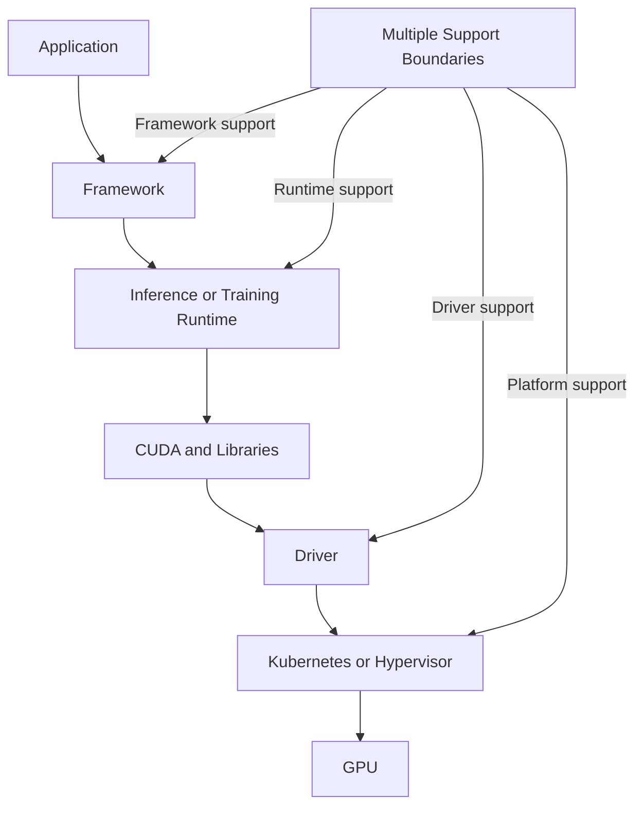
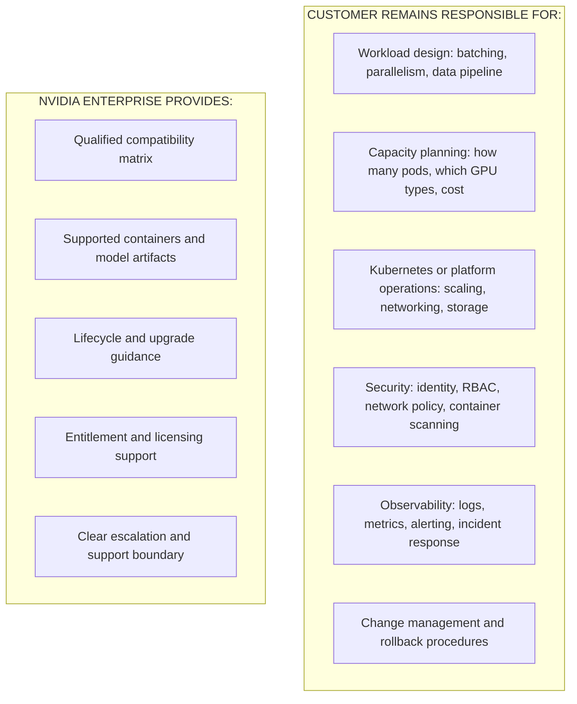
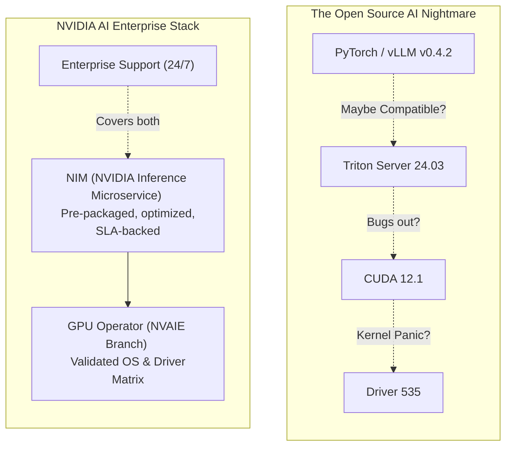

# Why NVIDIA AI Enterprise Exists

A research team can assemble open-source frameworks, containers, drivers, model servers, and monitoring tools quickly. Production exposes a different problem: who validates the combination, who supports it, how upgrades are coordinated, and how the organization proves that a known configuration can be restored?

NVIDIA AI Enterprise exists to reduce this compatibility and support uncertainty across the NVIDIA AI software stack.

## Learning Objectives

You will be able to explain the integration problem, distinguish software capability from enterprise supportability, identify customer responsibilities, and evaluate when the subscription is appropriate.

## Beginner's Primer: The "Red Hat" of AI

To understand NVIDIA AI Enterprise (NVAIE), you have to look at the history of Linux. 

In the early days of Linux, you could download the source code for free, compile your own kernel, and install your own packages. But if a bank wanted to run Linux in production, they couldn't risk a random package update taking down their trading platform, and they needed a phone number to call if the system crashed at 2 AM. **Red Hat Enterprise Linux (RHEL)** was born to solve this. Red Hat didn't invent Linux; they took the free, open-source Linux code, tested it rigorously, froze the versions, patched security holes, and sold a support contract.

**NVIDIA AI Enterprise (NVAIE) is the Red Hat of AI.**

Almost everything NVIDIA builds for AI (TensorRT, Triton Inference Server, the Container Toolkit, NeMo) is open source and available for free on GitHub or NGC. You can download it today. 
But if you are a bank building a generative AI application, you face a nightmare:
- *Is this version of Triton compatible with this specific CUDA toolkit?*
- *If we upgrade the Linux kernel, will the NVIDIA GPU Operator break?*
- *If our LLaMA model starts generating garbage text, who do we call?*

NVAIE is a paid software subscription. It gives you access to a massive matrix of rigorously tested, pre-compiled, security-scanned, and fully supported AI software components. If a certified NVAIE component breaks in production, you get an enterprise SLA and a dedicated NVIDIA support engineer to fix it. 

## The Problem Before an Enterprise Stack



A failure can cross several organizations. Each component may be individually supported while the combination is not validated. When a production incident occurs, the path to resolution becomes unclear: does the model-serving team contact the framework vendor, the runtime vendor, the platform vendor, or NVIDIA?

➕ **Real incident example:**

```text
Symptom: Model inference latency increased 40% after a routine Kubernetes upgrade
Layer 1: K8s team says "GPU scheduling is fine, not our issue"
Layer 2: GPU Operator team says "driver 550.127 is loaded, not our issue"
Layer 3: Framework team says "framework calls the runtime correctly, not our issue"
Layer 4: Runtime vendor says "we only support CUDA 12.4, verify your CUDA version"
Layer 5: After 6 hours: discovered CUDA 12.6 (auto-upgraded) changed kernel scheduling
Qualification gap: Kubernetes 1.28 + GPU Operator 24.3 + Driver 550 + CUDA 12.6 + Framework was not a qualified combination at that point
```

Without a defined boundary stating "NVIDIA validates this exact combination," determining who owns the fix becomes a negotiation rather than a warranty.

## What Enterprise Support Changes

The value is not a magical performance layer. It is a defined software portfolio, qualified deployment context, lifecycle guidance, access to supported artifacts, and a clearer escalation path.

➕ **Specific operational improvements from enterprise support:**

| Without enterprise support | With enterprise support |
|---|---|
| Support incidents require "reproduce on community versions" | Incidents start with "reproduce on a qualified matrix version" — a known starting point |
| Version compatibility matrix is undocumented or scattered | Explicit matrix: driver 550+, CUDA 12.4, cuDNN 9.1, NIM >= 1.0.5, K8s 1.28–1.31 |
| Upgrades are "test and hope" — if something breaks, you debug | Upgrades follow a procedure: check matrix, stage, canary, measure, approve, rollout |
| Entitlement/licensing behavior is unclear ("will it work on our plan?") | Entitlement model is documented and tested; image pulls fail clearly if not met |
| Model artifact sourcing is ad-hoc | NGC catalog provides versioned models with license metadata; mirrors supported |

## What It Does Not Replace

Customers still own workload architecture, capacity planning, security policy, identity, networking, storage, observability, change control, and incident evidence.

➕ **Specific customer-owned responsibilities that remain:**



## Customer Scenario

A bank needs a private LLM platform with a supported software baseline and regulated change management. The architecture team:

1. Chooses a qualified combination from the NVIDIA matrix (e.g., NIM 1.0.5, cuDNN 9.1, K8s 1.28, driver 550.127).
2. Mirrors the NIM container and model artifacts to their internal registry (GitOps-approved list).
3. Configures workload identity and egress policies to control entitlement token scope.
4. Documents the matrix, pins digests in Helm values, tests a canary rollout, and preserves rollback versions.
5. Integrates NVIDIA diagnostics into their own incident runbook (GPU logs, DCGM data, NIM readiness checks).
6. Remains responsible for Kubernetes cluster stability, network bandwidth to storage, and compliance logging.

The bank can now update with confidence: if something breaks, they can point NVIDIA support to a reproducible combination and get a clear answer about whether the issue is NVIDIA-qualified or an integration gap they own.

## Troubleshooting

**Symptom:** support cannot reproduce an issue.

**Root cause:** the environment drifted from the qualified combination and lacks version evidence. For example, driver was auto-updated to an untested version, CUDA version is unknown, or the exact NIM tag used is not recorded.

**Prevention:** maintain a compatibility inventory, artifact digests, configuration history, and reproducible diagnostics.

➕ **Concrete data structure to prevent this failure:**

```yaml
# Example: maintain this as versioned YAML in Git alongside your Helm values
deployment_manifest:
  timestamp: "2026-08-07T14:23:00Z"
  qualified_matrix_version: "NVIDIA AI Enterprise 24.07"
  
  components:
    gpu_driver:
      version: "550.127"
      verified_against: "NVIDIA Matrix: supported"
    cuda_toolkit:
      version: "12.4"
      verified_against: "driver 550.127 compatibility"
    kubernetes:
      version: "1.28.5"
      verified_against: "GPU Operator 24.3.0 tested with this K8s version"
    nim_container:
      image: "nvcr.io/nvidia/nim/llama2-7b:1.0.5"
      digest: "sha256:a1b2c3d4..."  # Immutable reference
      last_checked: "2026-08-06"
    model_artifact:
      name: "llama2-7b"
      version: "v1.0"
      license_entitlement_required: true
      
  incident_evidence_template:
    - pod_events_and_logs: "kubectl describe pod <name> -n default"
    - gpu_state: "nvidia-smi; dcgmi dmon"
    - nim_readiness: "curl http://localhost:8000/v1/health"
    - kubernetes_version: "kubectl version"
    - driver_version: "cat /proc/driver/nvidia/version"
```

When support needs to reproduce, they already know your CUDA version is 12.4, driver 550.127, and the NIM digest, instead of you needing to run diagnostics 5 times.

## Interview Preparation

**Conceptual:** "What problem does enterprise software support solve beyond access to binaries?"

**Model answer:** "Enterprise support solves the compatibility and reproducibility gap. When a production incident occurs, the customer can point NVIDIA support to a documented, qualified matrix and say ‘this exact combination failed.’ Without that boundary, debugging a cross-layer failure involves multiple vendors, each saying ‘not our layer.’ NVIDIA AI Enterprise defines which combinations are tested together, which ones are escalation-supported, and which ones are not qualified yet. That clarity turns a support incident into a reproducible problem statement."

---

**Scenario:** "Which responsibilities remain with the customer even after adopting NVIDIA AI Enterprise?"

**Model answer:** "The customer owns the workload architecture, capacity planning, Kubernetes or platform operations, security policy, observability integration, and incident runbooks. NVIDIA Enterprise guarantees that a specific NIM container, CUDA version, and driver combination is tested together — but the customer is responsible for whether that combination runs fast enough for their data pipeline, whether their network can feed the model at sufficient throughput, whether their identity system is correctly scoped to the entitlement tokens, and whether their monitoring actually alerts on failures. The subscription reduces integration uncertainty, not architecture uncertainty."

---

**Architecture:** "When could a fully open-source stack still be appropriate despite the existence of enterprise support?"

**Model answer:** "A fully open-source stack can be appropriate if: (1) the organization can staff the integration and testing work themselves, (2) the workload is non-critical or internal-only, (3) the organization prefers the freedom to patch or upgrade individual components on their own schedule without waiting for NVIDIA’s qualified combinations, or (4) the workload is experimental and the organization is willing to trade reproducibility for flexibility. However, the moment the workload moves into production with SLA commitments, the cost of reproducing an incident becomes high enough that the enterprise stack’s investment pays for itself quickly."

## Architecture Summary

NVIDIA AI Enterprise (NVAIE) bridges the gap between fast-moving open-source AI research and stable, SLA-backed enterprise production. It provides certified branches of the AI software stack, ensuring that the OS, Driver, Container Runtime, Model Server, and Application Framework are all tested together as a cohesive unit.


