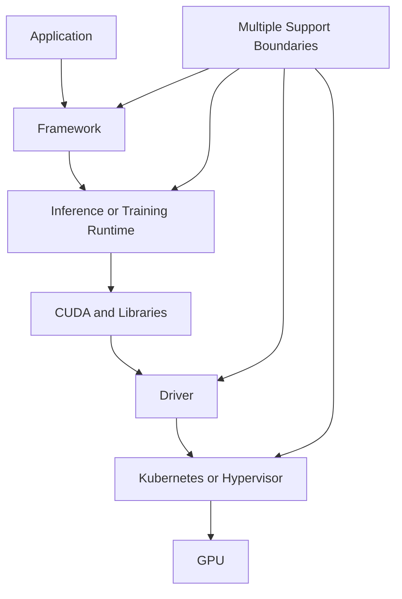

# Why NVIDIA AI Enterprise Exists

A research team can assemble open-source frameworks, containers, drivers, model servers, and monitoring tools quickly. Production exposes a different problem: who validates the combination, who supports it, how upgrades are coordinated, and how the organization proves that a known configuration can be restored?

NVIDIA AI Enterprise exists to reduce this compatibility and support uncertainty across the NVIDIA AI software stack.

## Learning Objectives

You will be able to explain the integration problem, distinguish software capability from enterprise supportability, identify customer responsibilities, and evaluate when the subscription is appropriate.

## The Problem Before an Enterprise Stack

A failure can cross several organizations. Each component may be individually supported while the combination is not validated.

## What Enterprise Support Changes

The value is not a magical performance layer. It is a defined software portfolio, qualified deployment context, lifecycle guidance, access to supported artifacts, and a clearer escalation path.

## What It Does Not Replace

Customers still own workload architecture, capacity planning, security policy, identity, networking, storage, observability, change control, and incident evidence.

## Customer Scenario

A bank needs a private LLM platform with a supported software baseline and regulated change management. The architecture team chooses a validated stack, pins artifacts, documents entitlement, and integrates it with the bank’s own Kubernetes, storage, security, and monitoring controls.

## Troubleshooting

**Symptom:** support cannot reproduce an issue.

**Root cause:** the environment drifted from the qualified combination and lacks version evidence.

**Prevention:** maintain a compatibility inventory, artifact digests, configuration history, and reproducible diagnostics.

## Interview Questions

- What problem does enterprise software support solve beyond access to binaries?
- Which responsibilities remain with the customer?
- When could a fully open-source stack still be appropriate?
