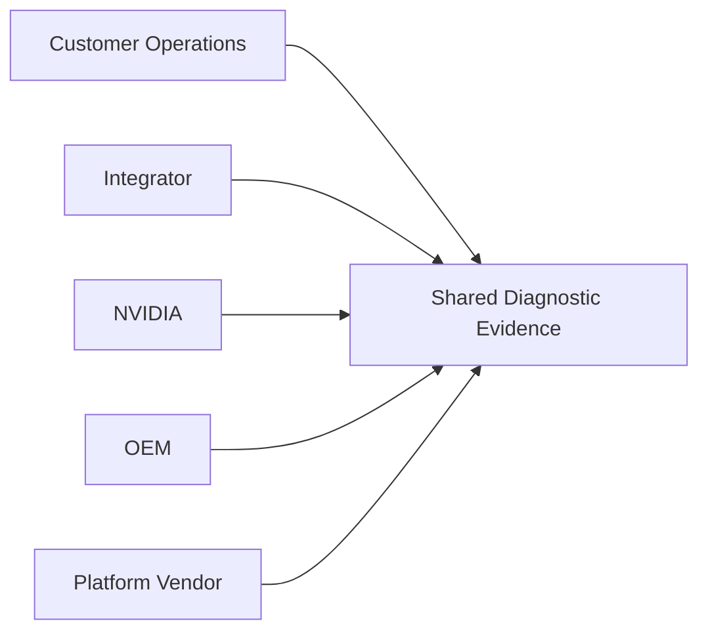

# Platform Architecture and Support Boundary

Supportability depends on knowing where responsibility changes.

## Responsibility Map

| Layer | Typical primary owner |
|---|---|
| Business application | Customer or application team |
| Model and data | Customer, model provider, or integrator |
| NIM or NeMo configuration | Platform and ML teams |
| NVIDIA AI Enterprise components | NVIDIA support boundary, subject to qualification |
| Kubernetes or hypervisor | Customer and platform vendor |
| OS, firmware, hardware | Customer, OEM, and NVIDIA by component |
| Network and storage | Customer and respective vendors |

## Architecture

The best support process begins before an incident. Define first contact, evidence bundle, escalation criteria, maintenance authority, and rollback ownership.

## Production Anti-Pattern

A team assumes the subscription makes every surrounding component NVIDIA’s responsibility. During an outage, network, storage, and platform evidence is missing, delaying isolation.

## Customer Perspective

A principal architect should state support boundaries honestly. Consolidated support reduces ambiguity but does not remove the need for customer operations and multi-vendor coordination.
