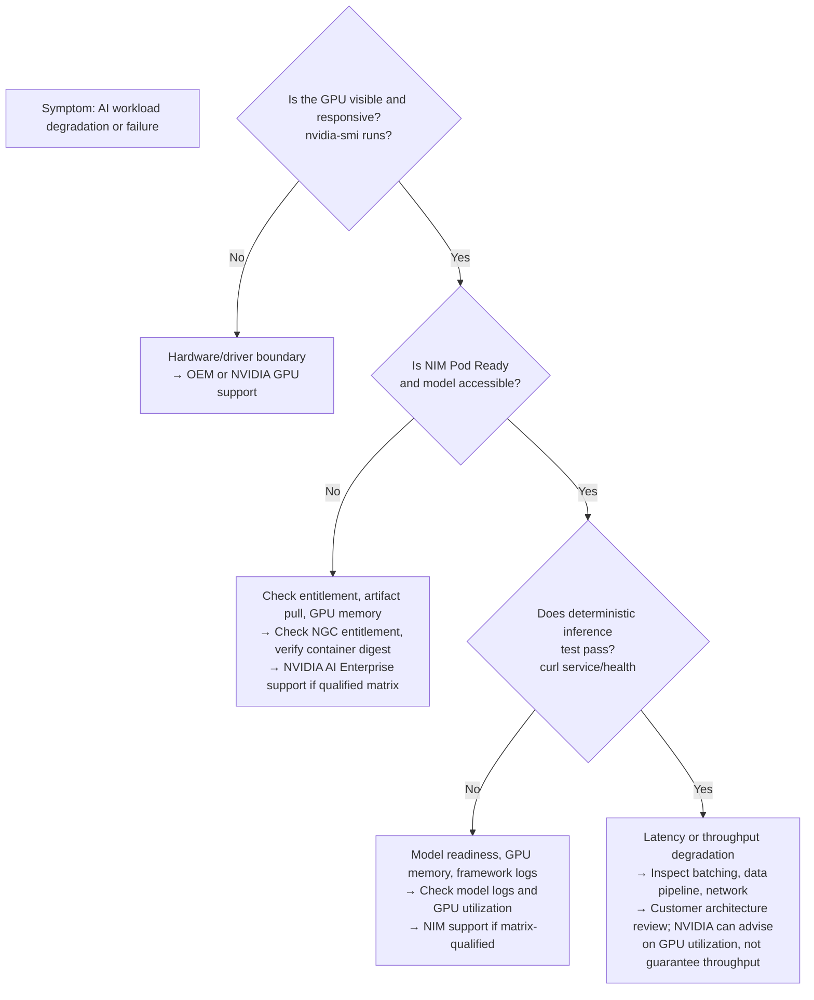

# Platform Architecture and Support Boundary

Supportability depends on knowing where responsibility changes. A broken deployment requires diagnosis across multiple layers, and a clear support boundary prevents hours of "which team should own this?" conversations.

## Responsibility Map

| Layer | Typical primary owner | NVIDIA responsibility boundary |
|---|---|---|
| Business application | Customer or application team | None — outside support scope |
| Model and data | Customer, model provider, or integrator | NGC artifact distribution only |
| NIM or NeMo configuration | Platform and ML teams | Configuration guidance; customer owns validation |
| NVIDIA AI Enterprise components | NVIDIA support boundary, subject to qualification | Driver, cuDNN, container runtime, CUDA libraries, NIM, NeMo |
| Kubernetes or hypervisor | Customer and platform vendor | Integration guidance; customer owns upgrades |
| OS, firmware, hardware | Customer, OEM, and NVIDIA by component | GPU firmware and driver; OEM owns system firmware and OS |
| Network and storage | Customer and respective vendors | None — beyond support scope |

➕ **Decision tree for support routing during an incident:**



## Architecture

```mermaid
flowchart TB
    subgraph Customer ["CUSTOMER OPERATIONS"]
        CO["Workload logic, data pipeline, business SLAs"]
    end
    subgraph Integration ["INTEGRATION & DIAGNOSTICS"]
        Diag["Shared evidence: logs, metrics, GPU state, versions"]
    end
    subgraph Integrator ["INTEGRATOR OR PARTNER"]
        Int["Stack assembly, tuning, testing"]
    end
    subgraph NVIDIA ["NVIDIA SUPPORT BOUNDARY"]
        NV["Driver, CUDA, cuDNN, NIM, NeMo<br/>when qualified matrix is met"]
    end
    subgraph OEM ["OEM / PLATFORM VENDOR"]
        OEM["Hardware, firmware, Kubernetes or hypervisor<br/>when matrix is met"]
    end
    
    Customer --> Diag
    Integrator --> Diag
    NVIDIA --> Diag
    OEM --> Diag
    Integration -.->|Evidence collected here| NVIDIA
    Integration -.->|Escalation path| OEM
    
    style Diag fill:#ffffcc
```

The best support process begins before an incident. Define first contact, evidence bundle, escalation criteria, maintenance authority, and rollback ownership.

## Production Anti-Pattern

❌ **Common mistake:** A team assumes the subscription makes every surrounding component NVIDIA’s responsibility. During an outage, network, storage, and platform evidence is missing, delaying isolation.

✅ **Better practice:** Before deployment, document the exact support boundary for this specific deployment:

```yaml
# Include this in your deployment runbook
support_matrix_and_contacts:
  deployment_name: "llm-inference-prod"
  qualified_nvidia_matrix: "AI Enterprise 24.07"
  components_owned_by_nvidia:
    - nvidia_driver_version: "550.127"
      contact: "NVIDIA support portal"
      response_sla: "4 hours for P1 GPU-level failures"
    - cuda_version: "12.4"
      contact: "NVIDIA support"
    - nim_container_version: "1.0.5"
      contact: "NVIDIA support"
  
  components_owned_by_platform_team:
    - kubernetes_version: "1.28.5"
      contact: "internal K8s team"
      escalation: "after 30 min if K8s team unavailable"
    - ingress_and_networking: "all custom Network Policies"
      contact: "network ops"
    - persistent_storage: "NFS/object-store for model cache"
      contact: "storage team"
  
  components_requiring_joint_diagnosis:
    - "model_not_loading": "check NGC entitlement (NVIDIA), check node storage (platform team), check network egress (network ops)"
    - "latency_degradation": "check GPU utilization (NVIDIA can advise), check data pipeline (customer), check network (network ops)"
    - "pod_eviction": "check cgroup limits (K8s), check GPU memory (NVIDIA), check workload (customer)"
  
  first_contact_decision:
    if: "GPU-related (nvidia-smi, cuda error, memory allocation)"
    then: "open NVIDIA ticket with qualified matrix reference above"
    if: "Pod-related (ImagePullBackoff, CrashLoopBackOff)"
    then: "check K8s events and logs; open K8s ticket if infrastructure"
    if: "Performance (latency/throughput down)"
    then: "start with GPU profiling; escalate to NVIDIA only after ruling out data pipeline"
```

## Customer Perspective

A principal architect should state support boundaries honestly. Consolidated support reduces ambiguity but does not remove the need for customer operations and multi-vendor coordination.

➕ **Realistic language for customer communications:**

```text
"NVIDIA AI Enterprise qualifies specific combinations of driver, CUDA, NIM, and NeMo. 
For those exact combinations, NVIDIA support will diagnose issues with GPU execution, 
model loading, and framework behavior.

However, the infrastructure surrounding that qualified stack remains your responsibility:
- If the model won’t download, we check whether NGC entitlement is met (NVIDIA side) 
  and whether your network policy allows egress (customer side).
- If latency is poor, we can profile GPU kernels and verify the container is using 
  intended precision and batching — but we cannot fix your data pipeline. 
- If the Pod won’t start, we check driver and container runtime compatibility; 
  you verify Kubernetes scheduling and storage access.

Most production incidents require two teams’ evidence. We design support so that 
evidence collection is fast and the boundary is clear."
```

## Worked Scenario

**Situation:** A customer reports that NIM Pod deployment fails to become Ready, with no errors in logs.

**Diagnosis approach:**

1. **First question:** Is the exact matrix version documented? (If not, ask for it before escalation.)
2. **Customer checks GPU layer:**
   ```bash
   # On the target node
   nvidia-smi  # Does driver detect GPU?
   nvidia-smi --query-gpu=memory.total --format=csv  # How much GPU memory?
   ```
3. **Integrator checks container runtime:**
   ```bash
   # On the target node
   kubectl describe node <node>  # GPU allocatable resource?
   crictl images | grep nvcr.io/nvidia/nim  # Is image cached?
   ```
4. **NVIDIA support checks entitlement:**
   - Verify NGC token is scoped to the model being deployed.
   - Confirm model license matches customer entitlement.
5. **Joint diagnosis:**
   - If GPU memory < model size: platform team must allocate larger GPU or reduce batch size.
   - If image pull fails with 401: customer’s NGC credentials need renewal.
   - If readiness probe fails: may be model download timeout; NVIDIA advises on GPU/network, customer fixes network path.
