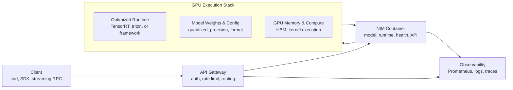
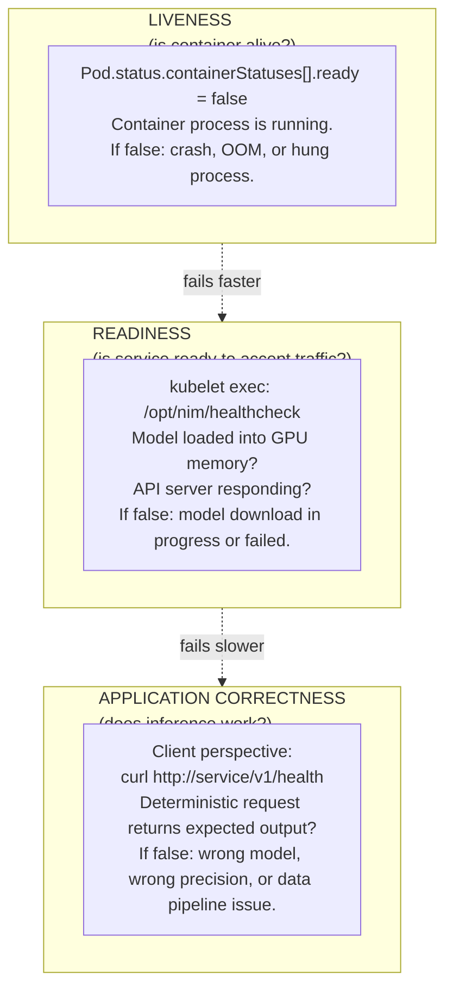

# NVIDIA NIM Architecture

NIM packages model-serving software, optimized runtimes, APIs, and operational conventions into a deployable microservice. A single NIM container includes model weights, inference engine, API server, health probes, and NVIDIA libraries — reducing the integration burden from "build a serving stack" to "run a container."

## Architecture



**Figure 3.1 — NIM packaging integrates model, runtime, and API into one deployable unit.** The client calls a standard OpenAI-compatible API; NIM handles all GPU details internally.

## Why It Exists

Without packaging, teams must integrate independently:

```mermaid
flowchart LR
    Team["Teams typically assemble:"]
    
    subgraph Manual ["MANUAL ASSEMBLY (error-prone, support-unclear)"]
        Direction ["1. Choose model source (HuggingFace, NGC, internal)"]
        Runtime ["2. Select runtime (TensorRT, vLLM, TGI, custom)"]
        API ["3. Build REST/gRPC server wrapper"]
        Health ["4. Add health checks and readiness logic"]
        Opt ["5. Configure optimization (quantization, batching)"]
        Deploy ["6. Package as container, deploy to K8s"]
        Fix ["7. Debug: which layer broke? Runtime? Model? API?"]
    end
    
    subgraph NIM_Path ["NIM APPROACH (pre-integrated, supported)"]
        Pull ["1. Pull nvcr.io/nvidia/nim/llama2-7b:1.0.5"]
        Creds ["2. Set NGC credentials and model cache"]
        Deploy2 ["3. Deploy with K8s manifest"]
        Check ["4. Wait for readiness; if it fails, NGC entitlement or GPU memory"]
    end
```

NIM eliminates steps 2–6; support responsibility is clear.

## Operational Boundary

The NIM container depends on these external resources — packaging narrows integration but does not eliminate it:

➕ **NIM's external dependencies and what happens when they fail:**

| Dependency | What NIM needs | Failure symptom | Ownership |
|---|---|---|---|
| **Model artifact** | NGC-hosted model weights, downloaded to cache on first run | ImagePullBackoff, pod remains NotReady, model log shows 404 | NGC entitlement (NVIDIA) + download permission (platform) |
| **GPU capacity** | GPU matching container request (e.g., 40GB HBM for Llama2-70B) | Pod evicted or CrashLoopBackOff, "cuda out of memory" in logs | Node capacity (customer) + scheduling (K8s) |
| **Driver and CUDA runtime** | nvidia-container-toolkit injection, driver-compatible CUDA in container | "Failed to initialize CUDA" in logs, even with GPU visible to node | Driver version (NVIDIA) + container runtime setup (platform) |
| **Networking/DNS** | Resolution and HTTP egress to NGC and HuggingFace mirrors | Model download hangs indefinitely, firewall blocks requests | Egress rules (platform), not NVIDIA |
| **Entitlement token** | Valid NGC token with scope for the model being served | 401 Unauthorized on model download attempts | Token management (customer) |

## Health Model: A Key NIM Design

NIM separates concerns that are often confused:



**This separation is critical:** liveness can recover automatically via container restart; readiness waits for model load; application-level issues require human diagnosis.

## Troubleshooting

**Symptom:** the NIM Pod is Running (liveness OK) but not Ready (readiness failing).

**Diagnosis steps:** (ordered by confidence and speed)

1. **Check readiness logs directly:**
   ```bash
   kubectl logs <pod> --tail=50 | grep -i -E 'error|fail|ready|model'
   # Look for: "Downloading model", "cuda", "entitlement", "timeout"
   ```

2. **Check GPU memory on the node:**
   ```bash
   kubectl exec <pod> -c nim -- nvidia-smi
   # Is GPU visible? Is it already in use by another process?
   # If empty, model hasn't loaded yet (check logs for download progress)
   ```

3. **Verify entitlement by attempting a direct model download (in a debug Pod):**
   ```bash
   kubectl run debug-ngc -it --image=nvcr.io/nvidia/cuda:12.4.1-runtime-ubuntu22.04 -- bash
   # Inside container:
   export NGC_CLI_API_KEY="your-token"
   curl -H "Authorization: Bearer $NGC_CLI_API_KEY" \
     https://api.ngc.nvidia.com/v2/models/nvidia/llama2-7b/versions/1.0.5
   # 200 response = entitlement OK; 401 = token issue
   ```

4. **Check model cache location — is there disk space?**
   ```bash
   kubectl exec <pod> -- df -h /model_cache  # Default location
   # If full or unavailable, readiness will fail even if model is in NGC
   ```

5. **Verify network connectivity from pod to NGC:**
   ```bash
   kubectl exec <pod> -- curl -I https://api.ngc.nvidia.com/v2/models  
   # Should get 200, not connection timeout or 401
   ```

➕ **Example of real readiness log output and interpretation:**

```text
$ kubectl logs llama2-deploy-abc123 -c nim

[2026-08-07 14:23:00] INFO: NIM container starting
[2026-08-07 14:23:05] INFO: CUDA detected, version 12.4
[2026-08-07 14:23:10] INFO: Attempting model download from NGC...
[2026-08-07 14:23:15] INFO: Downloading model artifact: llama2-7b-hf-v1.0.5
[2026-08-07 14:23:45] INFO: Downloaded 13850 MiB of model weights ← actual progress, not stuck
[2026-08-07 14:24:00] INFO: Loading model into GPU memory
[2026-08-07 14:24:05] WARNING: GPU memory available: 39.5 GiB, model size: 13.5 GiB ← fits comfortably
[2026-08-07 14:24:15] INFO: Model loaded successfully
[2026-08-07 14:24:20] INFO: API server listening on 0.0.0.0:8000
[2026-08-07 14:24:21] INFO: Readiness check passed ✓
```

**vs. a failure case:**

```text
$ kubectl logs llama2-deploy-xyz789 -c nim

[2026-08-07 14:23:00] INFO: NIM container starting
[2026-08-07 14:23:05] INFO: CUDA detected, version 12.4
[2026-08-07 14:23:10] INFO: Attempting model download from NGC...
[2026-08-07 14:23:20] ERROR: Failed to download model: 401 Unauthorized
[2026-08-07 14:23:20] ERROR: Entitlement check failed, check NGC_API_TOKEN
[2026-08-07 14:23:21] INFO: Readiness check failed
```

**Diagnosis:** "401 Unauthorized" → NGC token is invalid, missing, or expired. Not a GPU or infrastructure problem.
