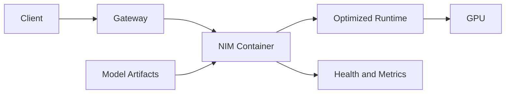

# NVIDIA NIM Architecture

NIM packages model-serving software, optimized runtimes, APIs, and operational conventions into a deployable microservice.

## Architecture

## Why It Exists

Without packaging, teams must integrate a model, runtime, server, API, health behavior, optimization, and deployment conventions independently. NIM reduces that repeated integration work.

## Operational Boundary

The container still depends on model access, compatible GPU capacity, driver and runtime, storage, networking, security, and entitlement. Packaging narrows the integration surface; it does not eliminate it.

## Health Model

Separate container liveness, service readiness, model readiness, and application-level correctness.

## Troubleshooting

**Symptom:** the NIM Pod is Running but not Ready.

**Diagnosis:** inspect model download, entitlement, artifact cache, GPU memory, runtime compatibility, and readiness logs.
